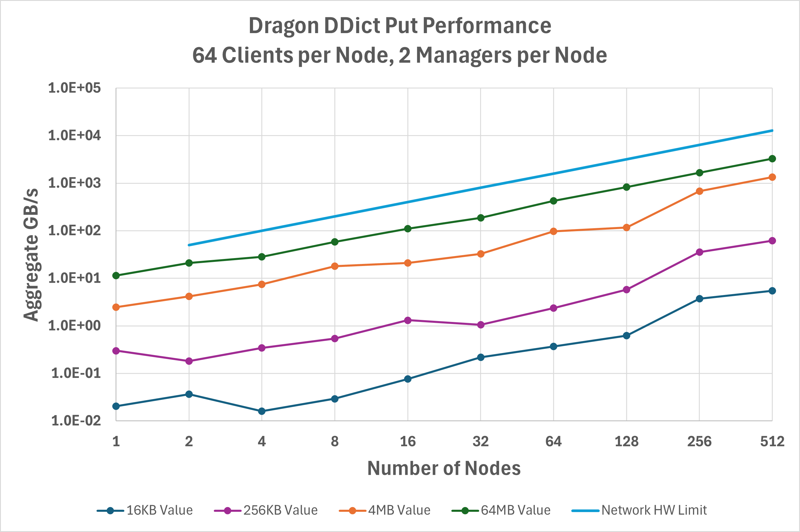
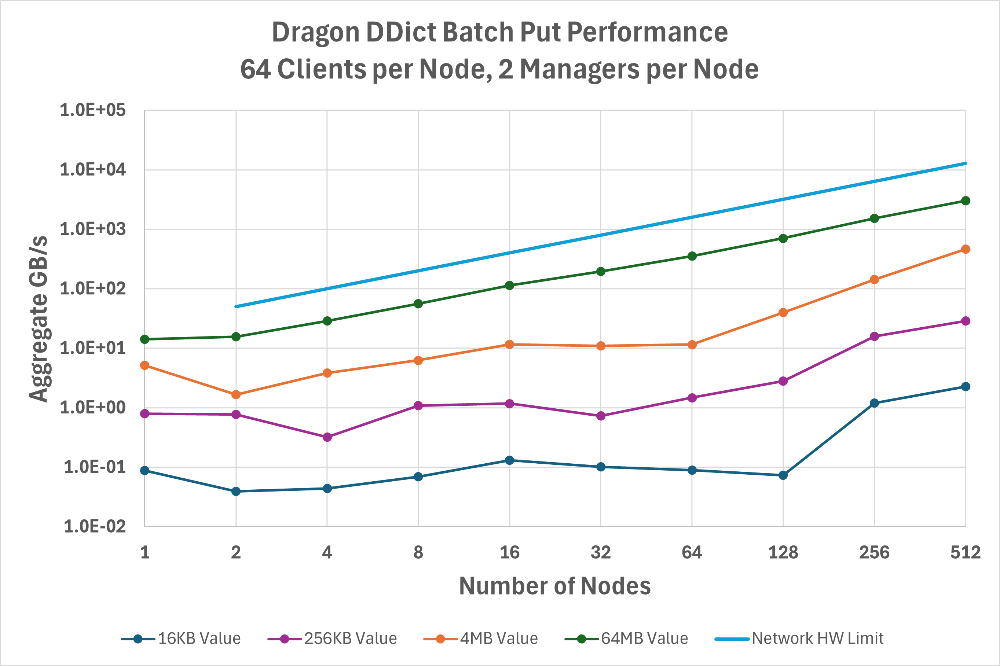
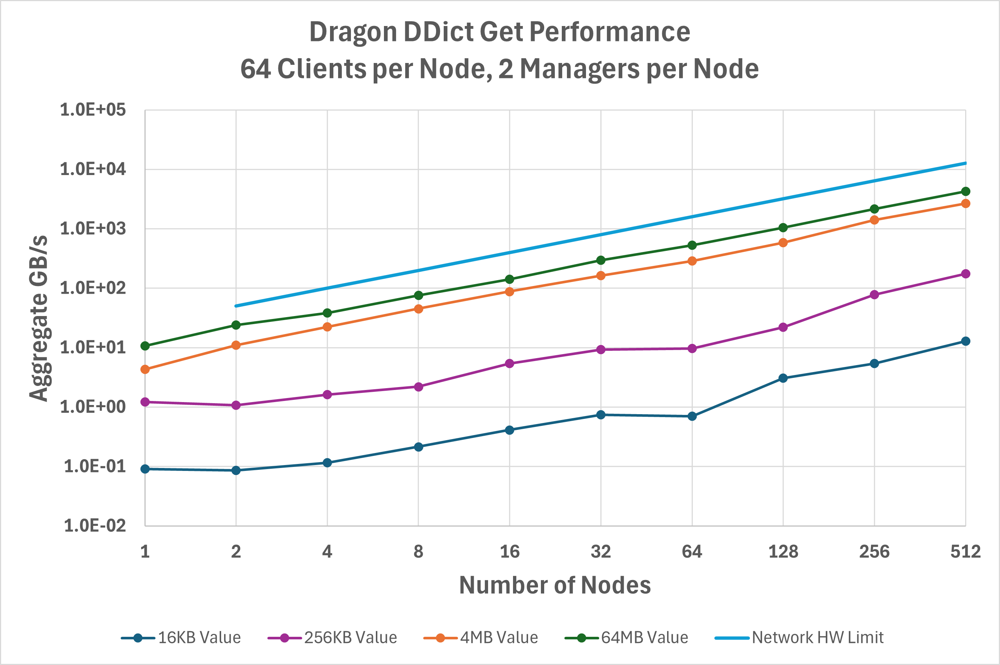
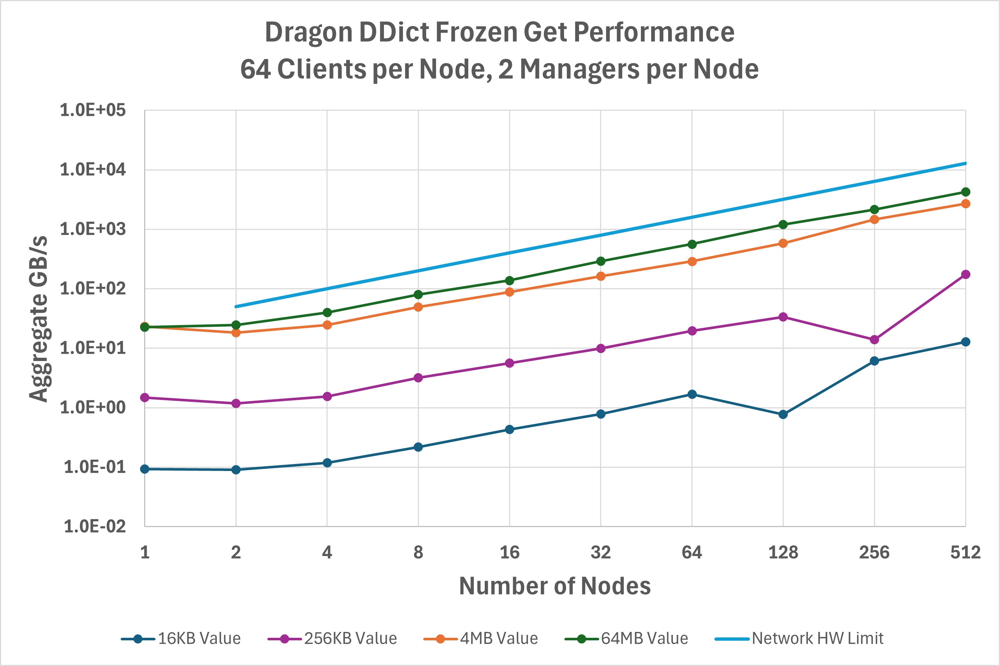

Distributed Dictionary Performance
++++++++++++++++++++++++++++++++++

How well does the :py:class:`~dragon.data.DDict` perform? We improve Dragon performance with each release, but
this is where we are at with Dragon v0.12.1. For the :example_benchmark:`gups_ddict.py`, inspired by the classic
`GUPS <https://hpcchallenge.org/projectsfiles/hpcc/RandomAccess.html>`_ benchmark, some large number of processes will
put or get a unique set of key/value pairs into or from the :py:class:`~dragon.data.DDict`. The keys are always 128 bytes
in size in this implementation, but the values vary in length. Figure :numref:`ddict_put_perf` below shows the aggregate
bandwidth measured across the clients for writing key/value pairs into a :py:class:`~dragon.data.DDict` sharded across
up to 512 nodes on a Cray EX system. For the largest value sizes, :py:class:`~dragon.data.DDict` is achieving ~1/3 of
the hardware-limited network bandwidth and scales linearly with the number of nodes.

.. _ddict_put_perf:

   Aggregate bandwidth for the `put` operation on a `DDict`.

Figure :numref:`ddict_batchput_perf` shows similar data but now using :py:meth:`~dragon.data.DDict.start_batch_put` and
:py:meth:`~dragon.data.DDict.end_batch_put` to enable aggregating operations, which can eliminate some overhead in
communicating with managers. In comparison with basic :py:meth:`~dragon.data.DDict.put` operations, this optimization
is most effective at lower client node counts and values less than 1 MB. For example, 4 KB values on a single node
achieve 5.6X higher throughput using batched operations. At large node counts, however, batched operations may reduce
performance.

.. _ddict_batchput_perf:

   Aggregate bandwidth for the batched `put` operation on a `DDict`.

Figure :numref:`ddict_get_perf` is the same but now for :py:meth:`~dragon.data.DDict.get` operations. Additional
optimizations were recently done to this path for read-heavy use cases, such as AI training data loading, that account
for :py:meth:`~dragon.data.DDict.get` frequently achieving higher performance than :py:meth:`~dragon.data.DDict.put`
in the v0.12.1 release.

.. _ddict_get_perf:

   Aggregate bandwidth for the `get` operation on a `DDict`.

A new feature added in v0.12 is the ability to :py:meth:`~dragon.data.DDict.freeze` a :py:class:`~dragon.data.DDict`.
A frozen :py:class:`~dragon.data.DDict` allows clients more direct access to dictionary buffers and eliminates some
required copy overheads. This optimization is most effective at low client node counts and large value sizes,
as seen in Figure :numref:`ddict_frozenget_perf`. For example, 64 MB values on a single node achieve 2X higher read
throughput with a frozen :py:class:`~dragon.data.DDict`, and 16 MB values on two nodes achieve 1.5X higher throughput.

.. _ddict_frozenget_perf:

   Aggregate bandwidth for the `get` operation on frozen a `DDict`.

All data was gathered on a Cray EX system equipped with a single HPE Slingshot 200Gbps NIC on each node. To run the same
benchmarks:

.. code-block:: console

    export DRAGON_DEFAULT_SEG_SZ=21474836480
    dragon gups_ddict.py --benchit
