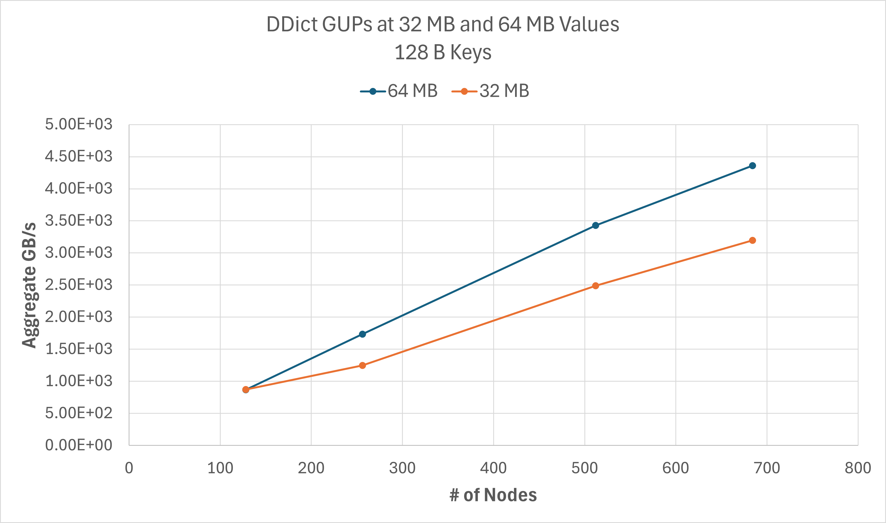

Distributed Dictionary Performance
++++++++++++++++++++++++++++++++++

.. code-block:: console

    dragon gups_ddict.py --nclients=8192 --managers_per_node=2 --num_nodes=128 --total_mem_size=128 --mem_frac=0.6 --iterations=6

.. figure:: ../images/ddict_128nodes.png
   :align: center
   :scale: 40 %

.. code-block:: console

    dragon gups_ddict.py --nclients=8192 --managers_per_node=2 --num_nodes=128 --total_mem_size=16384 --mem_frac=0.6 --iterations=1 --value_size_min=16777216 --value_size_max=67108864
    dragon gups_ddict.py --nclients=16384 --managers_per_node=2 --num_nodes=256 --total_mem_size=32768 --mem_frac=0.6 --iterations=1 --value_size_min=16777216 --value_size_max=67108864
    dragon gups_ddict.py --nclients=32768 --managers_per_node=2 --num_nodes=512 --total_mem_size=65536 --mem_frac=0.6 --iterations=1 --value_size_min=16777216 --value_size_max=67108864

