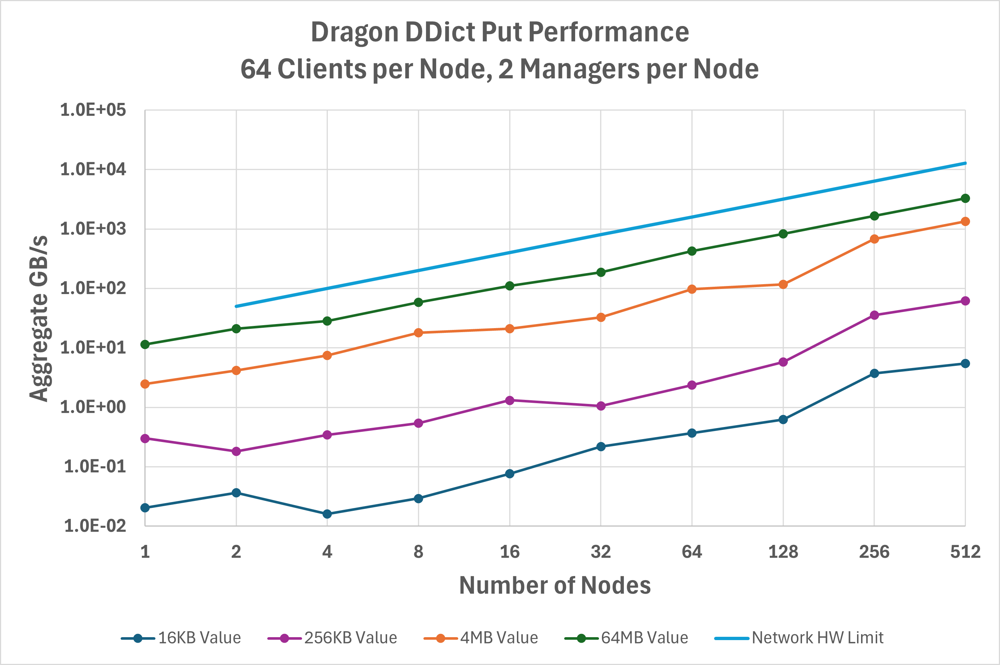
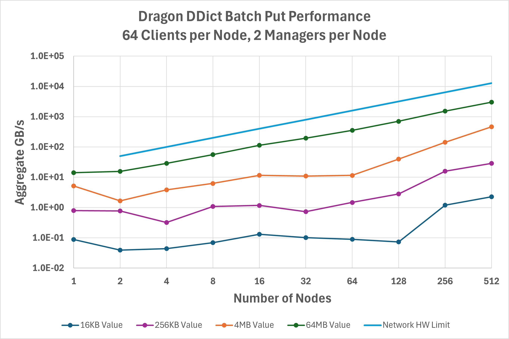
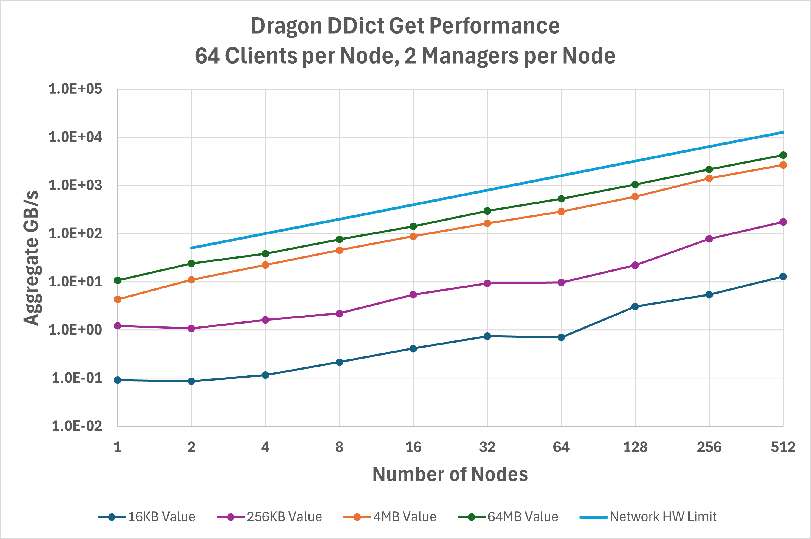
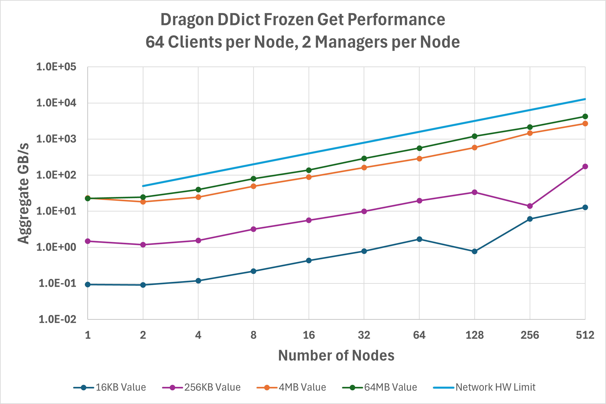

Distributed Dictionary Performance
++++++++++++++++++++++++++++++++++

How well does the :py:class:`~dragon.data.DDict` perform? We improve Dragon
performance with each release. For the :example_benchmark:`gups_ddict.py`,
inspired by the classic `GUPS (Global Updates Per Second)
<http://www.hpcchallenge.org/projectsfiles/hpcc/RandomAccess.html>`_ benchmark,
some large number of processes will put or get a unique set of key/value pairs
into or from the :py:class:`~dragon.data.DDict`. The keys are always 128 bytes in
size in this implementation, but the values vary in length. A snapshot of
performance at release 0.12.1 helps to depict how the DDict scales with the
number of nodes. Figure :numref:`ddict_put_perf` below shows the aggregate
bandwidth measured across the clients for writing key/value pairs into a
:py:class:`~dragon.data.DDict` sharded across up to 512 nodes on a Cray EX
system. For the largest value sizes, :py:class:`~dragon.data.DDict` is achieving
~1/3 of the hardware-limited network bandwidth and scales linearly with the
number of nodes.

.. _ddict_put_perf:

   Aggregate bandwidth for the `put` operation on a `DDict`.

Figure :numref:`ddict_batchput_perf` shows similar data but now using :py:meth:`~dragon.data.DDict.start_batch_put` and
:py:meth:`~dragon.data.DDict.end_batch_put` to enable aggregating operations, which can eliminate some overhead in
communicating with managers. In comparison with basic :py:meth:`~dragon.data.DDict.put` operations, this optimization
is most effective at lower client node counts and values less than 1 MB. For example, 4 KB values on a single node
achieve 5.6X higher throughput using batched operations. At large node counts, however, batched operations may reduce
performance.

.. _ddict_batchput_perf:

   Aggregate bandwidth for the batched `put` operation on a `DDict`.

Figure :numref:`ddict_get_perf` is the same but now for :py:meth:`~dragon.data.DDict.get` operations. Additional
optimizations were recently done to this path for read-heavy use cases, such as AI training data loading, that account
for :py:meth:`~dragon.data.DDict.get` frequently achieving higher performance than :py:meth:`~dragon.data.DDict.put`
in the v0.12.1 release.

.. _ddict_get_perf:

   Aggregate bandwidth for the `get` operation on a `DDict`.

A new feature added in v0.12 is the ability to :py:meth:`~dragon.data.DDict.freeze` a :py:class:`~dragon.data.DDict`.
A frozen :py:class:`~dragon.data.DDict` allows clients more direct access to dictionary buffers and eliminates some
required copy overheads. This optimization is most effective at low client node counts and large value sizes,
as seen in Figure :numref:`ddict_frozenget_perf`. For example, 64 MB values on a single node achieve 2X higher read
throughput with a frozen :py:class:`~dragon.data.DDict`, and 16 MB values on two nodes achieve 1.5X higher throughput.

.. _ddict_frozenget_perf:

   Aggregate bandwidth for the `get` operation on frozen a `DDict`.

All data was gathered on a Cray EX system equipped with a single HPE Slingshot 200Gbps NIC on each node. To run the same
benchmarks:

.. code-block:: console

    export DRAGON_DEFAULT_SEG_SZ=21474836480
    dragon gups_ddict.py --benchit

Further DDict optimizations
+++++++++++++++++++++++++++++

Under some circumstances, it is possible to get significant performance improvements from the DDict by setting some of the
configuration parameters when the DDict is created. Specifically, when loading larger data values it may be beneficial to
set `streams_per_manager` to 0. The default is not set to 0 for this value because it is possible, if you overfill the
DDict, to cause a DDict manager to hang when `streams_per_manager` is 0. The answer is to compute your needs for the DDict
and then make it at least twenty percent larger than you need. Once you have the size you need computed correctly, you
can set the `streams_per_manager` to 0 for better performance.

Setting `streams_per_manager` to 0 means that the DDict clients provide the stream channels in all circumstances rather
than prioritizing stream channels supplied by the manager. This eliminates a back and forth between manager and client
when processing requests (i.e. most DDict operations) thereby eliminating a significant network latency overhead and
reducing the number of times clients will all be targetting a single channel which also reduces a shared resource
dependency. The reduced network traffic and the reduction of shared resource contention significantly impact the
performance of the DDict, especially when loading larger data.

For these optimizations it is possible to gain some understanding of how they impact performance by accessing the
DDict `stats` property. The return value contains some DDict profiling information. In addition, you can call
`profile` on any DDict client to get some profiling information from the client's perspective. More profiling
information will be added in the future, but this represents what some of that profile information looks like
right now.

.. code-block:: console

   Sample DDict Client Profile
   TimeKeeper Timings
   ==================
   open send handle:  0.5769293503835797
   Sending message:  0.30854811845347285
   Sending key:  0.12454826012253761
   Sending value:  1.5593706415966153
   recv put resp:  78.58452005591244
   Total Time:  116.89926760224625

In addition to `streams_per_manager` being set to 0, another optimization is to increase the number of managers
and clients. During data loading for large amounts of data, splitting the work across several managers per node
can decrease load times significantly. Plan for at least one manager per NIC on the node. However, you may want
to turn that knob a bit and try up to two managers per NIC on the node. Increasing the number of managers increases
the parallelism for data loading since each manager can handle its work independently of all other managers.
Depending on the speed of the filesystem from which you are reading data, there will be tail at the end where you will
get decreasing returns from increasing the number of managers, but you should definitely this optimization to
see what kinds of returns you get.

Related to the number of managers per node, the number of clients involved in data loading also has a significant
impact on performance. Clients should load individual parts of the data and each client represents another independent
stream (literally) that can be pumped into the DDict in parallel. You want enough clients to keep the DDict managers busy
without overwhelming the nodes or the filesystem. In at least some testing we did, twenty-four clients per node seemed a
good number for performance, so you might use that as a rule-of-thumb to start with when optimizing performance.

Finally, there is a mode of the GUPS DDict benchmark that can be used to gather some performance information, not specifically
for data loading. Here is a sample run below. This was run on two nodes and the performance numbers are as given here.

.. code-block:: console

	examples/benchmarks> dragon gups_ddict.py --profileit
	DDict GUPS Benchmark
	  Running on 2 nodes (nclients=48)
	  8 DDict managers
	  2 DDict nodes
	  36 GB total DDict memory (2.160E+01 GB for keys+values)
	  Operation: put

	 Value [B]  Iters  keys/client  min(ops/s)  max(ops/s)  sum(ops/s)   sum(GB/s)
	      1024      1          127   2.069E+02   2.404E+02   1.037E+04   9.892E-03
	      2048      1          127   2.094E+02   2.292E+02   1.041E+04   1.986E-02
	      4096      1          127   1.966E+02   2.144E+02   9.729E+03   3.711E-02
	      8192      1          127   2.104E+02   2.325E+02   1.046E+04   7.977E-02
	     16384      1          127   2.114E+02   2.404E+02   1.064E+04   1.624E-01
	     32768      1          127   1.693E+02   1.904E+02   8.435E+03   2.574E-01
	     65536      1          127   2.235E+01   2.714E+01   1.115E+03   6.807E-02
	    131072      1          127   2.198E+01   2.600E+01   1.092E+03   1.334E-01
	    262144      1          127   2.520E+01   3.016E+01   1.269E+03   3.098E-01
	    524288      1          127   1.942E+01   2.171E+01   9.636E+02   4.705E-01
	   1048576      1          127   2.683E+01   3.213E+01   1.361E+03   1.330E+00
	   2097152      1          127   2.752E+01   3.211E+01   1.377E+03   2.689E+00
	   4194304      2          115   2.926E+01   3.357E+01   1.456E+03   5.686E+00
	   8388608      3           57   2.538E+01   2.842E+01   1.263E+03   9.865E+00
	  16777216      4           28   1.670E+01   2.014E+01   8.447E+02   1.320E+01
	  33554432      4           14   1.325E+01   1.770E+01   7.071E+02   2.210E+01
	  67108864      4            7   6.923E+00   1.071E+01   4.139E+02   2.587E+01

	Sample DDict Client Profile
	TimeKeeper Timings
	==================
	open send handle:  0.32423452008515596
	Sending message:  0.24805978080257773
	Sending key:  0.25392770301550627
	Sending value:  3.9071362633258104
	recv put resp:  58.57618703646585
	Total Time:  66.63464669184759

	DDict GUPS Benchmark
	  Running on 2 nodes (nclients=48)
	  8 DDict managers
	  2 DDict nodes
	  36 GB total DDict memory (2.160E+01 GB for keys+values)
	  Operation: batchput

	 Value [B]  Iters  keys/client  min(ops/s)  max(ops/s)  sum(ops/s)   sum(GB/s)
	      1024      1          127   1.325E+02   1.439E+02   6.526E+03   6.223E-03
	      2048      1          127   4.771E+01   9.112E+01   2.463E+03   4.698E-03
	      4096      1          127   6.261E+01   1.036E+02   3.327E+03   1.269E-02
	      8192      1          127   5.379E+01   9.635E+01   2.724E+03   2.078E-02
	     16384      1          127   5.881E+01   9.553E+01   2.946E+03   4.494E-02
	     32768      1          127   6.582E+01   1.168E+02   3.477E+03   1.061E-01
	     65536      1          127   4.659E+01   4.803E+01   2.254E+03   1.376E-01
	    131072      1          127   3.519E+01   4.348E+01   1.721E+03   2.101E-01
	    262144      1          127   3.247E+01   3.309E+01   1.567E+03   3.825E-01
	    524288      1          127   4.801E+01   4.946E+01   2.319E+03   1.132E+00
	   1048576      1          127   3.753E+01   3.836E+01   1.814E+03   1.772E+00
	   2097152      1          127   2.850E+01   2.929E+01   1.378E+03   2.691E+00
	   4194304      2          115   3.320E+01   3.846E+01   1.633E+03   6.379E+00
	   8388608      3           57   2.058E+01   2.377E+01   1.032E+03   8.060E+00
	  16777216      4           28   1.607E+01   1.928E+01   8.286E+02   1.295E+01
	  33554432      4           14   1.091E+01   1.448E+01   5.600E+02   1.750E+01
	  67108864      4            7   6.269E+00   9.097E+00   3.382E+02   2.114E+01

	Sample DDict Client Profile
	TimeKeeper Timings
	==================
	open send handle:  0.1520281508564949
	Total Time:  65.61104887817055

	DDict GUPS Benchmark
	  Running on 2 nodes (nclients=48)
	  8 DDict managers
	  2 DDict nodes
	  36 GB total DDict memory (2.160E+01 GB for keys+values)
	  Operation: get

	 Value [B]  Iters  keys/client  min(ops/s)  max(ops/s)  sum(ops/s)   sum(GB/s)
	      1024      1          127   3.902E+02   4.451E+02   1.949E+04   1.858E-02
	      2048      1          127   3.768E+02   4.186E+02   1.893E+04   3.610E-02
	      4096      1          127   3.953E+02   4.283E+02   1.966E+04   7.500E-02
	      8192      1          127   3.948E+02   4.458E+02   1.963E+04   1.497E-01
	     16384      1          127   3.788E+02   4.264E+02   1.919E+04   2.928E-01
	     32768      1          127   3.489E+02   3.929E+02   1.741E+04   5.314E-01
	     65536      1          127   2.234E+02   2.691E+02   1.116E+04   6.814E-01
	    131072      1          127   2.717E+02   2.961E+02   1.343E+04   1.640E+00
	    262144      1          127   2.500E+02   2.920E+02   1.250E+04   3.052E+00
	    524288      1          127   2.344E+02   2.576E+02   1.163E+04   5.677E+00
	   1048576      1          127   1.766E+02   2.033E+02   8.955E+03   8.745E+00
	   2097152      1          127   1.088E+02   1.225E+02   5.438E+03   1.062E+01
	   4194304      2          115   7.811E+01   8.982E+01   3.934E+03   1.537E+01
	   8388608      3           57   4.675E+01   5.851E+01   2.496E+03   1.950E+01
	  16777216      4           28   2.489E+01   3.904E+01   1.388E+03   2.169E+01
	  33554432      4           14   1.209E+01   2.175E+01   8.143E+02   2.545E+01
	  67108864      4            7   6.082E+00   1.115E+01   4.205E+02   2.628E+01

	Sample DDict Client Profile
	TimeKeeper Timings
	==================
	open send handle:  0.25631466461345553
	Sending message:  0.1695385123603046
	Sending key:  0.06005882006138563
	Sending value:  1.1203968413174152
	recv put resp:  35.20631247991696
	Total Time:  65.57867541816086

	DDict GUPS Benchmark
	  Running on 2 nodes (nclients=48)
	  8 DDict managers
	  2 DDict nodes
	  36 GB total DDict memory (2.160E+01 GB for keys+values)
	  Operation: frozenget

	 Value [B]  Iters  keys/client  min(ops/s)  max(ops/s)  sum(ops/s)   sum(GB/s)
	      1024      1          127   4.290E+02   4.744E+02   2.169E+04   2.068E-02
	      2048      1          127   3.915E+02   4.357E+02   1.960E+04   3.738E-02
	      4096      1          127   3.884E+02   4.328E+02   1.952E+04   7.445E-02
	      8192      1          127   3.774E+02   4.483E+02   1.917E+04   1.462E-01
	     16384      1          127   3.986E+02   4.470E+02   1.993E+04   3.041E-01
	     32768      1          127   3.689E+02   4.128E+02   1.840E+04   5.616E-01
	     65536      1          127   2.115E+02   2.532E+02   1.056E+04   6.444E-01
	    131072      1          127   2.829E+02   3.194E+02   1.420E+04   1.733E+00
	    262144      1          127   2.765E+02   3.085E+02   1.376E+04   3.360E+00
	    524288      1          127   2.709E+02   3.071E+02   1.346E+04   6.572E+00
	   1048576      1          127   2.393E+02   2.804E+02   1.211E+04   1.182E+01
	   2097152      1          127   1.325E+02   1.619E+02   6.622E+03   1.293E+01
	   4194304      2          115   1.227E+02   1.518E+02   6.597E+03   2.577E+01
	   8388608      3           57   6.705E+01   9.178E+01   3.942E+03   3.080E+01
	  16777216      4           28   3.489E+01   5.353E+01   2.055E+03   3.211E+01
	  33554432      4           14   1.382E+01   2.963E+01   1.083E+03   3.384E+01
	  67108864      4            7   6.779E+00   1.754E+01   5.548E+02   3.467E+01

	Sample DDict Client Profile
	TimeKeeper Timings
	==================
	open send handle:  0.20417668297886848
	Sending message:  0.209028922021389
	Sending key:  0.07103202771395445
	Sending value:  1.516074442770332
	recv put resp:  31.822717442642897
	Total Time:  57.57429178012535

