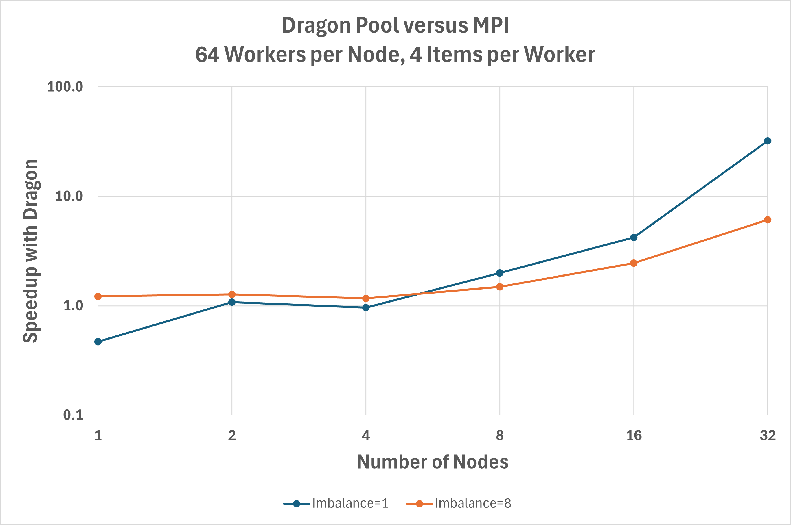

Multiprocessing Pool versus MPI-based Pool
++++++++++++++++++++++++++++++++++++++++++

.. currentmodule:: dragon.mpbridge.context

Dragon :ref:`multiprocessing <MultiprocessingAPI>` presents a notably different programming model for parallel
applications than options like MPI that are more familiar to the HPC community. Users coming from an HPC background
might be curious about performance advantages or disadvantages of using Dragon, and this benchmark shows one approach
to using MPI to implement a processing solution similar to :external+python:py:class:`multiprocessing.pool.Pool`.
The :example_benchmark:`dragon_pool_vs_mpi.py` benchmark measures the performance of a map-like workload using either
:py:meth:`~dragon.mpbridge.context.DragonContext.Pool` or an MPI-based equivalent, attempting to be fair in both
implementation complexity and optimization.

Figure :numref:`pool_v_mpi_perf` shows the performance improvement using a :py:meth:`~dragon.mpbridge.context.DragonContext.Pool`
for a map-like workload over the MPI implementation. Two sets of data are shown for a case where each work item requires
0.1 seconds of processing time (imbalance=1) and a case where work items require a randomly selected amount
of processing time between 0.1 and 0.8 seconds (imbalance=8). For balanced workloads (imbalance=1), MPI outperforms
Dragon on a single node and has equivalent performance up to 4 nodes. Beyond 4 nodes, Dragon rapidly outperforms the
MPI implementation and is 32X faster on 32 nodes. The exact cause of this requires deeper investigation, but we
believe it is related to Dragon's design to manage many-to-one patterns that occur in this case as workers communicate
nearly sychronously back to the primary orchestration process. For the imbalanced case (imbalance=8), Dragon
consistently outperforms the MPI implementation and is 6X faster at 32 nodes.
:py:meth:`~dragon.mpbridge.context.DragonContext.Pool` is designed for imbalanced workloads as work items are fetched as
workers become idle. This is difficult to achieve with the MPI implementation.

.. _pool_v_mpi_perf:

   Performance improvement using a Dragon `Pool` over an MPI-based implmentation. Values higher than 1 indicate better
   performance by that factor.

All data was gathered on a Cray EX system equipped with a single HPE Slingshot 200Gbps NIC on each node. To run the same
benchmarks:

.. code-block:: console

    # in an allocation of up to 32 nodes
    dragon dragon_pool_vs_mpi.py --items_per_worker=4 --imbalance_factor=1
    dragon dragon_pool_vs_mpi.py --items_per_worker=4 --imbalance_factor=8
