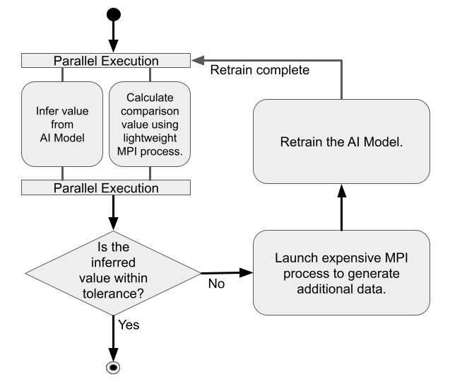

AI-in-the-loop Workflow
+++++++++++++++++++++++++++++++++++++++++++++++++++

This is an example of how Dragon can be used to execute an AI-in-the-loop workflow.
Inspiration for this demo comes from the NERSC-10 Workflow Archetypes White Paper.
This workflow most closely resembles the workflow scenario given as part of archetype four.

In this example we use a small model implemented in PyTorch to compute an approximation to :math:`\sin(x)`.
In parallel to doing the inference with the model, we launch `sim-cheap` on four MPI ranks.
This MPI job computes the Taylor approximation to :math:`\sin(x)` and compares this with the output of the model.
If the difference is less than 0.05 we consider the model's approximation to be sufficiently accurate and print out the result with the exact result.
If the difference is larger than 0.05 we consider this a failure and re-train the model on a new set of data.

To generate this data we launch `sim-expensive`.
This MPI job is launched on eight ranks-per-node and each rank generates 32 data points of the form :math:`(x, \sin(x))` where :math:`x \in U(-\pi, \pi)`.
This data is aggregated into a PyTorch tensor and then used to train the model.
We then re-evaluate the re-trained model and decide if we need to re-train again or if the estimate is sufficiently accurate.
We continue this loop until we've had five successes.

:numref:`ai-in-the-loop`  presents the structure of this main loop. It shows when each MPI application is launched and what portions are executed in parallel.



    **Example AI-in-the-loop workflow**


This example consists of the following python files:

* `ai-in-the-loop.py` - This is the main file. It contains functions for launching both MPI executables and parsing the results as well as imports functions defined in `model.py` and coordinates the model inference and training with the MPI jobs.

* `model.py` - This file defines the model and provides some functions for model training and inference.

Below, we present the main python code (`ai-in-the-loop.py`) which acts as the coordinator of the workflow.
The code of the other files can be found in the release package, inside `examples/workflows/ai-in-the-loop` directory.


.. code-block:: python
    :linenos:
    :caption: **ai-in-the-loop.py: Main orchestrator for AI-in-the-loop demo**

    import dragon
    import multiprocessing as mp

    import os
    import math
    import torch
    from itertools import count
    from model import Net, make_features, infer, train

    from dragon.native.process import Process, ProcessTemplate, Popen
    from dragon.native.process_group import ProcessGroup
    from dragon.infrastructure.connection import Connection
    from dragon.native.machine import System


    def parse_results(stdout_conn: Connection) -> tuple:
        """Read stdout from the Dragon connection.

        :param stdout_conn: Dragon connection to rank 0's stdout
        :type stdout_conn: Connection
        :return: tuple with a list of x values and the corresponding sin(x) values.
        :rtype: tuple
        """
        x = []
        y = []
        output = ""
        try:
            # this is brute force
            while True:
                output += stdout_conn.recv()
        except EOFError:
            pass
        finally:
            stdout_conn.close()

        split_line = output.split("\n")
        for line in split_line[:-1]:
            try:
                x_val = float(line.split(",")[0])
                y_val = float(line.split(",")[1])
                x.append(x_val)
                y.append(y_val)
            except (IndexError, ValueError):
                pass

        return x, y


    def generate_data(
        num_ranks: int, samples_per_rank: int, sample_range: list, number_of_times_trained: int
    ) -> tuple:
        """Launches mpi application that generates (x, sin(x)) pairs uniformly sampled from [sample_range[0], sample_range[1]).

        :param num_ranks: number of ranks to use to generate data
        :type num_ranks: int
        :param samples_per_rank: number of samples to generate per rank
        :type samples_per_rank: int
        :param sample_range: range from which to sample training data
        :type sample_range: list
        :param number_of_times_trained: number of times trained. can be used to set a seed for the mpi application.
        :type number_of_times_trained: int
        :return: tuple of PyTorch tensors containing data and targets respectively
        :rtype: tuple
        """
        """Launch process group and parse data"""
        exe = os.path.join(os.getcwd(), "sim-expensive")
        args = [str(samples_per_rank), str(sample_range[0]), str(sample_range[1]), str(number_of_times_trained)]
        run_dir = os.getcwd()

        grp = ProcessGroup(restart=False, pmi_enabled=True)

        # Pipe the stdout output from the head process to a Dragon connection
        grp.add_process(nproc=1, template=ProcessTemplate(target=exe, args=args, cwd=run_dir, stdout=Popen.PIPE))

        # All other ranks should have their output go to DEVNULL
        grp.add_process(
            nproc=num_ranks - 1,
            template=ProcessTemplate(target=exe, args=args, cwd=run_dir, stdout=Popen.DEVNULL),
        )
        # start the process group
        grp.init()
        grp.start()
        group_procs = [Process(None, ident=puid) for puid in grp.puids]
        for proc in group_procs:
            if proc.stdout_conn:
                # get info printed to stdout from rank 0
                x, y = parse_results(proc.stdout_conn)
        # wait for workers to finish and shutdown process group
        grp.join()
        grp.stop()
        # transform data into tensors for training
        data = torch.tensor(x)
        target = torch.tensor(y)
        return data, target.unsqueeze(1)


    def compute_cheap_approx(num_ranks: int, x: float) -> float:
        """Launch process group with cheap approximation and parse output to float as a string

        :param num_ranks: number of mpi ranks (and therefor terms) to use for the cheap approximation
        :type num_ranks: int
        :param x: point where you are trying to compute sin(x)
        :type x: float
        :return: Taylor expansion of sin(x)
        :rtype: float
        """
        exe = os.path.join(os.getcwd(), "sim-cheap")
        args = [str(x)]
        run_dir = os.getcwd()

        grp = ProcessGroup(restart=False, pmi_enabled=True)

        # Pipe the stdout output from the head process to a Dragon connection
        grp.add_process(nproc=1, template=ProcessTemplate(target=exe, args=args, cwd=run_dir, stdout=Popen.PIPE))

        # All other ranks should have their output go to DEVNULL
        grp.add_process(
            nproc=num_ranks - 1,
            template=ProcessTemplate(target=exe, args=args, cwd=run_dir, stdout=Popen.DEVNULL),
        )
        # start the process group
        grp.init()
        grp.start()
        group_procs = [Process(None, ident=puid) for puid in grp.puids]
        for proc in group_procs:
            # get info printed to stdout from rank 0
            if proc.stdout_conn:
                _, y = parse_results(proc.stdout_conn)
        # wait for workers to finish and shutdown process group
        grp.join()
        grp.stop()

        return y


    def infer_and_compare(model: torch.nn, x: float) -> tuple:
        """Launch inference and cheap approximation and check the difference between them

        :param model: PyTorch model that approximates sin(x)
        :type model: torch.nn
        :param x: value where we want to evaluate sin(x)
        :type x: float
        :return: the model's output val and the difference between it and the cheap approximation value
        :rtype: tuple
        """
        with torch.no_grad():
            # queues to send data to and from inference process
            q_in = mp.Queue()
            q_out = mp.Queue()
            q_in.put((model, x))
            inf_proc = mp.Process(target=infer, args=(q_in, q_out))
            inf_proc.start()
            # launch mpi application to compute cheap approximation
            te_fx = compute_cheap_approx(4, x.numpy()[0])
            inf_proc.join()
            model_val = q_out.get()
            # compare cheap approximation and model value
            diff = abs(model_val.numpy() - te_fx[0])

        return model_val, diff


    def main():

        ranks_per_node = 8
        data_interval = [-math.pi, math.pi]
        samples_per_rank = 32
        my_alloc = System()
        # Define model
        model = Net()
        # Define optimizer
        optimizer = torch.optim.Adam(model.parameters(), lr=0.01)
        # Load pretrained model
        PATH = "model_pretrained_poly.pt"
        checkpoint = torch.load(PATH)
        model.load_state_dict(checkpoint["model_state_dict"])
        optimizer.load_state_dict(checkpoint["optimizer_state_dict"])

        number_of_times_trained = 0
        successes = 0

        generate_new_x = True

        while successes < 5:

            if generate_new_x:
                # uniformly sample from [-pi, pi)
                x = torch.rand(1) * (2 * math.pi) - math.pi

            model_val, diff = infer_and_compare(model, x)
            if diff > 0.05:
                print(f"training", flush=True)
                # want to train and then retry same value
                generate_new_x = False
                number_of_times_trained += 1
                # interval we uniformly sample training data from
                # launch mpi job to generate data
                data, target = generate_data(
                    my_alloc.nnodes() * ranks_per_node, samples_per_rank, data_interval, number_of_times_trained
                )
                # train model
                loss = train(model, optimizer, data, target)
            else:
                successes += 1
                generate_new_x = True
                print(f" approx = {model_val}, exact = {math.sin(x)}", flush=True)


    if __name__ == "__main__":
        mp.set_start_method("dragon")
        main()


Installation
============

After installing dragon, the only other dependency is on PyTorch. The PyTorch version and corresponding pip command can be found here (https://pytorch.org/get-started/locally/).

```
> pip install torch torchvision torchaudio
```

Description of the system used
==============================

For this example, HPE Cray Hotlum nodes were used. Each node has AMD EPYC 7763 64-core CPUs.

How to run
==========

Example Output when run on 16 nodes with 8 MPI ranks-per-node used to generate data and four MPI ranks to compute the cheap approximation
-------------------------------------------------------------------------------------

.. code-block:: console
    :linenos:

    > make
    gcc -g  -pedantic -Wall -I /opt/cray/pe/mpich/8.1.26/ofi/gnu/9.1/include -L /opt/cray/pe/mpich/8.1.26/ofi/gnu/9.1/lib   -c -o sim-cheap.o sim-cheap.c
    gcc -g  -pedantic -Wall -I /opt/cray/pe/mpich/8.1.26/ofi/gnu/9.1/include -L /opt/cray/pe/mpich/8.1.26/ofi/gnu/9.1/lib  sim-cheap.o -o sim-cheap -lm -L /opt/cray/pe/mpich/8.1.26/ofi/gnu/9.1/lib -lmpich
    gcc -g  -pedantic -Wall -I /opt/cray/pe/mpich/8.1.26/ofi/gnu/9.1/include -L /opt/cray/pe/mpich/8.1.26/ofi/gnu/9.1/lib   -c -o sim-expensive.o
    gcc -g  -pedantic -Wall -I /opt/cray/pe/mpich/8.1.26/ofi/gnu/9.1/include -L /opt/cray/pe/mpich/8.1.26/ofi/gnu/9.1/lib  sim-expensive.o -o sim-expensive -lm -L /opt/cray/pe/mpich/8.1.26/ofi/gnu/9.1/lib -lmpich
    > salloc --nodes=16 --exclusive
    > dragon ai-in-the-loop.py
    training
    approx = 0.1283823400735855, exact = 0.15357911534767393
    training
    approx = -0.41591891646385193, exact = -0.4533079140996079
    approx = -0.9724616408348083, exact = -0.9808886564963794
    approx = -0.38959139585494995, exact = -0.4315753703483373
    approx = 0.8678910732269287, exact = 0.8812041533601648

