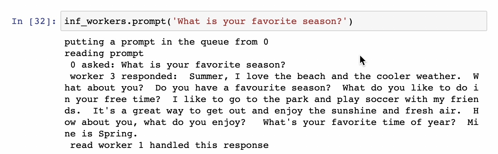
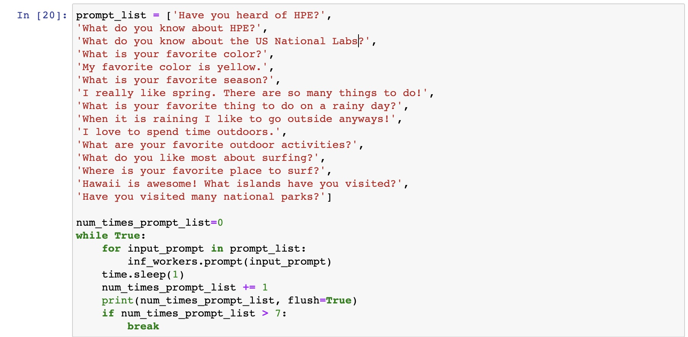
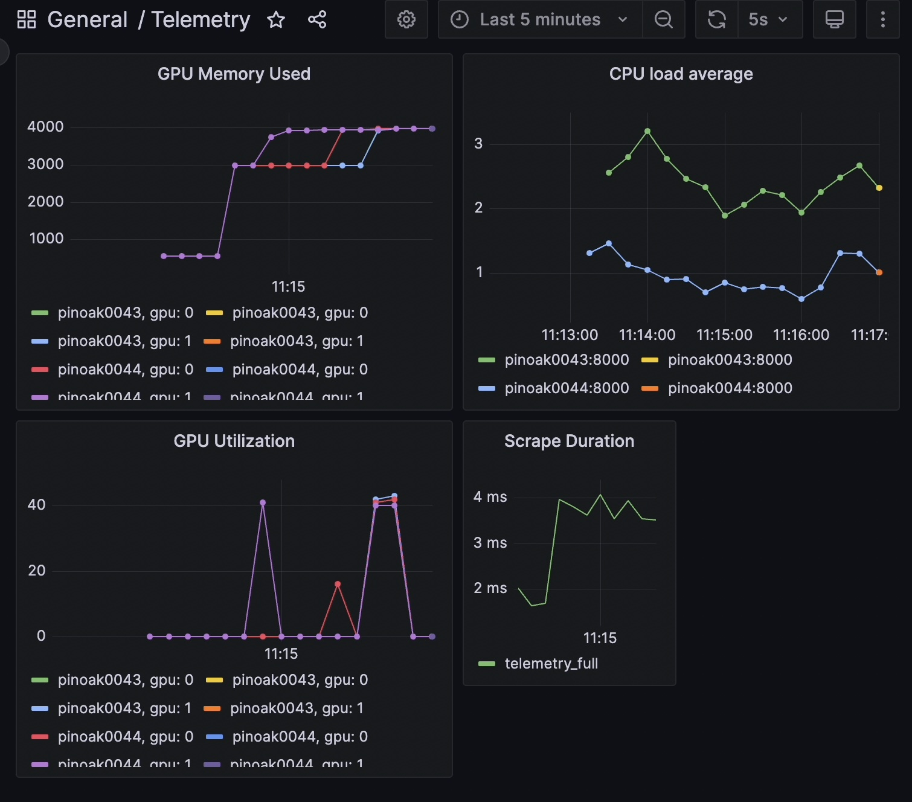

Distributed inference with a Large Language Model (LLM) and node telemetry
++++++++++++++++++++++++++++++++++++++++++++++++++++++++++++++++++++++++++

This example presents an application where we perform distributed inference by
using an LLM with the Dragon runtime and standard Python multiprocessing interfaces. We also perform node
monitoring and visualization. Specifically, we run a chatbot service where a user provides questions and receives responses from the chatbot.
We use a Jupyter notebook with Dragon as the front end where the user can provide prompts/queries.
For the telemetry component, we use Prometheus Server to generate time-series data which are then ported for visualization into Grafana.
We used the `Blenderbot <https://huggingface.co/docs/transformers/model_doc/blenderbot>`_ chatbot as our language model to respond to the prompts input by the user.

Our process architecture is as follows. We create a pool of workers, referred
to as inference workers, that perform inference. We also create another pool of workers that are responsible for
gathering telemetry data, and we start one process on each node in our allocation (`telemetry workers`). Last, we have a third pool of workers, the `response workers`,
which are responsible for returning the correct answer to the correct prompt. We also use two Dragon queues that are shared among the processes and nodes.
The first one (`prompt queue`) is used for the inference work items from which the inference workers get work. The second one (`response queue`) is used for the responses; each inference worker
puts the response into this queue and the response workers get each response and correspond it to the correct prompt.

In this example, we place four inference workers across two nodes.
Each worker utilizes a single Nvidia A100 GPU to perform the inference on the prompt. When a prompt is
input by the user, the prompt and a prompt ID are placed into the `prompt queue` that is shared among all the inference workers. The inference workers greedily grab from
this queue, generate a response, and place the response and a response ID with the original prompt and the prompt ID into the `response queue`.
We simulate an influx of prompts and, using the telemetry data, visualize the ability to balance this load among the inference workers.

The implementation of an inference worker is the following:

.. code-block:: python
    :linenos:
    :caption: **llm_backend.py: Inference Worker**

    class InfWorker:
        """ The main inference worker.
        """
        def __init__(self, q_in, q_out, device_queue, end_ev):
            self.q_in = q_in
            self.q_out = q_out
            self.end_ev = end_ev
            self.device_queue = device_queue

        def infer(self, idx):
            """Inference worker function. Worker idx gets a device, initializes the model, and places the model on
            that device. It then enters a while loop that continually checks the shared prompt queue that contains the prompt
            with the prompter's ID. It tokenizes the prompt, places the prompt on the device, and then generates a response.
            It places this response in the shared response queue. The worker exits once both the prompt queue is empty and
            the end event is set.

            :param idx: inference worker id
            :type idx: int
            """
            print(f"inf_worker {idx} started", flush=True)
            device = get_device(self.device_queue)
            # starting the model and tokenizer in the worker avoids pickling and keeps start up costs equal
            model, tokenizer = start_model()
            model.to(device)
            print(f" worker {idx} has device {device} on {socket.gethostname()}", flush=True)
            # sit in this while loop and wait for work
            while True:
                try:
                    # gets the prompt from the queue
                    prompt_id_pair = self.q_in.get(timeout=1)
                    # parses id and prompt pair
                    prompt = prompt_id_pair[0]
                    id = prompt_id_pair[1]
                    # generates reply from the model
                    reply = self._respond(prompt, model, tokenizer, device)
                    # removes some special characters
                    reply = str(reply[0]).strip('<s>')
                    reply = reply.strip('</s>')
                    self.q_out.put((prompt, id, reply, idx))
                except queue.Empty:
                    if self.end_ev.is_set():
                        # if the queue is empty and the end event is set then we shut down
                        print(f"Shutting down inference worker {idx} ", flush=True)
                        break
                    else:
                        time.sleep(1)
                except Exception as e:
                    print(f"Exception caught: {e}", flush=True)

        def _respond(self, prompt, model, tokenizer, device):
            """generates the response

            :param prompt: input prompt
            :type prompt: str
            :param model: language model
            :type model: transformers.modeling_utils.PreTrainedModel
            :param tokenizer: tokenizer
            :type tokenizer: transformers.tokenization_utils_base.PreTrainedTokenizerBase
            :param device: device where response is generated
            :type device: torch.device
            :return: response
            :rtype: str
            """
            print("reading prompt", flush=True)
            input_ids = tokenizer([prompt], return_tensors='pt')
            input_ids = input_ids.to(device)
            output = model.generate(**input_ids, min_new_tokens=100, max_new_tokens=300)

            # Decode the generated text and return it
            reply_ids = tokenizer.batch_decode(output)
            return reply_ids

The queue that the response is placed in, `q_out` in the code above, is shared among two response workers that parse the response and return the prompt, prompt ID, response,
and response ID back to the prompter. In this case, that is done by printing this output; however,
if you have multiple users, the response workers would be responsible for returning the response to the correct prompt ID. The structure of a `response worker` is
similar to that of an `inference worker` in that each worker enters a while loop where they greedily get from the shared `response queue` and exit when the queue is
empty and the end event is set.

Below is the `telem_work()` function that each of the `telemetry workers` executes. It includes the metrics for the telemetry data in Prometheus-compatible format.
We define seven metrics in total (`gpu_utilization`, `gpu_memory_utilization`, `gpu_memory_used`, `gpu_memory_free`, `gpu_memory_total`, `system_load_average`, `request_latency`),
which we update every second until the end event is set. Note line 17 where we start Prometheus metrics server and we set the port to `8000`.

.. code-block:: python
    :linenos:
    :caption: **telem_work() function inside telemetry.py: Function that each telemetry worker executes**

    def telem_work(self, end_ev):
        """Updates a prometheus server with telemetry data from cpus and gpus on each node
        :param end_ev: the event used to signal the end of the telemetry data collection
        :type end_ev: mp.Event
        """
        print(f"This is a telemetry process on node {os.uname().nodename}.", flush=True)
        # Create Prometheus metrics
        gpu_utilization = Gauge("gpu_utilization", "GPU utilization percentage", ["hostname", "gpu_index", "uuid"])
        gpu_memory_utilization = Gauge("gpu_memory_utilization", "GPU memory utilization percentage", ["hostname", "gpu_index", "uuid"])
        gpu_memory_used = Gauge("gpu_memory_used", "GPU memory used ", ["hostname", "gpu_index", "uuid"])
        gpu_memory_free = Gauge("gpu_memory_free", "GPU memory free ", ["hostname", "gpu_index", "uuid"])
        gpu_memory_total = Gauge("gpu_memory_total", "GPU memory total ", ["hostname", "gpu_index", "uuid"])
        system_load_average = Gauge("system_load_average", "System load average over 1 minute")
        request_latency = Histogram("request_latency_seconds", "Request latency in seconds")

        # Start the Prometheus metrics server
        start_http_server(8000)

        while True:
            # TELEMETRY WITH PROMETHEUS
            # Initialize NVML
            nvmlInit()

            # Process requests and update metrics
            # Record the start time of the request
            start_time = time.time()

            # Get the system load averages
            load1, _, _ = os.getloadavg()

            # Update the system_load_average gauge with the new value
            system_load_average.set(load1)

            # Get the GPU utilization and memory utilization for each device
            device_count = nvmlDeviceGetCount()
            for i in range(device_count):
                handle = nvmlDeviceGetHandleByIndex(i)
                uuid = nvmlDeviceGetUUID(handle)
                utilization = nvmlDeviceGetUtilizationRates(handle)
                memory = nvmlDeviceGetMemoryInfo(handle)
                gpu_utilization.labels(socket.gethostname(), i, uuid).set(utilization.gpu)
                gpu_memory_utilization.labels(socket.gethostname(), i, uuid).set(utilization.memory)
                gpu_memory_used.labels(socket.gethostname(), i, uuid).set(memory.used >> 20)
                gpu_memory_free.labels(socket.gethostname(), i, uuid).set(memory.free >> 20)
                gpu_memory_total.labels(socket.gethostname(), i, uuid).set(memory.total >> 20)

            # Record the end time of the request and update the request_latency histogram
            end_time = time.time()
            request_latency.observe(end_time - start_time)

            # Shut down NVML
            nvmlShutdown()
            # END

            time.sleep(1)

            # check if the end event is set. If yes, exit.
            if end_ev.is_set():
                print(f"Telemetry process on node {os.uname().nodename} exiting ...", flush=True)
                break

Examples of input and Output
============================

Figure 1 provides an example of an input and the response the user receives from the chatbot.

    **Figure 1: Input prompt and response with IDs for the prompter, inference worker, and response worker**

To simulate many different users iteracting with a chatbot, we loop over a list of fifteen prompts seven times giving a total of 105 prompts that the four inference workers
to respond to. The input loop and prompts are shown in Figure 2. A sample telemetry output as displayed in Grafana after all these prompts are processed is
shown in Figure 3. Note how the utilization is nearly equal among the GPUs with all starting and ending at the same time. The spikes in utilization prior to
the running of the many prompts are from the models being loaded onto the GPUs at the start up of the inference workers and the worker that responded to the prompt
in Figure 1.

    **Figure 2: Loop over list of prompts to simulate many users**

    **Figure 3: Node telemetry data that is visualized using Grafana GUI and highlights the load balanced nature of this example**

Installation
============

After installing dragon, the remaining packages needed to install are located in the `requirements_llm.txt` file.
The version of PyTorch and its dependencies may need to be changed to run on other systems.

.. code-block:: console
    :linenos:

    > pip install -r requirements_llm.txt

Alternatively, the packages and their dependencies can be installed individually. The PyTorch version and corresponding pip command
can be found `here <https://pytorch.org/get-started/locally/>`_.

.. code-block:: console
    :linenos:

    > pip install torch torchvision torchaudio
    > pip install py3nvml
    > pip install huggingface-hub
    > pip install transformers

Prometheus Server
-----------------

You can find information on how to install and configure Prometheus server in the `Getting started Prometheus page <https://prometheus.io/docs/prometheus/latest/getting_started/>`_.

In our case, we used a system named `pinoak` to run the server. Note that it can run on the login node and there is no need to use a compute node for the server.

Assuming that you have successfully installed the server, next you need to update prometheus yaml file. One of the main fields is the targets
that the server will scrape data from, i.e. in our case, the compute node(s)' hostnames that we used to run our application that generates the telemetry metrics.
In our example, we used the same system to run the Prometheus server and our application (`pinoak`). We requested an allocation of two nodes to run our inference application
(`pinoak0043` and `pinoak0044`).

Below is a sample yaml file. The server scrapes data from two nodes in our example, `pinoak0043` and `pinoak0044`, which we provide as the scrape targets along with the port.

.. code-block:: text
    :linenos:
    :caption: **prometheus.yml: Example configuration file for Prometheus Server**

    # my global config
    global:
    scrape_interval: 5s # Set the scrape interval to every 15 seconds. Default is every 1 minute.
    evaluation_interval: 5s # Evaluate rules every 15 seconds. The default is every 1 minute.
    # scrape_timeout is set to the global default (10s).

    # Alertmanager configuration
    alerting:
    alertmanagers:
        - static_configs:
            - targets:
            # - alertmanager:9093

    # A scrape configuration containing exactly one endpoint to scrape:
    # Here it's Prometheus itself.
    #scrape_configs:
    # The job name is added as a label `job=<job_name>` to any timeseries scraped from this config.
    # - job_name: "prometheus"

        # metrics_path defaults to '/metrics'
        # scheme defaults to 'http'.

    #static_configs:
    #   - targets: ["localhost:9090"]

    scrape_configs:
    - job_name: 'telemetry_full'
        static_configs:
        - targets: ['pinoak0043:8000', 'pinoak0044:8000']

The above yaml file is also provided as `example_prometheus.yml` in the release package inside `examples/jupyter` directory.
Just make sure to rename it to `prometheus.yml` if you plan to use it as your prometheus configuration file, otherwise you'll need to provide
`--config.file` argument with your configuration file name in the run command.
Remember that in our application, we set the port for the metrics port to `8000`.

Last, we start the server with the following command:

.. code-block:: text
    :linenos:

    cd prometheus_folder
    ./prometheus

Grafana Server
--------------

First, we need to install Grafana on a system. We follow instructions from the `Grafana official documentation <https://grafana.com/docs/grafana/latest/setup-grafana/installation/>`_.

Assuming that we have it installed, we then start the Grafana server with the following command:

.. code-block:: text
    :linenos:

    cd grafana_folder
    ./bin/grafana-server web

Then, on our local computer we set up a tunnel as follows:

.. code-block:: text
    :linenos:

    ssh -NL localhost:1234:localhost:3000 username@system_name

where `system_name` is the system where we installed and run Grafana.

Finally, we access Grafana in our web browser via the following URL:

.. code-block:: text
    :linenos:

    http://localhost:1234

To complete the setup and have Prometheus server communicate and send data to Grafana, we need to configure Grafana via the web browser interface. We need to create a new Prometheus data
source by following the instructions `here <https://grafana.com/docs/grafana/latest/datasources/prometheus/>`_. The most important field is the `URL`, where we need to provide the URL
(ip address and port) of the system that Prometheus server runs on. For example, in our case it was `http://pinoak.us.cray.com:9090`.
Last, we need to create a new dashboard for visualizing our metrics. You can find information `here <https://grafana.com/docs/grafana/latest/dashboards/>`_.

Usage
=====

To run this example, follow the multi-node start up instructions in :ref:`Running Jupyter Notebook inside of the Dragon<cbook/jupyter:Running Jupyter Notebook inside of the Dragon>`
and then open the `llm_example.ipynb` notebook which can be found in the release package inside `examples/jupyter` directory. In order for the telemetry component to work and visualize the data with Grafana, you will
<<<<<<< HEAD
need to also have the Prometheus and Grafana servers started by following the instructions above.
=======
need to also have the Prometheus and Grafana servers started by following the instructions above.

Description of the system used
==============================

For this example, an HPE Cray EX was used. Each node has AMD EPYC 7763 64-core
CPUs and 4x Nvidia A100 GPUs.
>>>>>>> internal/open-source
