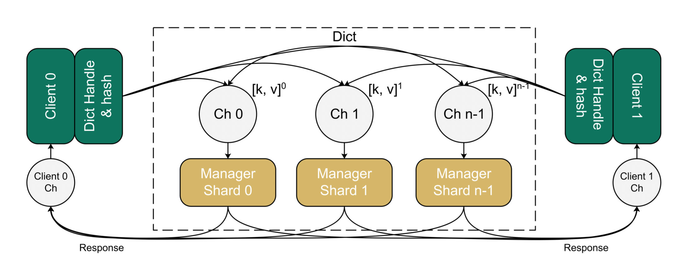
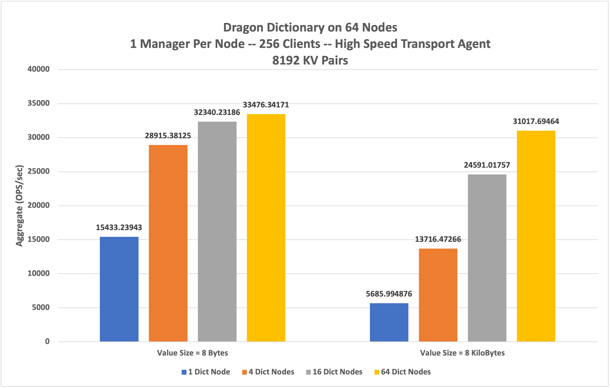

Distributed Dragon Dictionary
++++++++++++++++++++++++++++++++++++++++++++++
Dragon provides the core capabilities needed to implement an efficient multi-node dictionary. With Dragon's transparent multi-node support, the
Distributed Dragon Dictionary delivers a powerful communication foundation that is dynamic and flexible enough for distributed services.
Additionally, Dragon managed memory is capable of efficient shared memory partitioning, which satisfies many of the requirements for handling arbitrary data
structures in a dictionary. The Distributed Dragon Dictionary uses these technologies along with namespace and process management services of Dragon to provide
a highly productive and simple to use tool for communication among a set of distributed processes.

Architecture of Dragon Dictionary
--------------------------------

    **High-level architecture of a Dragon Dictionary**

From Python code, a user instantiates a dragon dictionary specifying the number of back-end managers. During bring-up of a dragon dictionary,
a pool of manager processes are started along with a collection of dragon channels used for communication between clients and managers. Each of the managers
supporting the dragon dictionary holds a shard of the distributed dictionary and has a dedicated input connection it monitors for operation requests,
such as a put or get, coming from any client. The manager processes are also associated with a pool that stores the (key, value) pairs of the dictionary.
Once initialized, a dragon dictionary can be shared with other processes. A common hash function translates a key to one of the manager channels.
This translation occurs entirely local to a client process and allows the dictionary to efficiently scale.

Example of Dragon Dictionary shared by the multiprocessing (mp) processes
------------------------------------------------------------------------
Here we show a simple demonstration of the dragon dictionary functionality with distributed clients, using the dictionary object. With the current dragon
multiprocessing implementation, each new process is spawned on a new node in a round-robin fashion in a multinode setup. The dictionary is instantiated spawning
across two-nodes with one manager process on each node. Each manager process is also associated with a pool of size 2GB. Client Process 1 picks a dictionary object,
and stores the (key, value) pair ("Hello", "Dragon"), while client process 2 retrieves the value from the dictionary using the same key. This demonstrates the object
can be shared across the client processes to perform data storage operations on the dictionary.

.. code-block:: python
    :linenos:
    :caption: **distributed_dict_client.py: store and retrieve value from mp client processes using dragon dictionary**

    import dragon
    import argparse
    import multiprocessing as mp
    from dragon.data.distdictionary.dragon_dict import DragonDict

    def _retrieve_value(_dict, key, client_id):
        value = _dict[key]
        print(f'Retrieving value:{value} for key:{key} for client id:{client_id} from the dictionary', flush=True)
        return value

    def _store_key_value(_dict, key, value, client_id):
        print(f'Storing key:{key} and value:{value} from client id:{client_id} into the dictionary', flush=True)
        _dict[key] = value

    if __name__ == "__main__":
        parser = argparse.ArgumentParser(description='Distributed dictionary example')
        parser.add_argument('--num_nodes', type=int, default=1,
                            help='number of nodes the dictionary distributed across')
        parser.add_argument('--managers_per_node', type=int, default=1,
                            help='number of managers per node for the dragon dict')
        parser.add_argument('--total_mem_size', type=int, default=1,
                            help='total managed memory size for dictionary in GB')

        my_args = parser.parse_args()
        mp.set_start_method("dragon")

        # Instantiate the dictionary and start the processes
        total_mem_size = my_args.total_mem_size * (1024*1024*1024)
        dd = DragonDict(my_args.managers_per_node, my_args.num_nodes, total_mem_size)

        client_proc_1 = mp.Process(target=_store_key_value, args=(dd, "Hello", "Dragon", 1))
        client_proc_1.start()
        client_proc_1.join()

        client_proc_2 = mp.Process(target=_retrieve_value, args=(dd, "Hello", 2))
        client_proc_2.start()
        client_proc_2.join()

        print("Done here. Closing the Dragon Dictionary", flush=True)
        dd.close()

The lines below show the output of the above code where client process with id:1 stores and client process with id:2 retrieves the value from the dictionary

.. code-block:: text
    :linenos:

    >$dragon distributed_dict_client.py --num_nodes=2 --managers_per_node=1 --total_mem_size=2
    Storing key:Hello and value:Dragon from client id:1 into the dictionary
    Retrieving value:Dragon for key:Hello for client id:2 from the dictionary
    Done here. Closing the Dragon Dictionary

Results on a multi-node setup
--------------------------------
Below are the results of aggregated operations on a dragon dictionary with a 64 node setup and High Speed Transport Agent (HSTA). The results are
collected with 256 distributed client processes performing the operations on dictionary in parallel with a total of 8192 kv pairs in the dictionary.
The dictionary is spawned from across 1 node to 64 nodes with each manager worker per node. The value sizes are varied with 8 bytes and 8 kilobytes,
with each key of constant size of 30 bytes in the dictionary. The results clearly demonstrate the advantage of distributed dictionary, with increased
aggregated rate of opearations as the dictionary managers are spawned across the increasing number of nodes.

    **Results on a multi-node setup**
