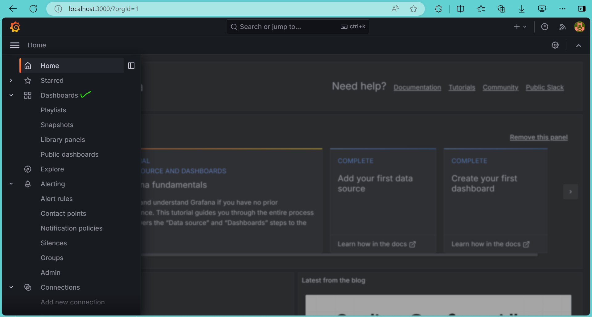
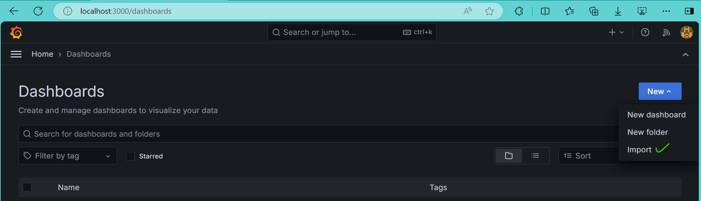
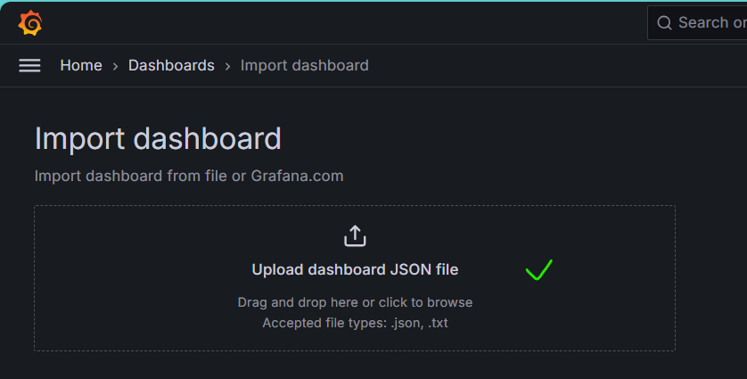
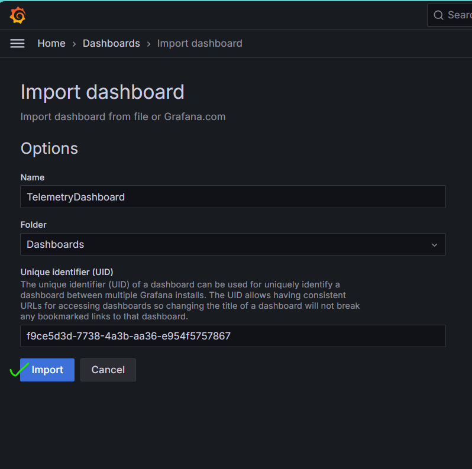

Example Using Dragon Telemetry
++++++++++++++++++++++++++++++

The Telemetry feature enables users to monitor and collect data on critical factors like system performance, and resource utilization.
Being able to visualize and gain deep insights on these metrics is crucial for optimizing resource allocation, identifying and diagnosing issues and ensuring the efficiency of compute nodes.
Telemetry comes with the option to add custom metrics tailored to the user application unique needs. This can be done using a simple interface that we have provided.

Why not Prometheus?
Prometheus is an open-source monitoring tool that collects and stores metrics as time-series data. Prometheus and Grafana are widely used together for telemetry services.
Dragon Telemetry is implemented on top of the Dragon infrastructure, which helps improve scalability of Telemetry as the user application scales up.
All off-node communication is happening over Dragon so, when applicable, the high-speed transport agent is used.
It avoids the use of third-party software and enables users to monitor both user specific metrics and Dragon specific metrics.

The program below demonstrates how users can add custom metrics:

.. literalinclude:: ../../examples/dragon_telemetry/scipy_scale_work.py

Telemetry Interface for User Application
========================================

We have exposed the following methods for users to add user generated data

Method: ``add_data``

Description: Insert user defined metrics to node local database. Currently there is not a way to write data into the same metric name from multiple processes on the same node and visualize that data separated by the process ID in Grafana. We do plan to support that in the future.

===============  =================  ====================================================================================================================================
fields           type               description
---------------  -----------------  ------------------------------------------------------------------------------------------------------------------------------------
ts_metric_name   string *required*  Metric name to store data
ts_data          float *required*   Metric value (time-series)
timestamp        int *optional*     Time stamp for data, defaults to current time
telemetry_level  int *optional*     Telemetry data level for storing metric. Only stores if data level is less than or equal to telemetry level specified during launch.
===============  =================  ====================================================================================================================================

Method: ``finalize``

Description: Indicate that user application has finished running, and that Telemetry services can be shut down.

NOTE: If this method is not called, Telemetry will not get the message that it has to shutdown, and user will have to sigterm/Ctrl+C to exit.

Installation
============

After installing dragon, the only other dependency that needs to be manually installed is the user's Grafana server.

Grafana can be downloaded `here <https://grafana.com/grafana/download?edition=oss>`_. We suggest following the instructions provided by Grafana to install Grafana locally. Telemetry has been verified to be working with Grafana v12.1.0 (current latest) and is compatible with all versions starting from v10.4.x.

We have created a custom config YAML for Grafana OpenTSDB connection setup that can be found in ``/dragon/telemetry/imports/custom.yaml``
Place this file where you have installed Grafana in ``grafana/conf/provisioning/datasources``.
**Do not replace default.yml**

We have also provided a custom dashboard that can be found in ``/dragon/telemetry/imports/Grafana_DragonTelemetryDashboard.json``

For convenience, those files are shown below:
  1. Config YAML for Grafana OpenTSDB Connection

  .. container:: custom

      .. literalinclude:: ../../src/dragon/telemetry/imports/custom.yaml

  2. Config YAML for Grafana OpenTSDB Connection

  .. literalinclude:: ../../src/dragon/telemetry/imports/Grafana_DragonTelemetryDashboard.json

Steps to import -
=================

1. Go to the Dashboard section in Grafana

2. Click on the New (dropdown) in the top right corner and select Import.

3. Upload the custom JSON config.

4. Click on Import. You should see the dashboard.

Description of the system used
==============================

For this example, an HPE Cray EX was used. Each node has AMD EPYC 7763 64-core
CPUs.

How to run
==========

There are two instances where port forwarding is required. These two port forwards together give Grafana access to the Aggregator to make requests for data.

1. Aggregator
    - Compute node to login node
    - The command for this will be printed in the output when the application is run with the telemetry flag
    - Example -  ``ssh command: ssh -NL localhost:4242:localhost:4242 pinoak0027``
    - NOTE: Run this step only after the command has been printed for you.
2. Grafana to Aggregator
    - This step may vary depending on where Grafana server is installed and running
    - If Grafana is on localhost (laptop):
        - On laptop - ``ssh -NL localhost:4242:localhost:4242 <user>@<login-node>``
    - NOTE: This can be setup anytime and left running. This provides Grafana access to the dragon implementation of the OpenTSDB datasource. Users should still use the default ``http://localhost:3000`` to open Grafana in their browser.

Note, that what we describe here assumes that the user can ssh to a specific login node and then ssh to the specific compute node. If there are extra proxies that the users are required to jump through then extra tunnels will need to be set up. If there are multiple login nodes, make sure that the tunnels are set up to use the same login node. If the login node is chosen non-deterministically, using ``ssh -NR`` from the login node back to the proxy is a potential solution.

Example Output when run on 4 nodes with telemetry enabled
==========================================================

.. code-block:: console
    :linenos:
    :caption: **Output when running scipy_scale_work.py with telemetry enabled and some user generated metrics**

    > salloc -N 4
    > dragon --telemetry-level=2 scipy_scale_work.py --dragon --num_workers 512 --iterations 4 --burns 1 --size 32 --mem 33554432 --work_time 0.5
    ssh command: ssh -NL localhost:4242:localhost:4242 pinoak0027
    using dragon runtime
    Number of images: 32768
    Number of workers: 512
    Time for iteration 0 is 39.586153381998884 seconds
    Time for iteration 1 is 34.648637460995815 seconds
    Time for iteration 2 is 35.434623396999086 seconds
    Time for iteration 3 is 33.31561650399817 seconds
    Time for iteration 4 is 33.696790750007494 seconds
    Average time: 34.27 second(s)
    Standard deviation: 0.83 second(s)

Troubleshooting
=============================
Listed below are some scenarios that we ran into and the steps we took to solve them.

1. Metrics aren't showing up on Grafana dashboard panels
    - You might encounter this the first time running Grafana and Telemetry
    - Verify that Grafana is able to access Telemetry -
        - Go to the Datasources tab in the navigation.
        - Select OpenTSDB, scroll to the bottom and click on the Save and Test button.
        - You should see a connection confirmation indicated by a green notification. If you don't, double check ssh tunnels. Check for messages like: "open failed: connect failed: Connection refused"
    - Refresh Grafana Panels individually
        - Click on the Edit option of any panel.
        - Click on the Datasource dropdown and re-select OpenTSDB
        - Click on the Metric dropdown and re-type the metric name.
        - Click on Apply (top-right corner)
        - Repeat for all panels
    - Save the Dashboard
