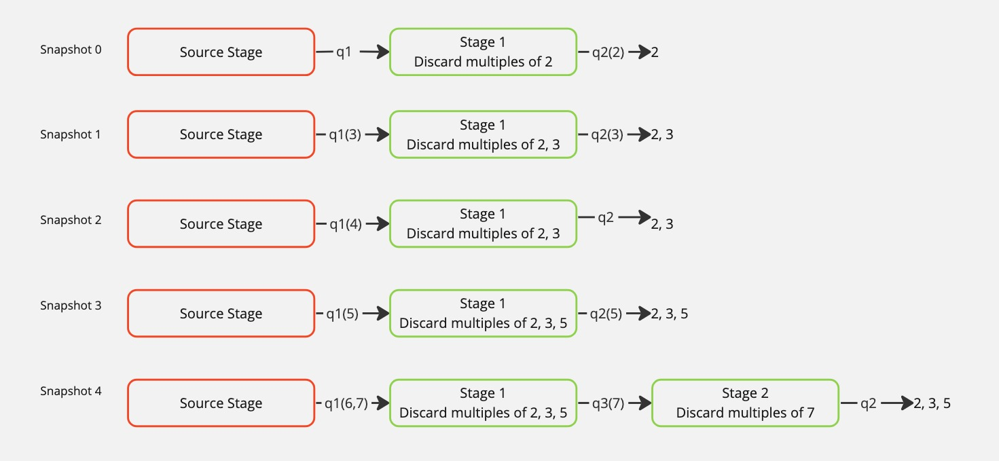

.. _cbook_pipeline:

Creating and Using a Pipeline with Multiprocessing
+++++++++++++++++++++++++++++++++++++++++++++++++++

With DragonHPC it is easy to distribute computation over a collection of nodes
and cores. In addition, it can be distributed dynamically. Consider a prime
number sieve, the Sieve of Eratosthenes. This example demonstrates building a
pipeline on-the-fly while getting results from it as they become available.

The complete code for this example is provided in
examples/multiprocessing/prime_numbers.py.

    **Dynamic Growth of Prime Number Pipeline**

Consider the code in :numref:`prime_setup`. Snapshot 0 in :numref:`pipelinepic`
depicts the state of the program just after startup. The *main* function creates
a *PrimeNumberPipeline* object and calls *start* which creates two queues and two
processes. The source process generates all numbers to be consider for primeness.
The pipeline stage process receives integers from its input queue and forwards them on
if they are relatively prime to the primes held in that stage.

Initially (i.e. in *snapshot 0*) the output from the stage goes directly to the
sink queue where the user's program will be receiving the prime numbers that made
it through the sieve, in this case the *main* program.

Notice that in the code there is nothing that specifies where these processes are
run. They could be run on any node. They could all be run on the same node. The
program is not written any different either way, unless the programmer really
wants to have more control over placement of these processes.

.. code-block:: python
    :linenos:
    :caption: **The Prime Number Pipeline Startup Code**
    :name: prime_setup

    class PrimeNumberPipeline:

        ...

        def start(self):
            self._source_queue = mp.Queue(maxsize=PrimeNumberPipeline.MAX_QUEUE_DEPTH)
            self._sink_queue = mp.Queue(maxsize=PrimeNumberPipeline.MAX_QUEUE_DEPTH)
            self._source_proc = mp.Process(target=PrimeNumberPipeline.source, args=(self._max_number, self._source_queue))
            self._source_proc.start()
            self._sink_queue.put(2) # "Prime" the sink queue ;)
            self._stage_proc = mp.Process(target=PrimeNumberPipeline.pipeline_stage, args=(self._stage_size, 2, self._source_queue, self._sink_queue))
            self._stage_proc.start()

        def stop(self):
            self._source_proc.join()
            self._stage_proc.join()

        def get(self):
            return self._sink_queue.get()

    def main():
        # We set the start method to dragon to use dragon multiprocessing.
        mp.set_start_method('dragon')

        # We can control the pipeline by max_number and stage_size. The
        # stage_size can control the amount of parallelism.
        prime_pipeline = PrimeNumberPipeline(stage_size=3, max_number=100)
        prime_pipeline.start()
        print('Prime numbers:')
        count = 0
        for prime in iter(prime_pipeline.get, PrimeNumberPipeline.SENTINEL):
            text = f'{prime} '
            print(text, end="", flush=True)
            count+= len(text)
            if count > 80:
                count = 0
                print(flush=True)
        print(flush=True)
        prime_pipeline.stop()

    if __name__ == "__main__":
        main()

Taking a look at the pipeline_stage code in :numref:`prime_stage` the code is
given a prime number when started to add to its list of primes. The stage will
check that a number received from the input queue to the stage is relatively
prime to the list of *primes* for the stage. If the new number is found to be
relatively prime it is added to the list of primes for that stage if the list has
not grown too large. In this way, each process in the pipeline can do a certain
amount of sequential work which is tunable, depending on performance of the
application.

When a stage has reached the capacity of the *primes* list, then a new stage is
started as shown in *snapshot 4*. The new stage is passed a number that is the
first prime greater than the primes in the previous stage. Lines 36-41 of
:numref:`prime_stage` is the code that recognizes a new stage is needed, creates
it, and splices it into the pipeline. Notice that the way the new pipeline stage
is spliced in, the original output queue remains the final output queue. In other
words the writing end of that queue is passed from one process to another. It is
that simple with multiprocessing and DragonHPC to pass around queues. You can
pass queues around and they are managed accordingly. This might mean
passing the queue on to a process that is on a completely different node. There
is a lot of very subtle power in the DragonHPC implementation of multiprocessing.

.. code-block:: python
    :linenos:
    :caption: **The Prime Number Pipeline Stage Code**
    :name: prime_stage

    class PrimeNumberPipeline:

        @staticmethod
        def pipeline_stage(stage_size, prime, in_queue, out_queue):
            # A stage is given a prime from which to start. All other
            # primes it finds (up to the stage size) are added to this
            # list of primes to check.
            primes = [prime]
            stage_proc = None

            # This is the number of primes (relative to primes) that this
            # stage has found.
            cur_count = 1

            while True:
                number = in_queue.get()

                # We terminate via a sentinel value.
                if number == PrimeNumberPipeline.SENTINEL:
                    out_queue.put(PrimeNumberPipeline.SENTINEL)
                    if stage_proc is not None:
                        stage_proc.join()
                    print(f'\nprimes in pipeline stage are {primes}', flush=True)
                    return

                if PrimeNumberPipeline.is_relatively_prime(number, primes):
                    # It is relatively prime, so send it to the output queue
                    out_queue.put(number)

                    # If it is found to be relatively prime, we add it to the
                    # list of primes or we create a new stage with it (which
                    # in turn builds its list of primes).
                    if cur_count < stage_size:
                        primes.append(number)

                    elif cur_count == stage_size:
                        # create a new pipeline stage
                        new_stage_queue = mp.Queue(maxsize=PrimeNumberPipeline.MAX_QUEUE_DEPTH)
                        stage_proc = mp.Process(target=PrimeNumberPipeline.pipeline_stage, args=(stage_size, number, new_stage_queue, out_queue))
                        out_queue = new_stage_queue
                        stage_proc.start()
                    else:
                        # It was checked/will be checked by other stages in the pipeline
                        pass

                    # Number of relatively prime primes found for this stage.
                    cur_count+=1

Of course as we progress through the sequence of prime numbers the pipeline
grows. So this application will scale to a large number of prime numbers, but
what is really amazing is that the same program will execute on your laptop, just
not with the same performance as a supercomputer.

The other subtlety in this program is that no stage is going to get too far ahead
in its processing. The *MAX_QUEUE_DEPTH* constant sets the allowable size of the
queue. No stage will get further ahead than *MAX_QUEUE_DEPTH* because the *put*
(line 28) and *get* (line 16) operations apply backpressure to processes. The
*put* and *get* operations will block and therefore suspend a pipeline stage that
gets to far ahead of its neighbors.

In the end this program demonstrates the dynamic nature of DragonHPC and its
ability to dynamically construct workflows and re-route data at run-time. It also
demonstrates the location independence of synchronization and communication
objects in multiprocessing. Finally, it demonstrates the implicit flow control
that is possible within these workflows which is managed by the ability of
DragonHPC to apply backpressure on processes.