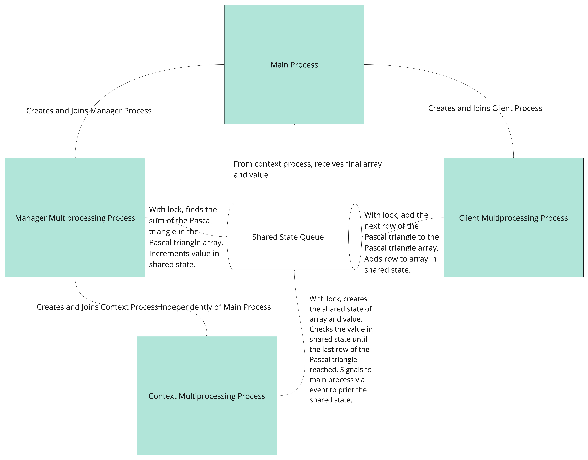

Shared State Example Utilizing Pascal Triangle
=================================================

In this example, we demonstrate that the Dragon multiprocessing interface can be used to create a simple shared state example. We utilize the Pascal triangle which is a method for calcuating coefficients for binomial expansions. 
The manager multiprocessing process and the client multiprocessing process communicate via a shared state spawned by the context multiprocessing process.
The main multiprocessing process will start the manager and client multiprocessing processes. The manager process finds the sum of the Pascal triangle array calcualated by the client process. 
The third multiprocessing process spawned by the context class finds when the Pascal triangle has been completed. 
The shared state that contains the Pascal triangle array and the Pascal triangle sum is guarded by a lock; only the process that accesses the lock may alter the array and value. 

:numref:`sharedstate_pascal_triangle` presents the code flow for the manager-client-shared state communication utilizing a common queue.

    **Example Pascal-Triangle SharedState Program*

How to run
==========

The following code shows how a shared state passed between the manager, client, and context Dragon multiprocessing processes can be used to compute all the elements of the Pascal triangle 
and the sum of all the elements in the Pascal triangle given the number of rows of the Pascal triangle of interest:

.. literalinclude:: ../../examples/multiprocessing/shared_state_pascal_triangle.py

The following output is expected when the user provides the row input of 5:

.. code-block:: console
    :linenos:

    > dragon shared_state_pascal_triangle.py --rows 5
    Pascal Triangle Array Calculated for 5 rows from the Pascal row of 0 to the Pascal row of 5 , and the associated sum of the Pascal triangle array.
    Pascal Triangle Array [1, 1, 1, 1, 1, 2, 1, 1, 3, 3, 1, 1, 4, 6, 4, 1]
    Pascal Triangle Sum: 32