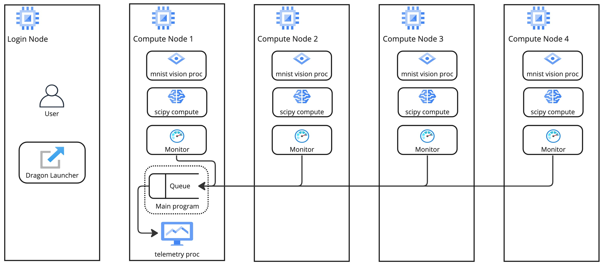

Multi-node process orchestration and node telemetry
+++++++++++++++++++++++++++++++++++++++++++++++++++

This is an example of running ensembles of PyTorch and SciPy jobs with the Dragon runtime as well as gathering telemetry data using queues and events.
It demonstrates the life-cycle management of many different processes and node monitoring using Dragon Multiprocessing.

In this example, we gather gpu utilization and the average cpu load over 1 minute. The SciPy job is similar to the one described in the
:ref:`SciPy Image Convolution Benchmark<cbook/mp_scipy_image:SciPy Image Convolution Benchmark>`. The PyTorch job is similar to the
`PyTorch MNIST example <https://github.com/pytorch/examples/tree/main/mnist>`_ and only differs in that each worker trains with a different learning rate.
Currently only Nvidia GPUs are supported since we utilize the py3nvml package to gather the GPU utilization. AMD GPUs can be utilized by gathering similar
info via rocm-smi directly.

The example consists of four components:

* cpu computation: image processing using the SciPy library
* gpu computation: training on the MNIST dataset
* monitor processes: we start a single process on each node. Every such process gathers telemetry data and pushes the data into a single queue that is shared among the nodes
* a post-processing process: this process gets the data from the queue, processes the data and then prints it. This process can live on any of the nodes, depending on the allocation scheme of Dragon. For now, Dragon follows a round-robin allocation over the available nodes. In the future, Dragon will provide different allocation schemes for the user to choose.

We start a pool of workers for the mnist computation, a different pool of workers for the SciPy computation, as many monitor processes as the number of nodes
that Dragon uses (it could be a subset of the node allocation) and a single post-processing process. All the workers are distributed across the available nodes.

Figure 1 presents the structure of a toy example with 4 compute nodes and shows the basic architecture and process placement. The shared queue
lives on the same node as the process that created it. In our example, the head/main process creates the queue. The user main program and the head/main process
live on compute node 1.

    **Figure 1: Structure of the multi-node process orchestration and node telemetry demo on an allocation of 4 compute nodes**

This example consists of the following python files:

* `telemetry_full.py` - This is the main file. It imports the other files and orchestrates the telemetry work. It contains telem_work, which is the function launched on every node that gathers telemetry data and pushes it to a shared queue, and post_process, which is launched only on one node and reads the telemetry data from the queue and then prints that information.

* `telem.py` - This file has all the functions used to gather telemetry data on each node. It relies heavily on py3nvml to gather this data.

* `mnist.py` - This contains the functions used to run the mnist jobs and utilizes dragon queues to orchestrate GPU placement.

* `conv.py` - This contains all of the functions used for the SciPy convolution jobs.

Below, we present the main python code (`telemetry_full.py`) which acts as the coordinator of the whole demo, that combines all the different components.
The code of the other files can be found in the release package, inside `examples/multiprocessing/torch-scipy-telemetry` directory.

.. code-block:: python
    :linenos:
    :caption: **telemetry_full.py: Multi-node process orchestration and node telemetry with Dragon Multiprocessing**

    import dragon
    from dragon.globalservices.node import get_list, query_total_cpus
    import multiprocessing as mp
    import argparse
    import time
    import os
    import queue

    import functools
    import mnist
    import telem as tm
    import conv

    def get_args():
        """Get the user provided arguments
        :return args: input args from command line
        :rtype args: ArgumentParser object
        """
        parser = argparse.ArgumentParser(description="SciPy and MNIST test with telemetry")
        parser.add_argument("--scipy_workers", type=int, default=2, help="number of scipy workers (default: 2)")
        parser.add_argument("--mnist_workers", type=int, default=2, help="number of mnist workers (default: 2)")
        parser.add_argument('--bars', action='store_true', default=False,
                            help='uses tqdm bars to print telemetry info')
        parser.add_argument('--no-cuda', action='store_true', default=False,
                            help='disables CUDA training')
        parser.add_argument("--size", type=int, default=1024, help="size of the array (default: 1024)")
        parser.add_argument(
            "--mem", type=int, default=(1024 * 1024 * 1024), help="overall footprint of image dataset to process (default: 1024^3)"
        )
        parser.add_argument('--batch-size', type=int, default=64, metavar='N',
                            help='input batch size for training (default: 64)')
        parser.add_argument('--test-batch-size', type=int, default=1000, metavar='N',
                            help='input batch size for testing (default: 1000)')
        parser.add_argument('--epochs', type=int, default=14, metavar='N',
                            help='number of epochs to train (default: 14)')
        parser.add_argument('--gamma', type=float, default=0.7, metavar='M',
                            help='Learning rate step gamma (default: 0.7)')
        parser.add_argument('--seed', type=int, default=1, metavar='S',
                            help='random seed (default: 1)')
        args = parser.parse_args()

        my_args = parser.parse_args()
        return my_args

    def telem_work(q, start_ev, end_ev):
        """This is used by every monitoring process. It gathers telemetry data
        for CPU and GPU utilization and pushed it into the shared queue.

        :param q: shared queue that stores the telemetry data for each node
        :type q: Dragon Multiprocessing Queue
        :param start_ev: event that signals the beginning of monitoring
        :type start_ev: Event
        :param end_ev: event that signals the end of monitoring
        :type end_ev: Event
        """
        print(f"This is a telemetry process on node {os.uname().nodename}.", flush=True)
        start_ev.wait() # wait until the starting event is set
        while True:
            gpu_info_list = tm.call_nvml()
            # one process on each node adds to a shared queue
            q.put(gpu_info_list)
            time.sleep(1)

            # check if the end event is set. If yes, exit.
            if end_ev.is_set():
                print(f"Telemetry process on node {os.uname().nodename} exiting ...", flush=True)
                break

    def post_process(q, start_ev, end_ev, tqdm_bars):
        """This is used by the single post-processing process
        that gets the telemetry data from the shared queue and
        prints it.

        :param q: shared queue that stores the telemetry data for each node
        :type q: Dragon Multiprocessing Queue
        :param start_ev: event that signals the beginning of monitoring
        :type start_ev: Event
        :param end_ev: event that signals the end of monitoring
        :type end_ev: Event
        :param tqdm_bars: flag that signals whether to use bars or not for the presentation of the telemetry data
        :type tqdm_bars: Boolean
        """
        print(f"This is the postprocessing process, {os.uname().nodename}.", flush=True)
        start_ev.wait() # wait until the starting event is set
        tqdm_dict = {} # used when bars are used for the presentation of the telemetry data
        while True:
            # single process reads from the shared queue and prints results
            try:
                results_telem = q.get(timeout=10)
                if tqdm_bars:
                    tm.updateTelemDict(results_telem, tqdm_dict, deviceID=None)
                else:
                    tm.printTelem(results_telem)
            # when the queue is empty, exit
            except queue.Empty:
                print("Post process is exiting", flush=True)
                break
            except Exception as e:
                print(f"Exception caught: {e}", flush=True)

    if __name__ == "__main__":
        args = get_args()
        print(f"Hello from main process {os.uname().nodename}.", flush=True)
        print("using dragon runtime", flush=True)
        mp.set_start_method("dragon")

        # get the list of nodes from Global Services
        nodeslist = get_list()
        nnodes = len(nodeslist)

        num_mnist_workers = args.mnist_workers
        assert num_mnist_workers > 1
        num_cpus = args.scipy_workers
        print(f"Number of nodes: {nnodes}", flush=True)
        print(f"Number of scipy workers: {num_cpus}", flush=True)
        print(f"Number of MNIST workers: {num_mnist_workers}", flush=True)

        # variable used to signal whether to use bars for the presentation of data or not
        use_bars = args.bars

        # Initialize the shared queue among the nodes
        # that is used for the communication of the telemetry data
        q = mp.Queue()

        # event used to signal the beginning of monitoring processes
        start_ev = mp.Event()
        # event used to signal the end of monitoring processes
        end_ev = mp.Event()

        # Create a process that gets and processes the telemetry data
        post_proc = mp.Process(target=post_process, args=(q, start_ev, end_ev, use_bars))
        post_proc.start()

        # Create a process on each node for monitoring
        procs = []
        for _ in range(nnodes):
            proc = mp.Process(target=telem_work, args=(q, start_ev, end_ev))
            proc.start()
            procs.append(proc)

        # Create a pool of workers for the scipy work
        time.sleep(5)
        scipy_data = conv.init_data(args)
        scipy_pool = mp.Pool(num_cpus)

        # Create a pool of workers for the mnist work
        deviceQueue = mnist.buildDeviceQueue()
        lr_list=[1/(num_mnist_workers-1)*i + 0.5 for i in range(num_mnist_workers)]
        mnist_lr_sweep_partial = functools.partial(mnist.mnist_lr_sweep, args, deviceQueue)
        mnist_pool = mp.Pool(num_mnist_workers)

        # start telemetry
        start_ev.set()

        # launch scipy and mnist jobs
        print(f"Launching scipy and mnist jobs", flush=True)
        workers_mnist = mnist_pool.map_async(mnist_lr_sweep_partial, lr_list,1)
        workers_scipy = scipy_pool.map_async(conv.f, scipy_data)

        # wait on async processes
        mnist_pool.close()
        mnist_pool.join()
        scipy_pool.close()
        scipy_pool.join()

        # set the event to signal the end of computation
        time.sleep(10)
        print(f"Shutting down procs", flush=True)
        end_ev.set()

        # wait on the monitoring processes and the post-processing process
        for proc in procs:
            proc.join()
        post_proc.join()
        q.close()

        for result in workers_mnist.get():
            print(f'Final test for learning rate {result[0]}: loss: {result[1]} accuracy: {result[2]}', flush=True)

Usage
=====

It is used as follows:

.. code-block:: console
    :linenos:

    dragon telemetry_full.py [-h] [--scipy_workers NUM_SCIPY_WORKERS] [--mnist_workers NUM_MNIST_WORKERS] [--bars]
                             [--no-cuda] [--size ARRAY_SIZE] [--mem IMAGE_MEM_SIZE] [--batch-size BATCH_SIZE]
                             [--test-batch-size TEST_BATCH_SIZE] [--epochs NUM_EPOCHS] [--gamma GAMMA]
                             [--seed SEED]

Optional arguments:
===================

.. code-block:: console
    :linenos:

    -h, --help            show this help message and exit

    --scipy_workers NUM_SCIPY_WORKERS
                        number of scipy workers (default: 2)
    --mnist_workers  NUM_MNIST_WORKERS
                        number of mnist workers (default: 2)
    --bars
                        uses tqdm bars to print telemetry data
    --no-cuda
                        disables CUDA training
    --size ARRAY_SIZE
                        size of the array (default: 1024)
    --mem IMAGE_MEM_SIZE
                        overall footprint of image dataset to process (default: 1024^3)
    --batch-size BATCH_SIZE
                        input batch size for training (default: 64)
    --test-batch-size TEST_BATCH_SIZE
                        input batch size for testing (default: 1000)
    --epochs NUM_EPOCHS
                        number of epochs to train (default: 14)
    --gamma
                        Learning rate step gamma (default: 0.7)
    --seed
                        random seed (default: 1)

Installation
============

After installing dragon, the remaining packages needed to install are located in the requirements.txt file.
The version of PyTorch and it's dependencies may need to be made to run on other systems.

.. code-block:: console
    :linenos:

    > pip install -r requirements.txt

Alternatively, the packages and their dependencies can be installed individually. The PyTorch version and corresponding pip command
can be found `here <https://pytorch.org/get-started/locally/>`_.

.. code-block:: console
    :linenos:

    > pip3 install torch torchvision torchaudio
    > pip install py3nvml
    > pip install tqdm
    > pip install scipy

<<<<<<< HEAD
=======
Description of the system used
==============================

For this example, an HPE Cray EX was used. Each node has AMD EPYC 7763 64-core
CPUs and 4x Nvidia A100 GPUs.

>>>>>>> internal/open-source
How to run
==========

Example Output when run on 2 nodes with 2 MNIST workers and 2 SciPy workers on Pinoak
-------------------------------------------------------------------------------------

.. code-block:: console
    :linenos:

    > salloc --exclusive -N 2 -p allgriz
    > dragon telemetry_full.py
    Hello from main process pinoak0033.
    using dragon runtime
    Number of nodes: 2
    Number of scipy workers: 2
    Number of MNIST workers: 2
    This is a telemetry process on node pinoak0033.
    Number of images: 1024
    This is a telemetry process on node pinoak0034.
    This is the postprocessing process, pinoak0034.
    Launching scipy and mnist jobs
    nodename: pinoak0033 cpu load average 1 minute: 0.17 device # 0 utilization: 0.00%
    nodename: pinoak0034 cpu load average 1 minute: 0.34 device # 0 utilization: 0.00%
    nodename: pinoak0033 cpu load average 1 minute: 0.17 device # 0 utilization: 0.00%
    nodename: pinoak0034 cpu load average 1 minute: 0.34 device # 0 utilization: 0.00%
    nodename: pinoak0033 cpu load average 1 minute: 0.17 device # 0 utilization: 0.00%
    nodename: pinoak0034 cpu load average 1 minute: 0.72 device # 0 utilization: 0.00%
    nodename: pinoak0033 cpu load average 1 minute: 0.31 device # 0 utilization: 0.00%
    nodename: pinoak0033 cpu load average 1 minute: 0.31 device # 0 utilization: 0.00%
    nodename: pinoak0033 cpu load average 1 minute: 0.31 device # 0 utilization: 1.00%
    nodename: pinoak0033 cpu load average 1 minute: 0.31 device # 0 utilization: 0.00%
    nodename: pinoak0033 cpu load average 1 minute: 0.31 device # 0 utilization: 1.00%
    nodename: pinoak0033 cpu load average 1 minute: 0.69 device # 0 utilization: 0.00%
    nodename: pinoak0033 cpu load average 1 minute: 0.69 device # 0 utilization: 2.00%
    nodename: pinoak0033 cpu load average 1 minute: 0.69 device # 0 utilization: 10.00%
    nodename: pinoak0033 cpu load average 1 minute: 0.69 device # 0 utilization: 10.00%
    nodename: pinoak0033 cpu load average 1 minute: 0.96 device # 0 utilization: 10.00%
    nodename: pinoak0033 cpu load average 1 minute: 0.96 device # 0 utilization: 10.00%
    nodename: pinoak0034 cpu load average 1 minute: 0.91 device # 0 utilization: 0.00%
    nodename: pinoak0033 cpu load average 1 minute: 0.96 device # 0 utilization: 10.00%
    nodename: pinoak0034 cpu load average 1 minute: 0.91 device # 0 utilization: 2.00%
    .
    .
    .
    < More Telemetry Data >
    .
    .
    .
    nodename: pinoak0033 cpu load average 1 minute: 33.97 device # 0 utilization: 2.00%
    nodename: pinoak0034 cpu load average 1 minute: 29.7 device # 0 utilization: 3.00%
    nodename: pinoak0033 cpu load average 1 minute: 33.97 device # 0 utilization: 0.00%
    nodename: pinoak0034 cpu load average 1 minute: 29.7 device # 0 utilization: 0.00%
    nodename: pinoak0033 cpu load average 1 minute: 33.97 device # 0 utilization: 0.00%
    nodename: pinoak0034 cpu load average 1 minute: 27.4 device # 0 utilization: 0.00%
    .
    .
    .
    < More Telemetry Data >
    .
    .
    .
    Shutting down procs
    Telemetry process on node pinoak0033 exiting ...
    Telemetry process on node pinoak0034 exiting ...
    Post process is exiting
    Final test for learning rate 0.5: loss: 0.02791020164489746 accuracy: 99.1
    Final test for learning rate 1.5: loss: 0.027457854652404787 accuracy: 99.21

Running with --bars will print the information using tqdm bars that are updated. The utilization for all GPUs on each node will be printed
along with the cpu load average. Mid-run the output should look like:

.. code-block:: console
    :linenos:

    > dragon telemetry_full.py --bars
    Hello from main process pinoak0033.
    using dragon runtime
    Number of nodes: 2
    Number of scipy workers: 2
    Number of MNIST workers: 2
    This is the postprocessing process, pinoak0034.
    This is a telemetry process on node pinoak0033.
    This is a telemetry process on node pinoak0034.
    Number of images: 1024
    Launching scipy and mnist jobs
    pinoak0034 cpu load avg.:  22%|██▏       | 22.07/100 [00:55<03:14,  2.50s/it]
    pinoak0034 device 0 util:   9%|▉         | 9/100 [00:55<09:17,  6.13s/it]
    pinoak0034 device 1 util:   0%|          | 0/100 [00:55<?, ?it/s]
    pinoak0034 device 2 util:   0%|          | 0/100 [00:55<?, ?it/s]
    pinoak0034 device 3 util:   0%|          | 0/100 [00:55<?, ?it/s]
    pinoak0033 cpu load avg.:  15%|█▌        | 15.03/100 [00:54<05:09,  3.64s/it]
    pinoak0033 device 0 util:   9%|▉         | 9/100 [00:54<09:13,  6.08s/it]
    pinoak0033 device 1 util:   0%|          | 0/100 [00:54<?, ?it/s]
    pinoak0033 device 2 util:   0%|          | 0/100 [00:54<?, ?it/s]
    pinoak0033 device 3 util:   0%|          | 0/100 [00:54<?, ?it/s]

Example Output when run on 4 nodes with 8 MNIST workers and 16 SciPy workers on Pinoak
--------------------------------------------------------------------------------------

We can run with more nodes and utilize more GPUs per node by increasing the number of MNIST workers. For example, in the following we see that devices 0 and 1 are used on all 4 nodes.

.. code-block:: console
    :linenos:

    > dragon telemetry_full.py --scipy_workers 16 --mnist_workers 8 --epochs 3 --bars
    Hello from main process pinoak0033.
    using dragon runtime
    Number of nodes: 4
    Number of scipy workers: 16
    Number of MNIST workers: 8
    This is a telemetry process on node pinoak0035.
    This is a telemetry process on node pinoak0036.
    This is a telemetry process on node pinoak0034.
    This is the postprocessing process, pinoak0034.
    This is a telemetry process on node pinoak0033.
    Number of images: 1024
    Launching scipy and mnist jobs
    pinoak0033 cpu load avg.:  22%|██▏       | 21.73/100 [00:32<01:57,  1.51s/it]
    pinoak0033 device 0 util:   8%|▊         | 8/100 [00:32<06:16,  4.09s/it]
    pinoak0033 device 1 util:   8%|▊         | 8/100 [00:32<06:16,  4.09s/it]
    pinoak0033 device 2 util:   0%|          | 0/100 [00:32<?, ?it/s]
    pinoak0033 device 3 util:   0%|          | 0/100 [00:32<?, ?it/s]
    pinoak0034 cpu load avg.:  11%|█▏        | 11.42/100 [00:32<04:10,  2.83s/it]
    pinoak0034 device 0 util:   8%|▊         | 8/100 [00:32<06:11,  4.04s/it]
    pinoak0034 device 1 util:   9%|▉         | 9/100 [00:32<05:26,  3.59s/it]
    pinoak0034 device 2 util:   0%|          | 0/100 [00:32<?, ?it/s]
    pinoak0034 device 3 util:   0%|          | 0/100 [00:32<?, ?it/s]
    pinoak0035 cpu load avg.:  16%|█▋        | 16.46/100 [00:32<02:45,  1.98s/it]
    pinoak0035 device 0 util:   9%|▉         | 9/100 [00:32<05:29,  3.62s/it]
    pinoak0035 device 1 util:   8%|▊         | 8/100 [00:32<06:14,  4.07s/it]
    pinoak0035 device 2 util:   0%|          | 0/100 [00:32<?, ?it/s]
    pinoak0035 device 3 util:   0%|          | 0/100 [00:32<?, ?it/s]
    pinoak0036 cpu load avg.:   7%|▋         | 6.56/100 [00:32<07:44,  4.97s/it]
    pinoak0036 device 0 util:   8%|▊         | 8/100 [00:32<06:14,  4.07s/it]
    pinoak0036 device 1 util:   9%|▉         | 9/100 [00:32<05:29,  3.62s/it]
    pinoak0036 device 2 util:   0%|          | 0/100 [00:32<?, ?it/s]
     ... (more hidden) ...

The same shut down message as above will be printed when the job is finished. Note, the first time this is run, the MNIST data set will
be downloaded and will lead to additional output.
