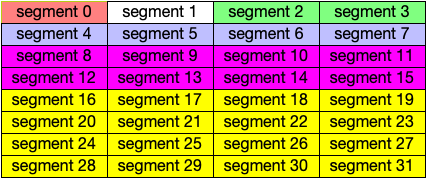
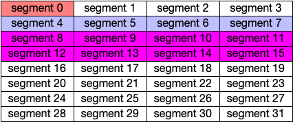
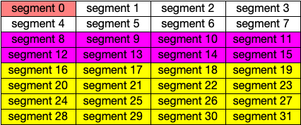
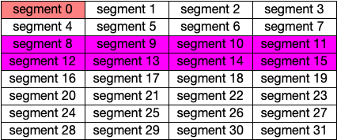
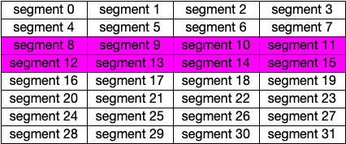
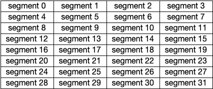
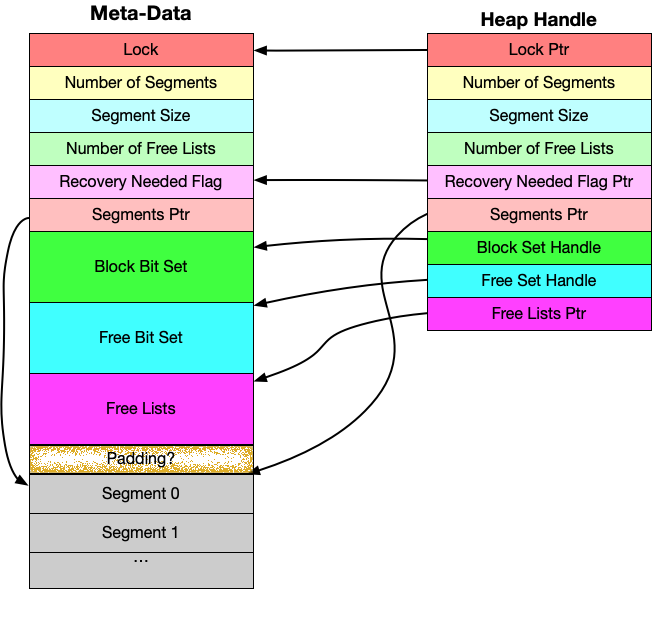

.. _HeapManager:

Heap Manager
++++++++++++

**FIXME: This whole section needs to be edited, but the examples still hold up.**

The Heap Manager provides low-level services to components within the dragon run-time. The heap manager
dynamically manages memory through a malloc/free interface. The Heap Manager implements a buddy memory
management system. It allocates memory in sizes of powers of two. In doing so, there is no external
fragmentation resulting in unused space between allocations. A user may request any size allocation, but the
heap manager will allocate space equal to or greater than the requested space to bring it to the next power of
two. This results in what is called internal fragmentation within allocations.

In this documentation, the power of two allocations reserved by the heap manager are called blocks. Each block
is composed of one or more segments. A segment is the smallest allocatable size of the heap manager. The
largest allocatable block is composed of all the segments, the entire heap. The overall heap size and the
segment size are user-configurable when the heap is created.

An Example of Malloc and Free
=============================

    **Figure 1: A Sample Heap with Allocations**

Consider a 1K heap with a minimum block size of 32 bytes. The smallest allocatable block size is called a
segment. The 1K heap is made up of 32 segments, each of 32 bytes each. Figure 1 shows a heap with allocations
in colors. The first allocation was for 16 bytes, which resulted in a 32 byte allocation (the smallest
possible size for this heap) and was allocated to segment 0. The second allocation was for 500 bytes (actually
512 bytes) which resulted in the allocation of segments 16-31. Then came an allocation of 64 bytes which went
into segments 2 and 3. The allocation of segments 8-15 was for a request of 222 bytes but allocated 256 bytes
since that is the nearest power of 2. Finally, the purple allocation from segments 4-7 resulted from a request
of 112 bytes but again resulted in an allocation of 4 segments and a size of 128 bytes. So the mallocs that
lead to the allocations in figure 1 might be as follows.

    * 32 bytes
    * 512 bytes
    * 64 bytes
    * 256 bytes
    * 128 bytes

Worst case, the malloc operations are O(log #segments). In other words, there are potentially repeated split
operations that must occur, but the maximum number of splits is based on the maximum and minimum block size
powers. Each split operation is O(1). In this example, the maximum number of splits is 5. In the example above
there were 5 splits required on the first allocation. The second allocation required 0 splits. The third
required two splits. The fourth 0 splits. The fifth and final allocation required 0 splits.

A heap with this maximum block size and minimum block size is initialized as shown in figure 2. Since the heap
manager always manages blocks sizes of powers of 2, a heap is initialized by providing the maximum and minimum
block size powers. In figure 2 the 10 is the 1024 byte maximum block size and 5 is the 32 byte minimum block
size.

.. code-block:: C
    :linenos:
    :caption: **Figure 2: Heap Initialization**

    // make a heap of size 1K with 32 byte segments as minimum block size. How much space
    // is required? This call determines how much space is required for a heap with
    // maximum block size of 2^10 and minimimum block size of 2^5. In other words,
    // a 1K to 32 byte block size heap. The 0 is a segment alignment requirement.
    // The segments will be minimally word aligned even if 0 is provided.

    dragonError_t rc;
    size_t heap_size;
    rc = dragon_heap_size(10,5,0,&heap_size);

    if (rc != DRAGON_SUCCESS) {
        // deal with error.
    }

    // get the required space however that might be done.
    void* space = (dragonDynHeap_t*)malloc(heap_size);

    dragonDynHeap_t heap;

    // Initialize the heap.
    rc = dragon_heap_init(space, &heap, 10, 5, 0);

    if (rc != DRAGON_SUCCESS) {
        // deal with error.
    }

As blocks are freed, they are joined together into large free blocks if the block and its buddy are free. The
buddy of a block is a block whose address differs from its address by a power of 2 size. For instance, segment
0 in the allocation of figure 1 has segment 1 as its buddy because they are at index 0 and index 1 of the list
of segments. The block starting at segment 2 has its buddy starting at index 0, but since index 0 is currently
split, the buddy of the green block is not available for joining to it once it is freed. To illustrate this
joining of blocks, consider the following sequence of free requests.

Freeing the Green Block Starting at Segment 2
---------------------------------------------

When the green block is freed we examine its buddy which starts at segment 0 and has a segment span of 1
segment. Since the block starting at segment 0 is not free, the green block cannot be joined with its buddy.
The algorithm doesn't consider anything further, but because segment 0 is in a block of 32 bytes and the green
block is part of a block of 64 bytes, they could not be joined either (at this point anyway).

    **Figure 3: After Freeing the Green Block**

Freeing the Purple Block Starting at Segment 4
----------------------------------------------

Freeing the purple allocation starting at segment 4 examines segment 0 as a potential buddy to join with.
However, the segment at 0 is not free and again does not result in any joining of blocks. At this point, there
are three free blocks that are available in the heap. The segment 1 is a 32 byte block. The segments 2 and 3
make up a 64 byte free block. Finally, the segments 4-6 make up a 128 byte free block.

    **Figure 4: After Freeing the Purple Block**

Freeing the Yellow Block Starting at Segment 16
-----------------------------------------------

The 512 byte block starting at segment 16 is freed next and results in once again examining its buddy at
segment 0. Again, segment 0 is not free and no further joining of blocks is possible.

    **Figure 5: After Freeing the Yellow Block**

Freeing the Orange Block Starting at Segment 0
----------------------------------------------

Finally, freeing segment 0 results in examining the buddy block. Since segment 0 is in a block of 32 bytes,
the buddy is at segment 1 which is free. These two one segment blocks are joined together forming a 64 byte
free block. But, joining cascades, resulting in now looking at the 64 byte block starting at segment 2. Again,
this block is free so the two blocks are joined, forming a 128 byte block. But again, the 128 byte block
starting at segment 4 is free and is joined with the 128 byte block starting at 0 to form a 256 byte block.
The buddy of this 256 byte block starts at segment 8 which is not free. So the joining of blocks stops at this
point.

At this point there are two free blocks: a 256 byte block starting at segment 0 and a 512 byte block starting
at segment 16.

    **Figure 6: After Freeing the Orange Block**

Freeing the Maroon Block Starting at Segment 8
----------------------------------------------

Freeing the maroon block starting at segment 8 results in examining the buddy starting at segment 0. Since it
is free and the same size as the block being freed, the blocks are joined together into a block of 512 bytes,
but since its buddy is also free and the same size, the two 512 byte blocks are joined together into one 1K
block.

    **Figure 7: After Freeing the Maroon Block**

Meta-Data and Handles
=====================

The meta-data/data structures required to implement this heap management system include a list of doubly
linked lists, called the free lists, and list of the actual segments making up the minimum size blocks, and
two bit sets, the block set and the free set. There is also a lock associated with the meta-data so the API is
multi-processing compatible.

    **Figure 8: Meta-Data and Handle Structure**

In the meta-data the *Segments Ptr* is necessary because there might be padding between the *Free Lists* and
the beginning of the segments, depending on the requested alignment of the segments when the heap is
initialized. The *Segments Ptr* is initialized to point to where the segments start subject to the alignment
requirement passed to the initialization API call. This is so that later calls to attach to the heap can find
the beginning of the segments without needing to know the alignment requirement and without needing to
re-compute the starting segments address.

.. code-block:: C
    :linenos:
    :caption: **Figure 9: C Handle Definition**

    typedef void dragonDynHeapSegment_t;

    typedef struct dragonDynHeap_st {
        pthread_mutex_t* exclusive_access_ptr;
        uint64_t num_segments;
        uint64_t segment_size;
        size_t num_freelists;
        size_t* recovery_needed_ptr;
        dragonBitSet_t block_set;
        dragonBitSet_t free_set;
        dragonDynHeapSegment_t** free_lists;
        dragonDynHeapSegment_t* segments;
        void* end_ptr;
        unsigned char init_handle;
    } dragonDynHeap_t;

The handle structure copies fields that can safely be accessed from either the meta-data or the handle. The
pointers within the handle point to shared data structures in the meta-data. The two BitSet handles have
within them pointers that point to the shared BitSet data.

The *Block Bit Set* has one bit for every segment in the *Segments* region of the heap. A *Block* is made up
of one or more segments. The *Segment* is a logical structure only. The *Number of Segments* and *Segment
Size* fields together define the total size of the segment area of the heap.

The corresponding *Block Bit* is set to one where a block begins within the segments. Initially, the first bit
in the *Block Bit Set* is set to a 1 and all other bits are zero, indicating that the entire heap is one big
block. When blocks are allocated, its *Block Bit* remains set. Blocks exist whether allocated or free.

The *Free Bit Set* is used to identify when a block is free. The *Free Bit Set* is the same size as the *Block
Bit Set* and also has one bit per segment in the heap. If the correponding *Free Bit Set* bit is a one, then
the block starting at that location is free.

The *Free Lists* is an array of doubly linked lists, one for each possible block size. Block sizes are always
a power of 2 and range from the maximum block size to the minimum block size. In the 1K to 32 byte heap
example, the number of free lists is 5, the difference between 10 and 5 the binary powers of 1K and 32.  Index
0 in the free lists array corresponds to 32 byte blocks. In the 1K heap example index 4 in the free lists
array corresponds to a 1K block, which is the initial state of the free lists array. The initial state of the
1K heap has only one non-null entry in the free lists array at index 4 and pointing to segment 0 of the
segments.

The *segments* pointer, points at the first segment in the array of segments that make up the blocks of the
heap. This is for internal use only. Likewise, the *end_ptr* is for internal use only as is the *init_handle*.

While a description of fields in the handle is provided here, no data in the handle should be accessed
directly. The handle is to be used on calls to the API and should be treated as an opaque type.

Performance of Malloc and Free
==============================

Each free block of the heap serves as a node in the doubly linked list of free blocks in the heap. When a
block is freed it may be joined together into a larger free block if its buddy is free. If its buddy is not
free, then the block is added to the linked list of free blocks that corresponds to its size. By having one
free list for each possible block size, there is no searching that needs to be done to find a free block of
the right size. Finding a block is a O(1) operation.

The entire structure and current state of the heap can be determined from the segment size, number of
segments, and the block set and free set. The free lists are kept to make it possible to have O(1) malloc
operations. The worst case complexity of the malloc operation is O(log (max block size - min block size)).  In
other words, the worst case is O(n) where n is the number of powers of 2 between the maximum block size and
the minimum block size. This is a result of potential splits of blocks that occur when a malloc is called.
This results in an amortized complexity of O(1) for malloc.

The free operation needs to know the block size of the block being freed which is available by counting the
zeroes to the right of the corresponding bit in the
*Block Bit Set*. Each zero bit the right of the corresponding bit for the block
in the *Block Bit Set* indicates that block extends for another segment.  Counting the number of zeroes to the
right is a O(n) operation where *n* is bounded by the number of segments in the heap. However, the operation
is implemented to consider whole words from the bit set at a time as long as possible, then consider whole
bytes at a time as long as possible, and finally gets to the bit level only when neither words nor bytes can
be read. In other words, the O(n) zeroes to the right operation on bit sets is quite efficiently written,
resulting in very good microsecond elapsed time even in large bit sets.  In the normal case this zeroes to the
right operation is called only once during a free operation. The buddy block is also examined to see if it has
the same block size and is free for posssible joining of the two blocks, but the block size of the buddy is
stored within it as it is in the free list if it is truly free.

In a 4GB heap with minimum block size of 32 bytes, running on a Rome test node, a test was executed with 60
random calls to malloc. Fifty-two of them were able to be satisfied. Eight required blocks that were not
available and had to be rejected. The average malloc execution time was 0.000022 seconds or 22 microseconds.
The average free time for the 52 blocks was 0.000048 seconds or 48 microseconds. The difference in average
malloc vs free time can be attributed to finding the size of the block being freed.

Recovery After Corruption
=========================

The free and malloc operations rely on the free lists that are constructed by chaining together free blocks
within the heap. However, an errant user process might write past the end of its block, potentially writing
into a free block's linked list node, thus corrupting the linked list of free blocks. If this happens, the
corruption can be detected in most cases by checking the pointers found in the doubly linked list to make sure
they are truly valid free pointers into the heap. The previous and next pointers in a node in the free list
must contain valid pointers for the beginning of a free block or they may contain null. If the previous and
next pointers are not valid, then there was a corruption that occurred. Likewise, the size of the block is
also stored in the linked list node. If that size is not a valid block size for the heap, then a corruption
occurred. The size of a block in the linked list is recorded as its index into the free lists array. So, if
the block size index is greater than or equal to the number of free lists, it is corrupted.

In the case of corruption within the heap it is possible to recover the correct state of the heap assuming the
block set, free set, and other meta-data at the beginning of the heap have not be corrupted. Since the
meta-data resides before the segments, it is unlikely that an errant user program would overwrite data prior
to its block allocation. Assuming the meta-data is not corrupted, a recover operation can be executed to
rebuild the free lists correctly from this meta-data. This recover operation is left up to the user of the
heap to execute, but any further operations after corruption is detected will result in a
*recovery required* error code.

Heap Client API
===============

The client API is meant for components that want to allocate and manage a heap.  The actual allocation of the
space for the heap is outside the scope of this API. The user of this API must allocate the space and where
and how that allocation is done is irrelevant to this API. The heap can be managed in any memory adderessable
address space. The performance of the API primitives is dependent on the address space being random accessible
memory.

Structures
----------

The enumeration of error codes and the handle definition are the two structures that are defined for the heap.

The Handle
^^^^^^^^^^

.. c:type::  void dragonDynHeapSegment_t

    A typedef for segments is without type. Segments are memory regions with no inherent type, but it is named
    here for use within the handle.

.. c:struct:: dragonDynHeap_t

    This is the heap handle specification. It is the definition of the information that is provided by
    initializing and/or attaching to a heap structure.

    .. c:var:: pthread_mutex_t* exclusive_access_ptr

        The lock guaranteeing mutually exclusive access to the heap.

    .. c:var:: uint64_t num_segments

        The number of segments in the heap. Blocks are made up of one or more segments allocated in powers of
        2.

    .. c:var:: uint64_t segment_size

        The size of the each segment in the heap.

    .. c:var:: size_t num_freelists

        The number of free lists which is an internal implementation detail of the heap.

    .. c:var:: size_t* recovery_needed_ptr

        The value referenced by this pointer is non-zero when the heap requires recovery before proceeding
        with further allocation and deallocations.

    .. c:var:: dragonBitSet_t block_set

        A handle to the block set which is an internal implementation detail of the heap.

    .. c:var:: dragonBitSet_t free_set

        A handle to the free set which is an internal implementation detail of the heap.

    .. c:var:: dragonDynHeapSegment_t** free_lists

        A pointer to an list of free lists.

    .. c:var:: dragonDynHeapSegment_t* segments

        A pointer to the first segment of the heap.

    .. c:var:: void* end_ptr

        Points at the last byte of the heap's segments and is stored here so it doesn't have to be re-computed
        each time it is needed.

    .. c:var:: unsigned char init_handle

        This field is non-zero when this handle was created by the initialization of the heap. This handle was
        not created by attaching after initialization of the heap.

Statistics
^^^^^^^^^^

.. c:struct:: dragonDynHeapStatsAllocationItem_t

    .. c:var:: uint64_t block_size

        The size of a block in the statistics report.

    .. c:var:: uint64_t num_blocks

        The current number of free blocks at that size within the heap.

.. c:struct:: dragonDynHeapStats_t

    .. c:var:: uint64_t num_segments

        Number of segments in this heap. A segment is the smallest possible block size for a particular heap
        allocation.

    .. c:var:: uint64_t segment_size

        The size of each segment. In other words, the minimum block size for this heap allocation.

    .. c:var:: uint64_t total_size

        Total size of the heap in bytes. It will be num_segments * segment_size.

    .. c:var:: uint64_t total_free_space

        The number of free bytes in the heap.

    .. c:var:: double utilization_pct

        The percentage of utilization of this heap. The value will be between 0 and 100 inclusive. This does
        not take into account internal fragmentation in the heap. In other words, the value reported here says
        nothing about unused space in an allocation. If you request 16 bytes and 32 bytes is the minimum block
        size, the block is counted as used, not 50 percent used.

    .. c:var:: size_t num_block_sizes

        The number of different block sizes that the heap maintains.

    .. c:var:: dragonDynHeapStatsAllocationItem_t free_blocks[BLOCK_SIZE_MAX_POWER-BLOCK_SIZE_MIN_POWER+1]

        Space for up to 58 block sizes, the maximum number of block sizes possible with this heap manager
        available in powers of 2.

API
---

These are the user-facing API calls for heap management.

Life-Cycle
^^^^^^^^^^

.. c:function:: dragonError_t dragon_heap_size(const size_t max_block_size_power, const size_t min_block_size_power, const size_t alignment, size_t* size)

    Find the size required to create a heap of the specified size. The size of the heap is given by the
    *max_block_size_power*, a power of 2. If 10 were passed to this function, then the size of the heap would
    be 1024 bytes or 1K. The *min_block_size_power* is the power of 2 that indicates the smallest possible
    block size within the heap. The smallest allowable size is 5 (i.e. 32 bytes).

    The *alignment* is the byte alignment requirement of blocks within the heap. If 0 is passed, the blocks
    will be at least 8 byte aligned. Non-zero *alignment* must be a multiple of 8 bytes. The *size* is the
    address of a variable to hold the computed size required to hold a heap of this size.

    **Returns**

    | :c:enumerator:`DRAGON_SUCCESS`
    |     Success.
    | :c:enumerator:`DRAGON_HEAP_MAX_BLOCK_SIZE_TOO_LARGE`
    |     Max size is 62.
    | :c:enumerator:`DRAGON_HEAP_MIN_BLOCK_SIZE_TOO_SMALL`
    |     Min size is 5.
    | :c:enumerator:`DRAGON_HEAP_BAD_ALIGNMENT_REQUEST`
    |     Must be a multiple of 8 bytes.

    **Example Usage**

    .. code-block:: C

        // make a heap of size 4GB with 4K blocks as minimum block size. How much space
        // is required?
        size_t heap_size;
        dragonError_t rc = dragon_heap_size(32,12,4096,&heap_size);
        if (rc != DRAGON_SUCCESS) {
            // handle it
        }

.. c:function:: dragonError_t dragon_heap_init(void* ptr, dragonDynHeap_t* heap, const size_t max_block_size_power, const size_t min_segment_block_power, const size_t alignment)

    Initialize the heap and a handle to it. The *ptr* points at a space big enough to hold the heap. The
    *heap* should be the address of a handle for the heap declared as a :c:struct:`dragonDynHeap_t` structure.
    All other parameters should be identical to a previous call to the :c:func:`dragon_heap_size` function.

    **NOTE**: The requested alignment will be relative to the address of *ptr*,
    the space provided on this call. For instance, if an alignment of 4K is requested, then the segments
    within the heap will start on a 4K boundary relative to *ptr*. If address 101 was passed to this function
    then the heap segments would start at address 4K x *i* + 101 where *i* is an integer.

    **Returns**

    | :c:enumerator:`DRAGON_SUCCESS`
    |     Success.
    | :c:enumerator:`DRAGON_HEAP_INVALID_POINTER`
    |     Returned if either *ptr* or *heap* are null pointers.
    | :c:enumerator:`DRAGON_HEAP_MAX_BLOCK_SIZE_TOO_LARGE`
    |     Max size is 62.
    | :c:enumerator:`DRAGON_HEAP_MIN_BLOCK_SIZE_TOO_SMALL`
    |     Min size is 5.
    | :c:enumerator:`DRAGON_HEAP_BAD_ALIGNMENT_REQUEST`
    |     Must be a multiple of 8 bytes.
    | :c:enumerator:`DRAGON_HEAP_LOCK_EBUSY`, :c:enumerator:`DRAGON_HEAP_LOCK_EINVAL`,
    | :c:enumerator:`DRAGON_HEAP_LOCK_EAGAIN`, :c:enumerator:`DRAGON_HEAP_LOCK_ENOMEM`,
    | :c:enumerator:`DRAGON_HEAP_LOCK_EPERM`
    |     Possible lock return codes.

    **Example Usage**

    .. code-block:: C

        // make a heap of size 4GB with 4K blocks as minimum block size. How much space
        // is required?
        size_t heap_size;
        dragonError_t rc = dragon_heap_size(32,12,4096,&heap_size);
        if (rc != DRAGON_SUCCESS) {
            // handle it
        }

        // get the required space. This is one way, but not part of the API.
        void* space = (dragonDynHeap_t*)malloc(heap_size);

        dragonDynHeap_t heap;

        // Initialize the heap.
        dragonError_t rc = dragon_heap_init(space, &heap, 32, 12, 4096);

        if (rc != DRAGON_SUCCESS) {
            // handle it
        }

.. c:function:: dragonError_t dragon_heap_destroy(dragonDynHeap_t* heap)

    Perform any operations necessary once the heap is no longer needed. The handle passed in there must be the
    same handle that was initialized using the :c:func:`dragon_heap_init` call.

    **Returns**

    | :c:enumerator:`DRAGON_SUCCESS`
    |     Success.
    | :c:enumerator:`DRAGON_HEAP_LOCK_EBUSY`, :c:enumerator:`DRAGON_HEAP_LOCK_EINVAL`,
    | :c:enumerator:`DRAGON_HEAP_LOCK_EAGAIN`, :c:enumerator:`DRAGON_HEAP_LOCK_ENOMEM`,
    | :c:enumerator:`DRAGON_HEAP_LOCK_EPERM`
    |     Possible lock return codes

    **Example Usage**

    .. code-block:: C

        dragonDynHeap_t heap;
        // initialize and use the heap. Then finally destroy it.
        dragon_heap_destroy(&heap);

.. c:function:: dragonError_t dragon_heap_attach(void* ptr, dragonDynHeap_t* heap)

    Attach to a previously intialized heap. The *ptr* parameter must point at a space that was previously
    initialized, possibly in another thread. The handle will be initialized by this call to share the
    previously initialized heap with other initialized handles.

    **Returns**

    | :c:enumerator:`DRAGON_SUCCESS`
    |     Success.
    | :c:enumerator:`DRAGON_HEAP_INVALID_POINTER`
    |     Returned if either *ptr* or *heap* are null pointers.
    | :c:enumerator:`DRAGON_HEAP_INVALID_HEAP`
    |     Returned if trying to attach to an invalid heap. Consistency of heap state did not pass meaning the heap was likely not a heap structure.

    **Example Usage**

    .. code-block:: C

        // make a heap of size 4GB with 4K blocks as minimum block size. How much space
        // is required?
        size_t heap_size;
        dragonError_t rc = dragon_heap_size(32,12,4096,&heap_size);
        if (rc != DRAGON_SUCCESS) {
            // handle it
        }

        // get the required space.
        void* space = (dragonDynHeap_t*)malloc(heap_size);

        dragonError_t rc = dragon_heap_init(space, &heap, 32, 12, 4096);

        if (rc != DRAGON_SUCCESS) {
            // handle it
        }

        dragonDynHeap_t heap2;
        rc = dragon_heap_attach(space, &heap2);

        if (rc != DRAGON_SUCCESS) {
            // handle it
        }

.. c:function:: dragonError_t dragon_heap_detach(dragonDynHeap_t* heap)

    Detach from an attached heap. The *heap* structure must have been initialized via a
    :c:func:`dragon_heap_attach` call.

    **Returns**

    | :c:enumerator:`DRAGON_SUCCESS`
    |     Success.
    | :c:enumerator:`DRAGON_HEAP_DETACH_BY_OWNER`
    |     Attempt to detach by a heap structure that was initialized by a call to :c:func:`dragon_heap_init`.

    **Example Usage**

    .. code-block:: C

        dragonDynHeap_t heap2; // attach this space to a heap.
        rc = dragon_heap_detach(&heap2);

        if (rc != DRAGON_SUCCESS) {
            // handle it
        }

Services
^^^^^^^^

.. c:function:: dragonError_t dragon_heap_malloc(dragonDynHeap_t* heap, const size_t size, void** ptr)

    Allocate a block of at least *size* from the heap. The *ptr* should be the address of a variable where the
    allocated block's pointer can be store.

    **Returns**

    | :c:enumerator:`DRAGON_SUCCESS`
    |     Success.
    | :c:enumerator:`DRAGON_HEAP_INVALID_POINTER`
    |     Attempted to allocate from heap, but *heap* pointer was null or the *ptr* pointer was null.
    | :c:enumerator:`DRAGON_HEAP_RECOVERY_REQUIRED`
    |     The heap's free lists were corrupted by an over-run in some user's code. The free lists must be rebuilt before any other operations can be called. Call :c:func:`dragon_heap_recover` to rebuild the free lists.
    | :c:enumerator:`DRAGON_HEAP_REQUESTED_SIZE_LARGER_THAN_HEAP`
    |     Attempt to allocate a block larger than the total heap size.
    | :c:enumerator:`DRAGON_HEAP_REQUESTED_SIZE_NOT_AVAILABLE`
    |     Attempt to allocate a block that could not be satisfied due to the current state of the heap. There was not enough free memory.
    | :c:enumerator:`DRAGON_HEAP_LOCK_EBUSY`, :c:enumerator:`DRAGON_HEAP_LOCK_EINVAL`,
    | :c:enumerator:`DRAGON_HEAP_LOCK_EAGAIN`, :c:enumerator:`DRAGON_HEAP_LOCK_ENOMEM`,
    | :c:enumerator:`DRAGON_HEAP_LOCK_EPERM`
    |     Possible lock return codes

    **Example Usage**

    .. code-block:: C

        dragonDynHeap_t heap;
        dragonError_t rc = dragon_heap_init(space, &heap, 32, 12, 4096);
        if (rc != DRAGON_SUCCESS) {
            // handle it
        }
        void* tmp;
        rc = dragon_heap_malloc(&heap, 16, &tmp);
        if (rc != DRAGON_SUCCESS) {
            // handle it
        }

.. c:function:: dragonError_t dragon_heap_free(dragonDynHeap_t* heap, void* ptr)

    Free a block pointed to by *ptr* in this heap.

    **Returns**

    | :c:enumerator:`DRAGON_SUCCESS`
    |     Success.
    | :c:enumerator:`DRAGON_HEAP_INVALID_POINTER`
    |     Attempted to free from heap, but *heap* pointer was null or the *ptr* pointer was null.
    | :c:enumerator:`DRAGON_HEAP_LOCK_EBUSY`, :c:enumerator:`DRAGON_HEAP_LOCK_EINVAL`,
    | :c:enumerator:`DRAGON_HEAP_LOCK_EAGAIN`, :c:enumerator:`DRAGON_HEAP_LOCK_ENOMEM`,
    | :c:enumerator:`DRAGON_HEAP_LOCK_EPERM`
    |     Possible lock return codes

    **Example Usage**

    .. code-block:: C

        // free the block pointed to by tmp.
        rc = dragon_heap_free(&heap, tmp);
        if (rc != DRAGON_SUCCESS) {
            // handle it
        }

.. c:function:: dragonError_t dragon_heap_recover(dragonDynHeap_t* heap)

    Perform free list recovery on the heap. This only needs to be called if the heap becomes corrupted which
    is indicated by getting back the return code :c:enumerator:`DRAGON_HEAP_RECOVERY_REQUIRED` on some other
    heap operation.

    **Returns**

    | :c:enumerator:`DRAGON_SUCCESS`
    |     Success.
    | :c:enumerator:`DRAGON_HEAP_INVALID_POINTER`
    |     Attempted to recover the heap, but *heap* pointer was null.
    | :c:enumerator:`DRAGON_HEAP_LOCK_EBUSY`, :c:enumerator:`DRAGON_HEAP_LOCK_EINVAL`,
    | :c:enumerator:`DRAGON_HEAP_LOCK_EAGAIN`, :c:enumerator:`DRAGON_HEAP_LOCK_ENOMEM`,
    | :c:enumerator:`DRAGON_HEAP_LOCK_EPERM`
    |     Possible lock return codes

    **Example Usage**

    .. code-block:: C

        dragon_heap_recover(&heap);

Status/Debug
^^^^^^^^^^^^

.. c:function:: dragonError_t dragon_heap_get_stats(const dragonDynHeap_t* heap, dragonDynHeapStats_t* data)

    Get statistics from the current state of the heap. The statistics are as reported in the
    :c:enum:`dragonDynHeapStats_t` structure.

    **Returns**

    | :c:enumerator:`DRAGON_SUCCESS`
    |     Success.
    | :c:enumerator:`DRAGON_HEAP_INVALID_POINTER`
    |     Attempted to recover the heap, but *heap* pointer was null.
    | :c:enumerator:`DRAGON_HEAP_LOCK_EBUSY`, :c:enumerator:`DRAGON_HEAP_LOCK_EINVAL`,
    | :c:enumerator:`DRAGON_HEAP_LOCK_EAGAIN`, :c:enumerator:`DRAGON_HEAP_LOCK_ENOMEM`,
    | :c:enumerator:`DRAGON_HEAP_LOCK_EPERM`
    |     Possible lock return codes

    **Example Usage**

    .. code-block:: C

        dragonDynHeapStats_t stats;
        dragon_heap_get_stats(&heap, &stats);

.. c:function:: dragonError_t dragon_heap_dump(const char* title, const dragonDynHeap_t* heap)

    Print a dump of the heap structure with the given *title* to standard output. The output looks similar to
    this.

    .. code-block:: text

        *****************************************************************************************
        * DYNAMIC MEMORY HEAP DUMP
        * Title goes here.
        *****************************************************************************************
        *  Size of Heap: 4294967296 (hex 100000000)
        *  Number of Segments: 1048576 (hex 100000)
        *  Segment Size: 4096 (hex 1000)
        *  Meta-Data Pointer:  00007F5218663010
        *  Block Set Pointer:  00007F5218663068
        *  Free Set Pointer:   00007F5218683070
        *  Free Lists Pointer: 00007F52186A3070
        *  Segments Pointer:   00007F52186A4010
        *  Recovery Needed: FALSE
        *  --------------------------------------------------------------------------------------
        *   Block Set
        *    Size of bitset is 131072
        *    BITS:
        *    00007F5218663068 80 00 00 00 00 00 00 00 00 00 00 00 00 00 00 00  ................
        *    00007F5218663078 00 00 00 00 00 00 00 00 00 00 00 00 00 00 00 00  ................
        *    ...
        *    00007F5218683058 00 00 00 00 00 00 00 00 00 00 00 00 00 00 00 00  ................
        *  --------------------------------------------------------------------------------------
        *   Free Set
        *    Size of bitset is 131072
        *    BITS:
        *    00007F5218683070 80 00 00 00 00 00 00 00 00 00 00 00 00 00 00 00  ................
        *    00007F5218683080 00 00 00 00 00 00 00 00 00 00 00 00 00 00 00 00  ................
        *    ...
        *    00007F52186A3060 00 00 00 00 00 00 00 00 00 00 00 00 00 00 00 00  ................
        *  --------------------------------------------------------------------------------------
        *   Free Lists:
        *  	index:	 pointer to 1st node:	block size (# segments):	free list length:
        *  	    0	0000000000000000	         1	                        0
        *  	    1	0000000000000000	         2	                        0
        *  	    2	0000000000000000	         4	                        0
        *  	    3	0000000000000000	         8	                        0
        *  	    4	0000000000000000	        16	                        0
        *  	    5	0000000000000000	        32	                        0
        *  	    6	0000000000000000	        64	                        0
        *  	    7	0000000000000000	       128	                        0
        *  	    8	0000000000000000	       256	                        0
        *  	    9	0000000000000000	       512	                        0
        *  	   10	0000000000000000	      1024	                        0
        *  	   11	0000000000000000	      2048	                        0
        *  	   12	0000000000000000	      4096	                        0
        *  	   13	0000000000000000	      8192	                        0
        *  	   14	0000000000000000	     16384	                        0
        *  	   15	0000000000000000	     32768	                        0
        *  	   16	0000000000000000	     65536	                        0
        *  	   17	0000000000000000	    131072	                        0
        *  	   18	0000000000000000	    262144	                        0
        *  	   19	0000000000000000	    524288	                        0
        *  	   20	00007F52186A4010	   1048576	                        1
        *  --------------------------------------------------------------------------------------
        *  Free Segment Nodes
        *  -----------
        *  Index: 0
        *  Address: 00007F52186A4010
        *  Size: 4294967296
        *  Number of Segments: 1048576
        *  Next: 0000000000000000
        *  Prev: 0000000000000000
        *****************************************************************************************

    **Returns**

    | :c:enumerator:`DRAGON_SUCCESS`
    |     Success.
    | :c:enumerator:`DRAGON_HEAP_INVALID_POINTER`
    |     Attempted to recover the heap, but *heap* pointer was null.
    | :c:enumerator:`DRAGON_HEAP_LOCK_EBUSY`, :c:enumerator:`DRAGON_HEAP_LOCK_EINVAL`,
    | :c:enumerator:`DRAGON_HEAP_LOCK_EAGAIN`, :c:enumerator:`DRAGON_HEAP_LOCK_ENOMEM`,
    | :c:enumerator:`DRAGON_HEAP_LOCK_EPERM`
    |     Possible lock return codes

    **Example Usage**

    .. code-block:: C

        dragon_heap_dump("Title goes here.", &heap);

.. c:function:: dragonError_t dragon_heap_dump_to_fd(FILE* fd, const char* title, const dragonDynHeap_t* heap)

    The same as :c:func:`dragon_heap_dump` except it writes to a user specified file. The effect of calling
    this function with *stdout* as the file is exactly the same as calling :c:func:`dragon_heap_dump`.

    **Returns**

    | :c:enumerator:`DRAGON_SUCCESS`
    |     Success.
    | :c:enumerator:`DRAGON_HEAP_INVALID_POINTER`
    |     Attempted to recover the heap, but *heap* pointer was null.
    | :c:enumerator:`DRAGON_HEAP_LOCK_EBUSY`, :c:enumerator:`DRAGON_HEAP_LOCK_EINVAL`,
    | :c:enumerator:`DRAGON_HEAP_LOCK_EAGAIN`, :c:enumerator:`DRAGON_HEAP_LOCK_ENOMEM`,
    | :c:enumerator:`DRAGON_HEAP_LOCK_EPERM`
    |     Possible lock return codes

    **Example Usage**

    .. code-block:: C

        // You can replace logfile with your own open writable file.
        dragon_heap_dump(logfile, "Title goes here.", &heap);
