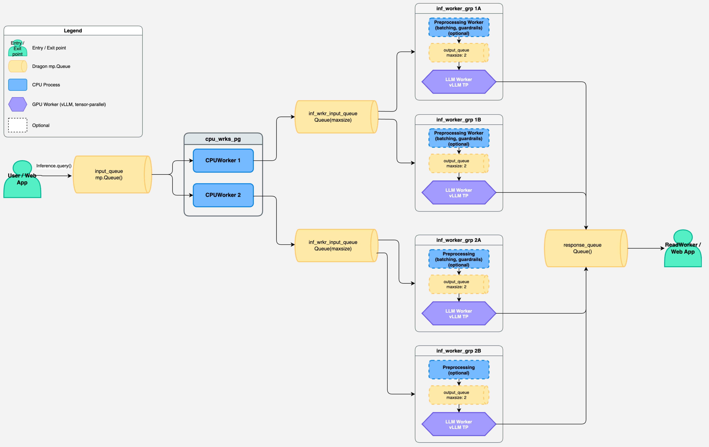

.. _developer-guide-inference:

Inference Service
===================================

This document explains the implementation of ``dragon.ai.inference`` for
developers who need to maintain, debug, or extend the service. For hands-on
usage, see :ref:`inference_tutorial`. For generated API documentation, see
:ref:`InferenceAPI`.

.. contents:: In this document
   :local:
   :depth: 2

What the Service Does
-------------------------

The inference service is a Dragon-native LLM serving stack. It combines Dragon
process placement and queues with vLLM tensor-parallel generation. The service
is designed around one shared request queue and many callers. Callers submit a
prompt and a response queue. Backend workers pull requests, optionally batch and
filter them, run vLLM, and put a response dictionary on the original response
queue.

The implementation is deliberately split into small subsystems:

- ``Inference`` owns lifecycle, hardware discovery, node/GPU subdivision, CPU
  worker process groups, and the shared shutdown event.
- ``CPUWorker`` owns a set of GPU model workers on one node and forwards work
  from the public input queue into local worker queues.
- ``InferenceWorker`` runs the preprocessing and vLLM loops. Depending on
  configuration, an inference worker is one process or a preprocessing process
  plus an LLM process.
- ``LLMInferenceEngine`` wraps vLLM construction, sampling parameters,
  generation, metrics, and shutdown.
- ``DragonQueueLLMProxy`` is the client-side chat interface used by the agent
  framework and other async applications.

Source Code Layout
----------------------

All inference service code lives in ``src/dragon/ai/inference/``.

::

    inference/
    |-- __init__.py
    |-- batching.py              # BatchItem, Batch, DynamicBatcher
    |-- config.py                # Dataclass configuration and YAML parsing
    |-- config.sample            # Sample YAML configuration
    |-- cpu_worker_utils.py      # CPUWorker lifecycle and dynamic workers
    |-- guardrails.py            # GuardrailsProcessor
    |-- inference_utils.py       # Inference service entry point
    |-- inference_worker_utils.py # Preprocessing loop and LLM loop
    |-- llm_engine.py            # vLLM wrapper and chat formatting helpers
    |-- llm_proxy.py             # LLMProxy and DragonQueueLLMProxy
    |-- prompt_guard_utils.py    # PromptGuard model wrapper
    |-- reader_utils.py          # Metrics readers and consolidation
    `-- patch_vllm/              # Dragon vLLM compatibility plugin

When looking for behavior:

- Service startup: ``inference_utils.py:Inference.initialize``
- Service teardown: ``inference_utils.py:Inference.destroy``
- Direct prompt submission: ``inference_utils.py:Inference.query``
- Chat request submission: ``llm_proxy.py:DragonQueueLLMProxy.chat``
- Streaming chat requests: ``llm_proxy.py:DragonQueueLLMProxy.chat_stream``
- Streaming generation: ``llm_engine.py:LLMInferenceEngine.generate_stream``
- Streaming types: ``llm_engine.py:StreamChunk, STREAM_DONE_SENTINEL``
- Hardware validation: ``config.py`` and ``Inference.maybe_subset_nodes_gpus``
- CPU head routing: ``cpu_worker_utils.py:CPUWorker.initialize``
- Dynamic worker decisions: ``cpu_worker_utils.py:CPUWorker.dynamic_inf_workers``
- Batching and guardrails: ``inference_worker_utils.py``
- vLLM construction and generation: ``llm_engine.py:LLMInferenceEngine``

Dragon Primitives Used
--------------------------

.. list-table:: Runtime primitives
   :header-rows: 1
   :widths: 25 25 45

   * - Primitive
     - Module
     - Role
   * - :py:class:`~dragon.native.queue.Queue`
     - ``dragon.native.queue``
     - Public request queue, per-request response queues, CPU-to-worker queues,
       preprocessing-to-LLM queues, and dynamic worker manager queues.
   * - :py:class:`~dragon.native.event.Event`
     - ``dragon.native.event``
     - Global service shutdown, LLM process shutdown, and inference-worker
       spin-down signaling.
   * - :py:class:`~dragon.native.barrier.Barrier`
     - ``dragon.native.barrier``
     - Startup synchronization for CPU workers and model workers.
   * - :py:class:`~dragon.native.process_group.ProcessGroup`
     - ``dragon.native.process_group``
     - Groups CPU head workers and each inference worker's processes.
   * - :py:class:`~dragon.native.process.ProcessTemplate`
     - ``dragon.native.process``
     - Process target, arguments, working directory, and placement policy.
   * - :py:class:`~dragon.infrastructure.policy.Policy`
     - ``dragon.infrastructure.policy``
     - Host placement for CPU heads and GPU affinity for LLM processes.
   * - :py:class:`~dragon.native.machine.System`
     - ``dragon.native.machine``
     - Discovers nodes and GPUs in the current Dragon allocation.
   * - :py:class:`~dragon.telemetry.telemetry.Telemetry`
     - ``dragon.telemetry.telemetry``
     - Records latency and throughput metrics from worker processes.

Initialization Flow
-----------------------

The top-level ``Inference`` object performs the setup work before any backend
process is launched.

1. Store the ``InferenceConfig`` and copy frequently used values onto the
   instance.
2. Create the global ``end_event`` and store the public ``input_queue``.
3. Discover allocation nodes with ``System()`` and ``Node(node_id)``.
4. Validate hardware, model, batching, guardrails, and dynamic worker settings.
5. Apply ``num_nodes``, ``num_gpus``, and ``node_offset`` to choose the resource
   slice for this service.
6. Split GPUs into inference-worker device groups of size ``tp_size``.
7. Group inference workers under CPU head workers according to
   ``num_inf_workers_per_cpu``. When this value is ``-1``, it is auto-calculated
   as ``num_gpus // tp_size`` (minimum one) using the resolved GPU count.
8. Create a CPU worker ``ProcessGroup`` and a startup ``Barrier`` with one slot
   for the parent plus one slot for each CPU head.
9. Create a Dragon ``Telemetry`` object.
10. Resolve ``inf_wrkr_queue_maxsize`` for the inference worker input queue.
    When this value is ``-1``, it defaults to ``num_inf_workers_per_cpu * 2``.
11. Build shared CPU worker constructor kwargs.

``Inference.initialize()`` then creates one CPU worker process per CPU head with
a host-name placement policy. Each CPU worker subsequently creates its own local
inference worker process groups.

Runtime Request Flow
------------------------

The direct text path and proxy chat path converge on the same backend queue.

    **Dragon inference data flow**

:numref:`dragon-inference-data-flow` is an example of the internal data flow,
not a fixed service size. The diagram shows one public ``input_queue`` receiving
``Inference.query()`` requests from a user or web application. A CPU worker
process group, ``cpu_wrks_pg``, contains two CPU workers. Each CPU worker reads
from the shared input queue and forwards requests to its own local
``inf_wrkr_input_queue`` instances.

In this example each CPU worker owns two inference worker process groups. The
first CPU worker routes to ``inf_worker_grp 1A`` and ``inf_worker_grp 1B``; the
second CPU worker routes to ``inf_worker_grp 2A`` and ``inf_worker_grp 2B``.
Each inference worker group contains one LLM worker and may also contain a
preprocessing worker. The preprocessing worker appears as optional because it is
created only when dynamic batching or guardrails need CPU-side work before
generation. When preprocessing is enabled, it batches requests, applies
guardrail filtering, and forwards safe work through that group's output queue.
When preprocessing is disabled, the LLM process reads directly from the local
inference worker input queue.

The purple LLM worker blocks represent vLLM tensor-parallel generation. Each
LLM worker consumes ``model.tp_size`` GPUs. With ``tp_size=2``, every
inference worker group in the diagram would use two GPUs; the four groups shown
would therefore require eight GPUs. With ``tp_size=1``, the same four groups
would require four GPUs. The number of CPU workers, inference worker groups,
queue sizes, and GPU ranks are all determined by ``HardwareConfig``,
``BatchingConfig``, and ``ModelConfig`` rather than by the diagram itself.

Responses flow back through the per-request ``response_queue`` to the caller or
read worker. Along the way, the CPU worker records queue latency, the
preprocessing worker records batching or guardrail timing when present, and the
LLM process formats chat requests, invokes vLLM, records model metrics, and
writes the response dictionary back to the original response queue.

::

    Caller or Agent
        |
        |  Inference.query((prompt, response_queue))
        |  or await DragonQueueLLMProxy.chat(messages)
        |  or async for chunk in DragonQueueLLMProxy.chat_stream(messages)
        v
    Input Dragon Queue
        |
        v
    CPUWorker on selected node
        |
        |  adds CPU latency metadata
        |  starts inference workers
        v
    InferenceWorker preprocessing process (optional)
        |
        |  optional dynamic batching
        |  optional PromptGuard filtering
        v
    InferenceWorker LLM process
        |
        |  tokenizer chat template for chat requests
        |  vLLM generate() or generate_stream()
        |  telemetry metric calculation
        v
    Response queue (dict for batch, StreamChunk for streaming)

``Inference.query()`` builds OpenAI-format message dicts from plain text prompts
and the configured system prompt. It puts ``(prompt, messages, response_queue,
timestamp)`` onto the input queue.

``DragonQueueLLMProxy.chat()`` creates an ``InferenceRequest`` named tuple. The
first four fields intentionally match the direct tuple layout, and optional
fields carry tools, per-request JSON schema overrides,
``continue_final_message``, and ``stream``. The proxy owns a bounded pool of
response queues; pool exhaustion is the caller-side backpressure mechanism.

``DragonQueueLLMProxy.chat_stream()`` creates an ``InferenceRequest`` with
``stream=True``. The LLM worker detects this and uses ``generate_stream()``
instead of batch ``generate()``, putting ``StreamChunk`` objects on the response
queue followed by ``STREAM_DONE_SENTINEL``.

CPU Worker Responsibilities
-------------------------------

``CPUWorker`` is the node-local head process for a group of inference workers.
It owns:

- A local queue feeding the assigned inference workers.
- A dynamic worker manager queue containing available worker device groups.
- Output queues and end events for worker cleanup.
- The main loop that receives public requests and forwards them locally.

At startup, every configured inference worker is created. If dynamic worker
management is enabled, idle extra workers can later shut down. When a worker
shuts down, the LLM loop returns its ``(hostname, devices, inf_worker_id)`` to
the CPU worker's manager queue. If enough prompts arrive within
``spin_up_threshold_seconds``, the CPU worker pulls one available worker
configuration from that manager queue and starts it again.

Dynamic worker management never removes the first
``min_active_workers_per_cpu`` workers under a CPU head.

Inference Worker Modes
--------------------------

``CPUWorker.create_inf_worker()`` creates a process group for each inference
worker. The group always includes one LLM process. It also includes one
preprocessing process when either guardrails are enabled or dynamic batching is
enabled.

No preprocessing process
    Used when guardrails are disabled and batching is disabled or pre-batching
    is used without guardrails. The LLM process reads directly from the local
    CPU worker queue.

Preprocessing process
    Used for dynamic batching and guardrails. The preprocessing process reads
    local requests, optionally batches and filters them, then sends a uniform
    tuple to the LLM process.

This split keeps CUDA and vLLM state inside the LLM process and keeps CPU-only
batching and PromptGuard work outside the LLM loop.

Batching
------------

``DynamicBatcher`` collects ``BatchItem`` instances until one of two conditions
is true:

- The batch reaches ``max_batch_size``.
- The first item has waited at least ``batch_wait_seconds``.

Every ``BatchItem`` carries the raw prompt, formatted prompt or chat messages,
the response queue, latency metadata, and optional chat fields. When a batch is
ready, the preprocessing worker filters it if guardrails are enabled and then
forwards safe requests to the LLM process.

Pre-batch mode bypasses ``DynamicBatcher``. The caller sends a list of prompts,
and the backend treats that list as the batch.

Guardrails
--------------

Guardrails are implemented by ``GuardrailsProcessor`` and ``PromptGuard``.
``PromptGuard`` loads a Hugging Face sequence classification model, evaluates
prompt text, and returns jailbreak scores. ``GuardrailsProcessor`` compares
those scores against ``prompt_guard_sensitivity``.

For chat requests, ``InferenceWorker._extract_user_text()`` concatenates all
``role == "user"`` messages before classification. This prevents system and
assistant messages from dominating the safety score and checks the actual user
input across multi-turn requests.

Unsafe prompts are removed from the batch in lockstep with their tools, schema
overrides, and continuation flags. The worker writes a rejection response to
the original response queue and records zero model latency and throughput for
that request.

vLLM Integration
---------------------

``LLMInferenceEngine.initialize()`` sets the environment required by vLLM and
then creates ``vllm.LLM`` inside the worker process. Notable settings include:

- ``tensor_parallel_size=config.model.tp_size``
- ``distributed_executor_backend="mp"``
- ``enforce_eager=True``
- ``disable_custom_all_reduce=True``
- ``max_num_seqs=config.batching.max_batch_size``
- ``max_model_len=config.model.max_model_len``

The engine sets ``HF_TOKEN``, ``MASTER_ADDR``, ``MASTER_PORT``,
``VLLM_LOGGING_LEVEL``, and ``_DRAGON_DEVICE_OFFSET`` before importing vLLM.
``find_free_port()`` chooses a deterministic port range based on the first GPU
device assigned to the worker. The plugin under ``patch_vllm/`` is shipped
inside ``dragonhpc`` and registered through the ``vllm.general_plugins`` entry
point group declared by the package, so vLLM loads it automatically. Its patches
cover engine startup, worker startup, multiprocessing-context selection, and
open-port selection seeded by GPU device ID so co-located vLLM instances avoid
collisions. Each patch checks for ``_DRAGON_DEVICE_OFFSET`` and is a no-op when
vLLM runs outside the Dragon inference service.

For chat requests, the LLM loop asks the model tokenizer to
``apply_chat_template()``. Tools, JSON schema overrides, and
``continue_final_message`` are carried per request, so a single dynamic batch
can contain different chat options. For base models that lack a chat template,
the worker falls back to plain-text concatenation in the format
``System: ...\n\nUser: ...\n\nAssistant:``.

``LLMInferenceEngine.generate()`` builds per-request sampling parameters when
JSON schemas are present. For vLLM 0.12.0 and newer it uses
``StructuredOutputsParams``; older vLLM versions use ``GuidedDecodingParams``.

Response and Metrics
-------------------------

The LLM process sends one response dictionary per original request. The
dictionary includes worker identifiers, batch size, latency measurements,
throughput measurements, original user input, and assistant text.

Metrics are calculated in two places:

- ``LLMInferenceEngine._calculate_metrics()`` computes inference time,
  requests per second, token counts, total tokens per second, and output tokens
  per second from vLLM outputs.
- ``InferenceWorker._send_responses()`` combines engine metrics with queue and
  preprocessing timestamps and writes values to Dragon telemetry.

``reader_utils.py`` provides helper classes for response reading and metric
consolidation in performance tests.

Streaming Support
---------------------

The inference service supports token-by-token streaming for low-latency
interactive applications. Streaming is enabled per-request via the ``stream``
field in ``InferenceRequest``.

**Data flow for streaming requests:**

::

    DragonQueueLLMProxy.chat_stream(messages)
        |
        |  InferenceRequest(stream=True)
        v
    Input Dragon Queue
        |
        v
    CPUWorker (extracts stream flag at index 7)
        |
        v
    InferenceWorker LLM process
        |
        |  detects is_streaming=True
        |  calls LLMInferenceEngine.generate_stream()
        v
    vLLM generate(stream=True)
        |
        |  yields RequestOutput per token
        v
    StreamChunk objects put on response_queue
        |
        v
    STREAM_DONE_SENTINEL put on response_queue
        |
        v
    DragonQueueLLMProxy yields chunks to caller

**Key components:**

- ``StreamChunk``: Dataclass containing ``delta_text`` (new tokens),
  ``accumulated_text`` (full text so far), ``is_finished`` flag,
  ``finish_reason``, and ``metrics`` (populated on final chunk).
- ``STREAM_DONE_SENTINEL``: Singleton marker indicating end of stream.
- ``LLMInferenceEngine.generate_stream()``: Generator that iterates vLLM's
  streaming output and yields ``StreamChunk`` objects.
- ``DragonQueueLLMProxy.chat_stream()``: Async generator that polls the
  response queue and yields chunks until sentinel received.

**Request tuple format with streaming:**

The full request tuple format is now::

    (user_prompt, formatted_prompt, response_queue, timestamp,
     tools, json_schema_override, continue_final_message, stream)

Index 7 carries the ``stream`` boolean. When ``stream=True``, the LLM worker
bypasses batch generation and processes the single request through
``generate_stream()``.

**Compatibility notes:**

- Streaming requires vLLM 0.5.0 or newer for true token-by-token output.
  Older vLLM versions fall back to returning the complete response as a single
  ``StreamChunk``.
- Streaming requests bypass dynamic batching and are processed immediately
  with effective batch size of 1.
- Streaming is not currently supported through the preprocessing path (batching
  or guardrails enabled). When preprocessing is required, streaming requests
  receive ``stream_list=[False]`` and fall back to non-streaming generation.

Shutdown Flow
------------------

``Inference.destroy()`` sets the global end event, waits for CPU workers,
stops and closes the CPU worker process group, and closes the public input
queue.

CPU workers watch the global end event while polling their public input queue.
On shutdown they join, stop, and close each active inference worker process
group.

Preprocessing workers drain remaining local work where possible before exiting.
LLM workers shut down either when the global end event is set or when dynamic
worker spin-down sets their per-worker LLM end event. ``LLMInferenceEngine``
attempts to shut down the vLLM executor, destroy torch distributed process
groups, empty CUDA cache, and collect CUDA IPC handles.

Extension Points
---------------------

Adding a new client transport
    Implement ``LLMProxy.chat()`` and ``LLMProxy.chat_stream()`` and translate
    the external request into the existing queue payload. Preserve the first
    four tuple fields so CPU workers can route it without another code path.
    For streaming, put ``StreamChunk`` objects on the response queue followed
    by ``STREAM_DONE_SENTINEL``.

Adding request metadata
    Append optional fields to the request tuple or ``InferenceRequest`` and
    handle missing fields with length checks. Existing code follows this
    pattern for tools, JSON schema overrides, continuation flags, and the
    stream flag. The current tuple format is::

        (user_prompt, formatted_prompt, response_queue, timestamp,
         tools, json_schema_override, continue_final_message, stream)

Changing safety behavior
    Extend ``GuardrailsProcessor`` or replace ``PromptGuard``. Keep filtering
    in lockstep across prompts, response queues, latency metrics, tools,
    schemas, and continuation flags.

Changing batching policy
    Update ``DynamicBatcher`` if the policy is purely CPU-side. If a policy
    needs model-token information, keep tokenizer access in the LLM process to
    avoid moving vLLM or CUDA state into preprocessing.

Changing vLLM versions
    Reinstall the desired vLLM and re-test ``patch_vllm/`` and
    ``LLMInferenceEngine.generate()``. The plugin is bundled with ``dragonhpc``
    and patches vLLM at runtime, so no plugin reinstall or source-editing step
    is needed. The plugin supports ``vllm>=0.11.0,<0.18.0`` and the code has
    explicit version branches for structured output APIs, engine startup,
    worker startup, multiprocessing-context selection, and engine arguments.
