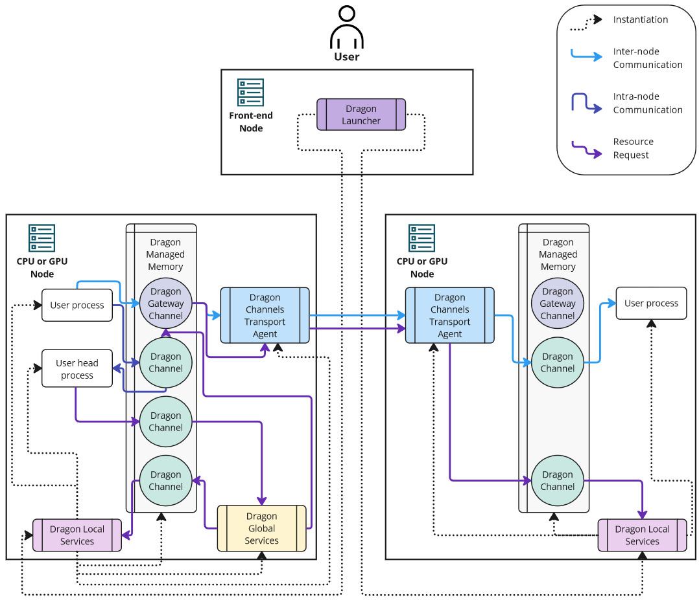

.. Consult  https://opensource.com/article/20/3/documentation for general style advice about OS project docs

.. Tips for the documentation:

..    * Assume the reader is significantly less experienced than you are
..    * A paper/book citation creates credibility

..    * After running `make -j 2` once, Sphinx recompilation is much faster using
..      /usr/local/bin/sphinx-build -M html "." "_build" -T -j 2

..    * We use auto section references, :ref:`ref/native/Python/index:Python Language Bindings`
..      will reference just that. No need to introduce custom labels
..    * useful when moving files around:
..      grep -rl uguide/resource_model . | xargs sed -i 's|uguide/resource_model|uguide/resource_model|g'
..      replaces the old path of a file with a new path of the file.
..    * We have configured Sphinx, so that `bla` means :code:`bla`, not :any:`bla`
..    * Glossary items can be referenced with :term:`Managed Object`
..    * It is easy to reference a code object with :any:`dragon.data.ddict`
..    * Hyperlinks: `Google <https://google.de>`_

..    * Code uniformity looks professional: Run `black -l 110` over your Python example
..    * Python type annotations are standard in many verticals and make the code more readable
..    * Docstrings are easy to read, easy to skip and can be autodoced.
..    * In-line comments for the non-obvious show a deep understanding of the algorithm

..    * Consider using PlantUML to produce sequence, component, state and other diagrams.
..    * PlantUML is an industry standard and autocompiled into SVG in our Makefile for optimal image quality
..    * A VSCode plugin called PlantUML is available to preview diagrams on the spot
..    * Example code can be found in the API reference.

Welcome to Project Dragon!
++++++++++++++++++++++++++

Overview
========

Dragon is a composable distributed run-time for managing dynamic processes,
memory, and data at scale through high-performance communication objects that
work transparently from laptop to supercomputer. Some of the key use cases for
Dragon include distributed applications and :term:`workflows <Workflow>` for
analytics, HPC, and converged HPC/AI.

Dragon has a core, which consists of run-time services and foundational memory and
communication primitives. Other Dragon components build on top of the core.
Composability among the components makes Dragon a flexible ecosystem in which to
build scalable solutions across a wide range of applications and workflows.

Dragon development has been organized into several areas of ongoing work as shown
in :numref:`dragoncomponents`. These key areas are seen as common to many of the
needs of distributed computing at scale.
.. _dragoncomponents:

.. list-table:: Dragon Components
   :header-rows: 1
   :widths: 15 20 10

   * - Name
     - Use Cases
     - Status
   * - Core
     - Complete control over processes, memory, and communication
     - Ready
   * - Python multiprocessing
     - Scale any Python multiprocessing program across nodes with little effort
     - Ready
   * - Workflow Extensions
     - Higher level interface for defining workflows and adapters into workflow tools
     - Alpha
   * - Data
     - Workloads needing a distributed KVS or mid-level cache
     - Beta
   * - Telemetry
     - Introspection of Dragon, hardware utiliziation, user-injected real-time data
     - pre-Alpha
   * - AI
     - Scalable data loaders for AI training, distributed training and resiliency
     - Alpha

There are a few comments about :numref:`dragoncomponents` that help provide context:

  * Dragon core is for advanced users. APIs may change slightly. However, it is mature
    code and has been tested and used very thoroughly.

  * Nearly all of Python multiprocessing becomes multi-node with Dragon's run-time.

  * Dynamic workflow extensions requirements gathering and use cases are being investigated.

  * A distributed dictionary or Key/Value Store (KVS) is ready for beta use. Performance improvements will continue.

  * Telemetry work will help to provide feedback to users on performance and potential optimization
    of user code.

  * Dragon developers are working independently and with library developers to provide
    integration with AI libraries, testing, and performance at scale.

What distinguishes the Dragon project from many other projects is that Dragon has
been designed from the ground up to be a powerful run-time to support distributed
computing at scale and work continues to make it even more useful. After more
than four years of design and development, we are happy to share this with the
open source community and are grateful to Hewlett Packard Enterprise for
supporting what we see as an open source project that helps fulfill a critical
need in AI and high performance computing.

How Dragon Works
================

.. sidebar:: Dragon API stack.

   .. figure:: images/dragon_sw_stack.jpg
      :align: center
      :scale: 32 %

..   .. figure:: images/dragon_spokes.jpg
..      :align: center
..      :scale: 38 %

Dragon consists of a low-level set of core interfaces and high-level interfaces
that are composed from the low-level components. Dragon's run-time services manage
the life-cycles of instances of core components, perform inter-node communication
on behalf of user processes, and manage the deployment of the run-time across the
nodes of a distributed system.

Dragon's most basic components are Dragon Managed Memory and Dragon Channels as
depicted in :numref:`dragonarch`. Allocations from Managed Memory are used for
each Dragon Channel, and a Dragon Channel is similar to a FIFO queue. All
communication objects, both user and infrastructure, are based on Dragon
Channels. Intra-server communication is done directly over shared memory, and
inter-server communication is done with the assistance of a Transport Agent. User
processes may have lifetimes that are independent of communication object
lifetimes, and processes can utilize communication objects without knowledge of
the physical location of the underlying Channels communication objects are
composed from. The final basic component of Dragon is a Process. Dragon manages
the life-cycle and placement of processes on any server the run-time is executing
on. Global Services is the broker for all life-cycle requests related to
Managed Memory, Channels, and Processes. It negotiates with the Local Services
process running on a given node, which does the work of managing a component on
its node. With this basic architecture, programs written for Dragon can
transparently run on a single node, multi-node, or a multi-system environment
with little-to-no changes.

Higher-level communication and synchronization objects supported by Dragon are
implemented on top of these basic (i.e. core) Dragon components. User programs
can take full advantage of their distributed system without having to deal with
the details of location and inter-node communication. Where an object resides is
functionally irrelevant because the Dragon core and transport service provide
transparent, location independent access to objects that are composed of the
Dragon core.

.. _dragonarch:

   Dragon Infrastructure Architecture

Dragon's implements most of Python's multiprocessing library. The functionality
that is not implemented includes managers. The sharedctypes of multiprocessing
are limited to Value and Array in Dragon. Listeners and clients are not
implemented in the Dragon version of multiprocessing. All the rest of
multiprocessing is implemented by Dragon.

Why Dragon?
===========

Dragon was originally conceived to address choices developers and researchers
often face as their workloads become more demanding, "Is it worth the effort to
rewrite this?" or "Must I use cumbersome interfaces just to get scaling and
performance?". Dragon does this by bringing performance and scaling to standard
libraries of high-productivity languages. The Dragon run-time (a rudimentary
distributed OS in user space) developed to support a scalable implementation
of the standard Python multiprocessing API, can be adapted for many other uses as
well through the composability of its components. Distributed orchestration of
dynamic processes and data through efficient communication primitives, programmed
through high-level APIs like Python multiprocessing, is simpler and more
productive with Dragon.

Where to Next?
================

Follow the directions in :ref:`gettingstarted` to install Dragon. Then consult
the :ref:`userguide` and :ref:`cookbook` to familiarize yourself with using
Dragon. Most users will want to install Dragon and then refer to `Python
multiprocessing <https://docs.python.org/3/library/multiprocessing.html>`_ to
learn what you can do with multiprocessing and Dragon's multi-node
implementation!

Contents
========

.. toctree::
   :maxdepth: 2

   start/start.rst
   uguide/uguide.rst
   pguide/pguide.rst
   cbook/cbook.rst
   benchmarks/benchmarks.rst
   faq/faq.rst
   ref/ref.rst
   infrastructure/infrastructure.rst
   services/services.rst
   components/components.rst

Indices and tables
==================

* :ref:`genindex`
* :ref:`search`

.. * :ref:`modindex`
