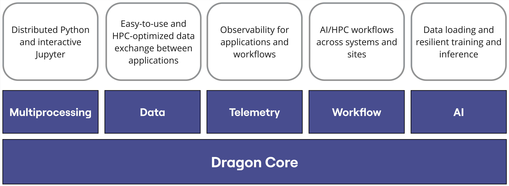

.. Consult  https://opensource.com/article/20/3/documentation for general style advice about OS project docs

.. Tips for the documentation:

..    * Assume the reader is significantly less experienced than you are
..    * A paper/book citation creates credibility

..    * After running `make -j 2` once, Sphinx recompilation is much faster using
..      /usr/local/bin/sphinx-build -M html "." "_build" -T -j 2

..    * We use auto section references, :ref:`ref/native/Python/index:Python Language Bindings`
..      will reference just that. No need to introduce custom labels
..    * useful when moving files around:
..      grep -rl uguide/resource_model . | xargs sed -i 's|uguide/resource_model|uguide/resource_model|g'
..      replaces the old path of a file with a new path of the file.
..    * We have configured Sphinx, so that `bla` means :code:`bla`, not :any:`bla`
..    * Glossary items can be referenced with :term:`Managed Object`
..    * It is easy to reference a code object with :any:`dragon.data.ddict`
..    * Hyperlinks: `Google <https://google.de>`_

..    * Code uniformity looks professional: Run `black -l 110` over your Python example
..    * Python type annotations are standard in many verticals and make the code more readable
..    * Docstrings are easy to read, easy to skip and can be autodoced.
..    * In-line comments for the non-obvious show a deep understanding of the algorithm

..    * Consider using PlantUML to produce sequence, component, state and other diagrams.
..    * PlantUML is an industry standard and autocompiled into SVG in our Makefile for optimal image quality
..    * A VSCode plugin called PlantUML is available to preview diagrams on the spot
..    * Example code can be found in the API reference.

Home
++++

.. container:: homeblock

    .. figure:: images/dragon_logo.png
       :align: left
       :scale: 18 %
       :figwidth: 70%

    * :ref:`installation-guide`
    * :ref:`getting-started`
    * :ref:`uses`
    * :ref:`DragonAPI`
    * :ref:`developer-guide`

|

Dragon is a composable runtime that lets users create scalable, complex, and resilient HPC and AI
applications and workflows through standard Python interfaces. Dragon provides capabilities to address many
of the challenges around programmability, memory management, transparency, and efficiency on distributed
systems. Built by a team with decades of experience developing software for Cray supercomputers, Dragon lets you
write familiar code, making it easy to scale from a laptop to a supercomputer.

.. toctree::
   :hidden:

   install.rst
   start.rst
   uses.rst
   ref.rst
   devguide.rst
   benchmarks.rst
   faq.rst

.. Welcome to Project Dragon!
.. ++++++++++++++++++++++++++
..
.. Overview
.. ========
..
.. Dragon is a composable distributed run-time for managing dynamic processes, memory, and data at scale through
.. high-performance communication objects. Some of the key use cases for Dragon include distributed applications and
.. :term:`workflows <Workflow>` for analytics, HPC, and converged HPC/AI.
..
.. Dragon has a core, which consists of runtime services and foundational memory and communication primitives. Other Dragon
.. components for specific use cases build on top of the core. Composability among the components makes Dragon a flexible
.. ecosystem in which to build solutions across a wide range of applications and workflows.
..
.. .. list-table:: Dragon Components
   .. :header-rows: 1
   .. :widths: 20 30 30
..
   .. * - Name
     .. - Use Cases
     .. - Status
   .. * - Core
     .. - Complete control over processes, memory, and communication
     .. - Architectural maturity but not recommended for direct production use yet
   .. * - Python multiprocessing
     .. - Scale any Python multiprocessing program across nodes with little effort
     .. - Reasonably mature, most of the multiprocessing API implemented
   .. * - Workflow
     .. - Higher level interface for defining workflows and adapters into workflow tools
     .. - Under development
   .. * - Data
     .. - Workloads needing a simple "batteries included" KVS or mid-level cache
     .. - Under development
   .. * - Telemetry
     .. - Introspection of Dragon, hardware utiliziation, user-injected real-time data
     .. - Under development
   .. * - AI
     .. - Scalable data loaders for AI training, distributed training and resiliency
     .. - Under development
..
..
.. How Dragon Works
.. ================
..
.. .. sidebar:: Dragon API stack.
..
   .. .. figure:: images/dragon_sw_stack.jpg
      .. :align: center
      .. :scale: 32 %
..
.. ..   .. figure:: images/dragon_spokes.jpg
.. ..      :align: center
.. ..      :scale: 38 %
..
.. Dragon consists of a low-level set of core interfaces and high-level interfaces that are composed from the low-level
.. components. Infrastructure services manage the life-cycles of instances of core components, perform inter-node
.. communication on behalf of user processes, and manage the deployment of the infrastructure.
..
.. Dragon's most basic components are Dragon Managed Memory and Dragon Channels. Partitions of Managed Memory are used
.. for each Dragon Channel, and a Dragon Channel is similar to a FIFO queue. All communication objects, both user and
.. infrastructure, are based on Dragon Channels. Intra-server communication is done directly over shared memory, and
.. inter-server communication is done with the assistance of a Transport Agent. User processes may have lifetimes that are
.. independent of communication object lifetimes, and processes can utilize communication objects without knowledge of the
.. physical location of the underlying Channels communication objects are composed from. The final basic component of
.. Dragon is a Process. Dragon manages the life-cycle and placement of processes on any server the runtime is executing on.
.. Dragon Global Services is the broker for any life-cycle requests related to Managed Memory, Channels, or processes. It
.. negotiates with the Local Services process running on a given node, which does the work of managing a component on its
.. node. With this basic architecture, programs written for Dragon can transparently run in a single server, multi-server,
.. and multi-system environment with little-to-no changes.
..
.. Architecture
.. ------------
..
.. .. figure:: images/dragon_deployment.jpg
   .. :align: center
   .. :scale: 75%
..
..
.. Why Dragon?
.. ===========
..
.. Dragon was originally conceived to address choices developers and researchers often face as their workloads become more
.. demanding, "Is it worth the effort to rewrite this?" or "Must I use cumbersome interfaces just to get scaling and
.. performance?". Dragon does this by bringing performance and scaling to standard libraries of high-productivity
.. languages. The Dragon runtime (a rudimentary distributed OS in user space) we developed, first for a scalable
.. implementation of the standard Python multiprocessing API, can be adapted for many other uses as well through the
.. composability of its components. Distributed orchestration of dynamic processes and data through efficient communication
.. primitives, programmed through high-level APIs like Python multiprocessing, is simpler and more productive with Dragon.
..
..
.. Contents
.. ========
..
.. .. toctree:
   .. :maxdepth: 2
..
   .. start/start.rst
   .. uguide/uguide.rst
   .. pguide/pguide.rst
   .. cbook/cbook.rst
   .. benchmarks/benchmarks.rst
   .. faq/faq.rst
   .. ref/ref.rst
..
..
..
.. INTERNAL
.. ========
..
.. .. toctree:
   .. :maxdepth: 2
..
   .. internal/internal.rst
..
..
.. Indices and tables
.. ==================
..
.. * :ref:`genindex`
.. * :ref:`search`
..
.. .. * :ref:`modindex`
