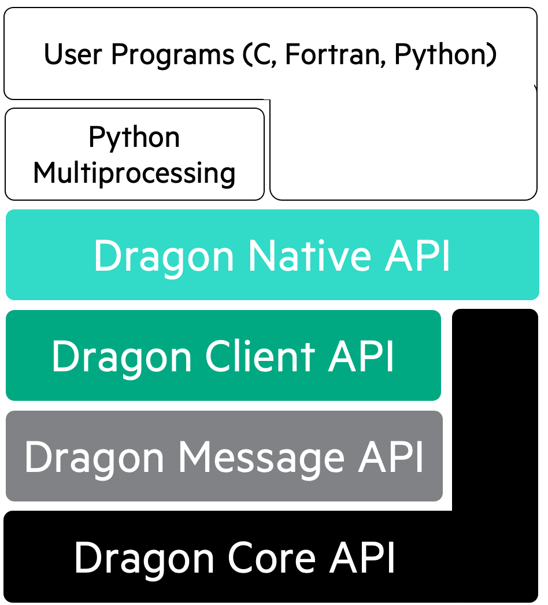

The API Stack
+++++++++++++

Before you start programming with Dragon, you need to decide which API you want
to program to. The runtime provides a stack of interfaces abstracting 
:term:`resources <System Resource>` of a distributed system, ranging from low-level shared
memory to a distributed dictionary. It is *composable*, meaning the APIs are
built on top of each other (see :numref:`dragon-api-stack`). We deliberately expose the whole
stack of APIs so that you can choose if you want to interact with the complete
runtime or want to use only parts of it. For an overview, see table 1 in the 
:ref:`reference section <ref/ref:API Reference>`.

   **The Dragon API stack**

Lower level interfaces yield less convenient objects. Thus new and experienced
users should consider programming to Dragon in two ways:

1. In Python using :ref:`pguide/dragon_multiprocessing:Multiprocessing with Dragon`, if they 
   want to make an existing Python code scale to a distributed system quickly.
2. In C, C++, Fortran and Python using the :ref:`ref/native/index:Dragon Native` API, if they want to take advantage 
   of all Dragon features or need to use languages other than Python.

The objects provided by these two APIs have the following properties:

* **interoperable**: a named Python Multiprocessing Queue object can be used as a managed Dragon Native Queue in C with the same name. 
* **transparent**: :term:`objects <Transparency>` can be used everywhere on a system of distributed or even federated nodes.
* **shareable**: objects can be serialized and passed to other programs, processes or threads via stdin.
* **managed**: :term:`objects <Managed Object>` can be looked up by :term:`name <Object Name>` or :term:`uid <Object UID>` to retrieve their :term:`serialized descriptor <Serialized Descriptor>`.
* **refcounted**: :term:`object<Refcounted Object>` life-cycle is controlled by the Dragon runtime. It is automatically removed by the runtime if no program, process or thread is using it anymore.
* **thread-safe**: users do not have to care about race conditions in objects when they are shared among programs, processes or threads.
* **performant**: objects scale to distributed systems and efficiently support workflows across federated systems.

Only the Dragon Native API is *polyglot*, i.e. available in all supported
programming languages.

In the future, experienced developers can further program to the

3. :term:`Unmanaged <Unmanaged Object>` Dragon Native API, if they want to use composite objects with improved performance. See :ref:`uguide/resource_model:Performance Costs`. 
4. Dragon Client API or Dragon Infrastructure API, if they want to extend the functionality of the Dragon runtime by extending Dragon Services.
5. Dragon Core API, to use core functionality in their own programs without starting the runtime. To use the Dragon core API on its own, see also :ref:`pguide/dragon_multiprocessing:Multiprocessing and Dragon without Patching`

Architecture of a Dragon Program
================================

.. figure:: images/api_use_python.svg
   :scale: 75%
   :name: api-use-python 
  
   **Architecture of a user program using Dragon with Python Multiprocessing or Dragon Native. Internal Dragon APIs are not shown.**

In :numref:`api-use-python` we show a component diagram of the architecture of a Dragon program
using either the Python Multiprocessing with Dragon API, or the Dragon Native
API.

* User programs using :term:`managed <Managed Object>` Dragon native objects directly call into the Dragon
  stack. The Dragon native implementation uses the core and client components to
  implement its objects on top of the four :term:`primary objects <Primary Object>`.
  Dragon services manage the primary objects and communicate using the
  infrastructure message component on top of the core API.

* Python Multiprocessing with Dragon programs only use the Multiprocessing API. Our 
  MPBridge component translates the Multiprocessing objects into Dragon native objects by
  heavily modifying the object APIs. This way we achieve limited interoperability between
  both APIs.

Architecture of Advanced Use Cases
==================================

.. figure:: images/api_use_core.svg
   :scale: 75%
   :name: api-use-core 

   **Architecture of advanced use cases for the Dragon runtime. Internal APIs are not shown.**

In :numref:`api-use-core` we show a component diagram of the architecture of advanced use cases for Dragon.
Note that these use cases are not supported yet.

* User programs using :term:`unmanaged <Unmanaged Object>` Dragon native objects directly call into
  Dragon, but do not require the infrastructure services to track :term:`names <Object Name>` and 
  :term:`uids <Object UID>` of their objects. This reduces the load on infrastructure services, which only
  provide :term:`transparency <Transparency>` across :term:`distributed or federated systems <Federated System>`.
* Users may choose to extend the Dragon native API with their own composite objects, using Dragons 
  native, client and core APIs for maximum flexibility.
* User may want to use only the Dragon core components to extend their own programs with its components. In
  that case the infrastructure components of Dragon do not need to be started, Dragon core components can be
  :ref:`directly imported and used <pguide/dragon_multiprocessing:Multiprocessing and Dragon without Patching>`. 