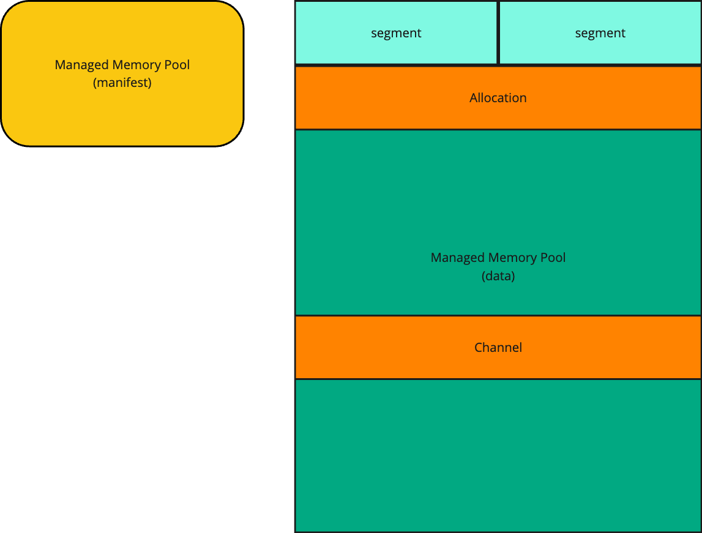
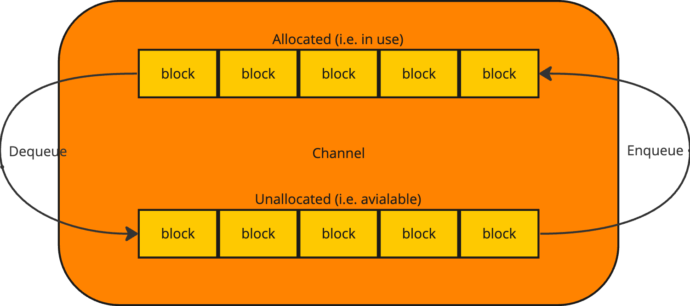
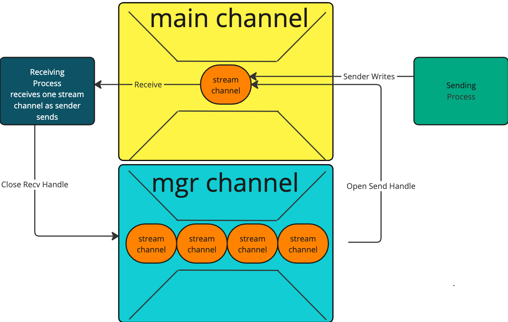
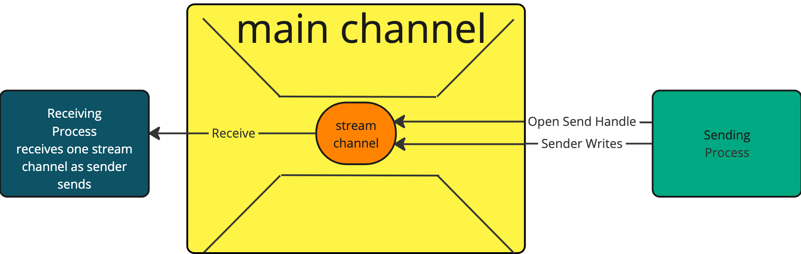
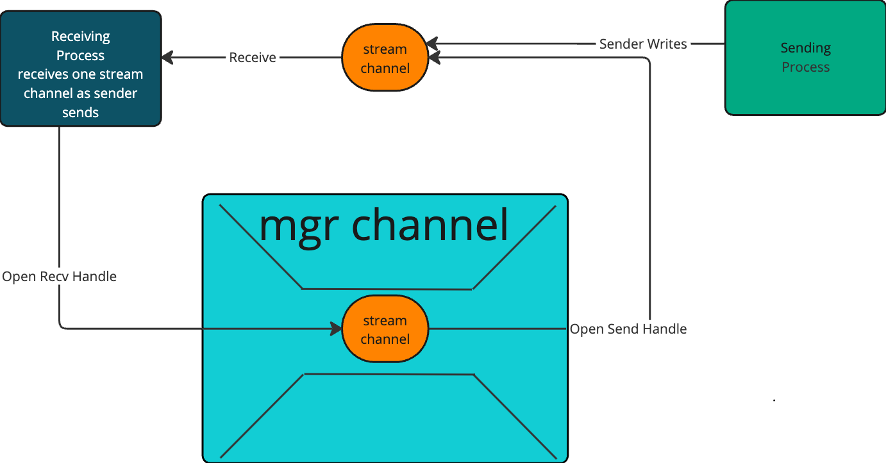

.. _DragonCore:

Dragon Core
+++++++++++++++++++++

The Dragon Core API supports much of the rest of the Dragon run-time services. It
can also be programmed to directly by knowledgable programmers. The API has at
its core two types of objects, shared memory allocations and channels. Written in
C, the API is interoperable with other languages, including C, C++, Python, and
Fortran (C++ and Fortran bindings are currently not available as of this
writing).

The following sections provide an overview of the major components of the Dragon
Core. The sections following this introduction provide a detailed description of
the API and objects that are a part of the Dragon Core.

.. _managed_mem_overview:

Managed Memory
=========================

    **Conceptual View of Managed Memory**

As depicted in :numref:`managed_mem_fig`, shared memory allocations come from
memory pools. Both memory pools and memory pool allocations are part of the
shared memory API. POSIX shared memory provides the underlying mechanism through
which managed memory is implemented. Managed memory pools consist of two parts, a
manifest and a data. The manifest is where all meta-data about the managed memory
pool is stored. The data part is where allocations are made. The data part is
managed by a heap manager whose state is maintained in the manifest. The data is
split up into segments which are the smallest allocatable block of data within
the data part. The size of the memory pool, size of segments, and number of
segments are all configurable at run-time.

The heap manager, a sub-component of managed memory, allocates data from the pool
by allocating one or more contiguous segments that together are as big or bigger
than a requested allocation. Should the managed memory pool be full or unable to
make an allocation of a specific size, but may be able to in the future once
other allocations are freed, allocation requests may block the requesting process
until the allocation is available. Processes decide whether to use blocking
allocation calls or not and decide on the amount of time they are willing to
wait.

Managed memory allocation is thread and interprocess safe. Interprocess locking
guarantees that critical sections are executed without interleaving between
processes. Managed memory is an interprocess and thread-safe dynamic memory
allocation framework.

To share a managed memory allocation a serialized descriptor can be created and
shared. Other processes which receive a copy of the serialized descriptor can
then attach to the same shared memory within their own process. This concept of
serializing an object to be shared with other processes that can then attach to
it is widespread within Dragon. Managed memory, channels, and things that are
built from these fundamental building blocks all can be shared by creating a
serialized representation that can then be attached in other processes.

Managed memory allocations can be attached, even off-node. However, memory
allocations are hosted in shared memory of a single node. Attaching to a managed
memory allocation is different than getting a pointer into the data. Managed
memory descriptors can be passed around at will in the Dragon run-time and
between Dragon managed processes. But, a process must be running on the node
where the pool exists to obtain a pointer into a managed memory allocation.

When the Dragon run-time is started, two managed memory pools are created per node
to facilitate communication within the run-time. An infrastructure pool is created that
is used strictly by infrastructure supporting code internal to Dragon. A default pool
is also allocated which is used by APIs when making internal allocations on behalf of a
user.

.. _channels_overview:

Channels
==================

As shown in :numref:`managed_mem_fig`, a channel, at its most fundamental level,
is an allocation in a managed memory pool. Channels only exist inside managed
memory pools. All channels are allocated out of some managed memory pool.
Internally, as shown at a very high level in :numref:`channel_pic` a channel is
composed of finite number of blocks. Both the number of blocks and the block size
are configurable at run-time.

    **Conceptual View of a Channel's Structure**

The channels API provides an organized means of synchronizing and communicating
between processes. Channels provides a queue-like interface between these
processes both on-node and off-node (when used in conjunction with a transport
service). Channels are a thread and interprocess-safe queue where messages can be
sent and received.

A channel, like managed memory, can be serialized and shared with other
processes. A channel, like managed memory, can also be attached both on-node and
off-node. The channels library itself recognizes when a channel is located
off-node and coordinates with a gateway channel which in turn is serviced by a
transport service to provide communication from a process that is located on a
node different from the channel with which it is communicating.

Messages are sent into channels and are captured inside a channel block. Each
block either contains a message or contains a reference to a message if the
message is too big to be contained in the block. When a message is sent, an
unallocated block is allocated and added to the list of allocated blocks to be
dequeued in sequential order. When a block is unavailable, a process may wish to
block until a block is available to send its message.

Channels provide both blocking and non-blocking semantics for sending and getting
messages. When sending, blocking can be chosen to wait when memory from a pool is
needed and not available. When getting messages, blocking receives will wait
until a message is available. All blocking operations within Dragon can either
idle wait, consuming fewer resources and energy, or spin wait, with relatively no
wakeup cycles. Channels are highly configurable and customizable for whatever
situation they are used in at the expense of being a low-level primitive
synchronization and communication construct.

When a message is dequeued the relevant message payload is copied from the block
and its corresponding block is added to the list of unallocated blocks to be used
again. In this way a channel's blocks are re-used during its lifetime.

During the enqueue operation (called send_msg in the API) message data is copied
into a block and during the dequeue operation (called get_msg in the API) message
data is copied out of the block. For large messages the contents of a block is a
serialized descriptor of the message and therefore the actual message contents
may not be copied but rather shared in a controlled manor between processes
providing the potential for a zero copy transfer of data between processes when
both processes are located on-node.

Out of these basic concepts all other, higher level objects are constructed. Both
channels and managed memory also rely on even more primitive sub-components to do
their work. These sub-components provide locking, blocking, heap management, and
various other services that are needed by these two fundamental building blocks, but
managed memory and channels are the fundamental building blocks of all higher level
objects like the File Like Interface described in the next section.

Further Information
'''''''''''''''''''''''

Dragon Channels is the low-level transport layer for communicating messages
between POSIX processes in the Dragon runtime. The Dragon run-time services
itself uses channels for communication between processes. User programs,
utilizing the Dragon run-time services also use channels either directly, or
indirectly. This API would be used directly when a program wants to communicate
in the most efficient way possible while being willing to give up the services
provided by higher level communication and synchronization abstractions like FLIs
and even higher level abstractions like queues. Choosing to communicate at the
channels level will mean giving up features like pickling and unpickling,
automatic serialization of data, and the automatic streaming of data over a
channel.

A major advantage of Channels is that they retain the flexibility of using
sockets or a filesystem while enabling zero-copy on-node transfers, single-copy
RDMA-enabled transfers off-node, and choices for blocking semantics. There is a
rich set of buffer management options that enable use cases such as:

    - static target-side managed payload landing pads much like SHMEM or
      one-sided MPI

    - dynamic target-side managed payload landing pads much like two-sided MPI

    - static or dynamic origin-side managed payload landing pad, which nothing
      else has

Dragon Channels can reside in any valid :c:struct:`dragonMemoryDescr_t` as
provided by Dragon Memory Pools. This includes shared memory, a filesystem, or
private virtual memory. Payload buffers for messages can reside within a
channel, a memory pool :c:struct:`dragonMemoryPoolDescr_t` the channel was
allocated from, or any valid :c:struct:`dragonMemoryDescr_t` passed with a
message. This design allows Channels to provide multiple usage scenarios with
different performance and persistence characteristics.

Example
'''''''''''

:ref:`An example can be found here <channels_example>`. The example illustrates how
to use the C Channels API.

Channels provide flexible on-node and communication that processes use by
attaching and detaching to the underlying
:ref:`Managed Memory<DragonCoreManagedMemory>`. When Channels are used in conjunction with a
transport agent, transparent off-node communication is also provided when sending
and receiving messages using the Channels API. In this respect, Channels resemble
POSIX sockets as they are always available as a service and not built upon the
static distributed model that MPI or SHMEM is. :term:`Transparency` is provided because
the exact same Channels API calls work for both on-node and off-node
communication. The user program does not change when communicating off-node or
on-node.

.. _fli_overview:

File Like Interface
==============================

The File Like Interface (i.e. FLI) provides an abstraction over channels of 1:1
communication between two end points. The abstraction supports streaming data
over a *connection* like interface. Sending and receiving data is done by opening
a send or receive handle. Once a send and a receive handle is opened, a 1:1
connection exists between sender and receiver. Data can then be streamed over the
connection with a guarantee that data from other senders and receivers will not
interrrupt the stream between the two end points.

There is no restriction about the location of the two end points. They may exist
in different processes on different nodes using channels that may be co-located
on the sending or receiving side, but are not required to be. There are certain
benefits to co-location, but no requirements for it in the FLI API.

    **File Like Interface Overview**

The FLI is implemented as a channel of stream channels. A *Stream Channel* is a
channel that is designated for one sender and one receiver to share while carrying
on a streaming conversation. When the conversation is over, the stream channel is
recycled according to the FLI protocol.

When an FLI is created, a *Main Channel* and a *Manager Channel* are created in
the nominal case. When the FLI is created, there are some number of stream
channels that are supplied. These stream channels are serialized and their
serialized descriptors are placed in the manager channel. The manager channel is
then a channel of channel descriptors.

When a *Sender* comes along, it opens a send handle on the FLI which then
receives a serialized channel descriptor for a stream channel from the manager
channel. A sender looks for stream channels in the manager channel and attempts
to dequeue it when the send handle is opened.

At the moment the send handle is opened, the serialized representation of it is
then written into the *Main Channel*. This means that as soon as there is a
sender, the stream channel becomes available to a receiver to begin receiving
streaming data. A sender and receiver can be carrying on their 1:1 conversation
as soon as a sender is opens a send handle.

When a *Receiver* opens a receive handle, the FLI API receives a stream channel
from the main channel and adds it to the receive handle. The receiver can begin
receiving data on the stream channel at that point.

When a sender closes a send handle a special message is sent to the receiving
side to indicate that the conversation is over. This results in the receiver
receiving a return code of DRAGON_EOT to indicate that the end of the
conversation has been reached.

Once the receiver has received DRAGON_EOT it must respond by closing the receive
handle. When the receive handle is closed, the stream channel is recycled by
enqueuing a serialized descriptor for it back into the *Manager Channel*.

Controlling the Placement of Data
'''''''''''''''''''''''''''''''''''

One nuance of the FLI design can help in the placement of data within a pool.
When data is sent to a channel, either on-node or off-node, the data must be
copied into a managed memory pool while it is transferred through the stream
channel.

In the absence of further information about a pool from which to allocate space,
the pool of the channel being sent to will be used. If the user application
wishes to optimally handle data by placing it in a pool and minimizing copies of
that data, then creating the stream channels from the same pool will mean that
the FLI will automatically place data that was sent to a stream channel into the
same pool as the stream channel and therefore into a pool chosen by the user. The
net result of this rather complicated explanation is that if the receiver creates
the FLI then it may be beneficial to first create a pool and stream channels from
that same pool to optimally minimize the copying of data.

Example
'''''''''''

Here is some sample code for creating an FLI using only the C interface. This
example code was taken from the test/channel_subtests/test_fli.c program. Note
that for this to be useful production code, resources should be created using a
means of guaranteeing unique CUIDs for channels and if needed, unique MUIDs for
pools. For instance, you might use the dragon_create_process_local_channel API
call to create guaranteed unique CUIDs for you channels.

.. code-block:: C
    :linenos:
    :caption: **Creating an FLI**

    #include <dragon/channels.h>
    #include <dragon/fli.h>

    #define M_UID 0
    #define POOL_M_UID 2
    #define POOL "fli_test"
    #define NUM_CHANNELS 10
    #define MAX_STREAM_SIZE 500

    dragonError_t create_pool(dragonMemoryPoolDescr_t* mpool) {
        /* Create a memory pool to allocate messages and a Channel out of */
        size_t mem_size = 1UL<<31;

        dragonError_t err = dragon_memory_pool_create(mpool, mem_size, POOL, POOL_M_UID, NULL);
        if (err != DRAGON_SUCCESS)
            err_fail(err, "Failed to create memory pool");

        return DRAGON_SUCCESS;
    }

    dragonError_t create_channels(dragonMemoryPoolDescr_t* mpool, dragonChannelDescr_t channel[], int arr_size) {
        int k;
        dragonError_t err;

        for (k=0;k<arr_size;k++) {
            /* Create the Channel in the memory pool */
            err = dragon_channel_create(&channel[k], k, mpool, NULL);
            if (err != DRAGON_SUCCESS)
                err_fail(err, "Failed to create a channel");
        }

        return DRAGON_SUCCESS;
    }

    int main() {
        dragonError_t err;
        dragonMemoryPoolDescr_t pool;
        dragonChannelDescr_t channels[NUM_CHANNELS];
        dragonChannelDescr_t* channel_ptrs[NUM_CHANNELS];
        dragonFLIDescr_t fli;
        dragonFLISerial_t ser;

        /* Creating the channel set and the pool */
        for (int k=0;k<NUM_CHANNELS;k++)
            channel_ptrs[k] = &channels[k];

        /* Always check error codes - omitted for brevity */
        err = create_pool(&pool);
        err = create_channels(&pool, channels, NUM_CHANNELS);
        err = dragon_fli_create(&fli, channel_ptrs[0], channel_ptrs[1], &pool, NUM_CHANNELS-2, &channel_ptrs[2], false, NULL);
        err = dragon_fli_serialize(&fli, &ser);

        /* The serialized fli named ser can then be base64 encoded and shared
           with other processes where it can then be base64 decoded
           and attached to other processes within the dragon run-time. */

        ...
    }

Variations on Creation of FLIs
'''''''''''''''''''''''''''''''''

There are several variations possible on the creation of FLI connections. The
following sections provide a comprehensive list of these possible variations. In
summary, the variations are:

    * Buffered FLI
    * Sender Supplied Stream Channels
    * Receiver Supplied Stream Channels
    * Main Channel as Stream Channel

These variations are all different from the nominal case presented in the
previous section.

Buffered FLI
''''''''''''''

On creation, it is possible to create an FLI that is designated as *buffered*. This is done
as follows.

.. code-block:: C
    :name: buffered_fli_code
    :linenos:
    :caption: **A Buffered FLI**

    int main() {
        dragonError_t err;
        dragonChannelDescr_t channels[NUM_CHANNELS];
        dragonChannelDescr_t* channel_ptrs[NUM_CHANNELS];
        dragonFLIDescr_t fli;

        for (int k=0;k<NUM_CHANNELS;k++)
            channel_ptrs[k] = &channels[k];
        /* Always check error codes - omitted for brevity */
        err = create_pool(&pool);
        err = create_channels(&pool, channels, NUM_CHANNELS);
        err = dragon_fli_create(&fli, channel_ptrs[0], NULL, &pool, 0, NULL, true, NULL);

In :numref:`buffered_fli_code` *true* is passed for the value of the
*use_buffered_protocol* argument. Also in this case there are no specified stream
channels and no manager channel. In this case, while the FLI continues to operate
using the normal FLI API, all writes to a send handle are buffered until the send
handle is closed. This means that no streaming occurs in this case, but one
channel, the main channel, can be used by multiple senders and receivers and
conversations between opening and closing a receive handle will consist of one
receive operation on the underlying channel. However, there may be multiple read
operations performed on the received chunk of data when less than the whole chunk
is being read. For instance, the buffered send my send 128 bytes of data. A
reader may read 32 bytes resulting in 96 bytes of data left to read. Once the
received data is exhausted by read operations, DRAGON_EOT will be returned.

To reiterate, with a buffered FLI, multiple writes are possible and multiple
reads are possible, but the underlying data is all sent in one buffered chunk. By
sending all the conversations data within one buffered chunk, multiple
conversations can peacefully co-exist within the same channel.

Sender Supplied Stream Channels
''''''''''''''''''''''''''''''''''

An application designer may decide that senders should all have their own dedicated stream
channels. In the nominal case, senders pick up a stream channel from the manager channel. If
the design of the application is to have each sender have its own dedicated stream channel, then
a manager channel is not necessary.

    **File Like Interface with Sender Supplied Stream Channels**

:numref:`sender_fli_code` demonstrates creating an FLI with the intention of providing sender
supplied stream channels. This is allowed because it is created with a main channel. No manager
channel is required in this case.

.. code-block:: C
    :name: sender_fli_code
    :linenos:
    :caption: **Creating a Send Handle with a Sender Supplied Stream Channel**

    int main() {
        dragonError_t err;
        dragonChannelDescr_t channels[NUM_CHANNELS];
        dragonChannelDescr_t* channel_ptrs[NUM_CHANNELS];
        dragonFLIDescr_t fli;
        dragonFLISendHandleDescr_t sendh;

        for (int k=0;k<NUM_CHANNELS;k++)
            channel_ptrs[k] = &channels[k];
        /* Always check error codes - omitted for brevity */
        err = create_pool(&pool);
        err = create_channels(&pool, channels, NUM_CHANNELS);
        err = dragon_fli_create(&fli, channel_ptrs[0], NULL, &pool, 0, NULL, false, NULL);
        err = dragon_fli_open_send_handle(&fli, &sendh, channel_ptrs[1], NULL, NULL);

When opening the send handle, a sender supplied stream channel is specified.
Opening the send handle places the stream channel's serialized descriptor into
the main channel to be picked up by a receiver. NOTE: While both sender supplied
stream channels and receiver supplied stream channels are possible, one or the
other must be chosen and adhered to in a particular FLI. If stream channels are
sender supplied, the receivers should not specify a stream channel when opening a
receive handle. Doing so would mean that senders and receivers would not talk to
each other.

Receiver Supplied Stream Channels
''''''''''''''''''''''''''''''''''

In some cases it may be desirable for each receiver to have a dedicated stream channel.
In the nominal case, receivers pick up a stream channel from the main channel. If
the design of the application is to have each receiver have its own dedicated stream channel, then
a main channel is not necessary.

    **File Like Interface with Receiver Supplied Stream Channels**

:numref:`receiver_fli_code` demonstrates creating an FLI with the intention of providing receiver
supplied stream channels. This is allowed because it is created with a manager channel. No main
channel is required in this case.

.. code-block:: C
    :name: receiver_fli_code
    :linenos:
    :caption: **Creating a Receive Handle with a Receiver Supplied Stream Channel**

    int main() {
        dragonError_t err;
        dragonChannelDescr_t channels[NUM_CHANNELS];
        dragonChannelDescr_t* channel_ptrs[NUM_CHANNELS];
        dragonFLIDescr_t fli;
        dragonFLIRecvHandleDescr_t recvh;

        for (int k=0;k<NUM_CHANNELS;k++)
            channel_ptrs[k] = &channels[k];
        /* Always check error codes - omitted for brevity */
        err = create_pool(&pool);
        err = create_channels(&pool, channels, NUM_CHANNELS);
        err = dragon_fli_create(&fli, NULL, channel_ptrs[0], &pool, 0, NULL, false, NULL);
        err = dragon_fli_open_recv_handle(&fli, &recvh, channel_ptrs[1], NULL, NULL);

When opening the receive handle, a receiver supplied stream channel is specified.
Opening the receive handle places the stream channel's serialized descriptor into
the manager channel to be picked up by a sender. NOTE: While both sender supplied
stream channels and receiver supplied stream channels are possible, one or the
other must be chosen and adhered to in a particular FLI. If stream channels are
receiver supplied, the senders should not specify a stream channel when opening a
send handle. Doing so would mean that senders and receivers would not talk to
each other.

When a sender opens a send handle in this case, the API dequeues from the manager
channel and uses the receiver supplied stream channel found there. The user-supplied
stream channel is not returned to a main channel in this case since the receiver is
already receiving from its dedicated channel.

Main Channel as Stream Channel
''''''''''''''''''''''''''''''''
In certain situations it may be known that there is only one sender and one receiver that
are going to use an FLI interface. If that is the case, then management of the FLI is
not essential to managing the 1:1 conversation, but it may be desirable to use the FLI
interface anyway. In such situations, the main channel can be used as a stream channel so
data may be streamed between sender and receiver without the need for extra channels.

.. code-block:: C
    :name: noop_fli_code
    :linenos:
    :caption: **Creating an FLI for One Sender and One Receiver**

    int main() {
        dragonError_t err;
        dragonChannelDescr_t channels[NUM_CHANNELS];
        dragonChannelDescr_t* channel_ptrs[NUM_CHANNELS];
        dragonFLIDescr_t fli;
        dragonFLISendHandleDescr_t sendh;
        dragonFLIRecvHandleDescr_t recvh;

        for (int k=0;k<NUM_CHANNELS;k++)
            channel_ptrs[k] = &channels[k];
        /* Always check error codes - omitted for brevity */
        err = create_pool(&pool);
        err = create_channels(&pool, channels, NUM_CHANNELS);
        err = dragon_fli_create(&fli, channel_ptrs[0], NULL, &pool, 0, NULL, false, NULL);
        err = dragon_fli_open_send_handle(&fli, &sendh, STREAM_CHANNEL_IS_MAIN_FOR_1_1_CONNECTION, NULL, NULL);
        /* and separately on the receiver */
        err = dragon_fli_open_recv_handle(&fli, &recvh, STREAM_CHANNEL_IS_MAIN_FOR_1_1_CONNECTION, NULL, NULL);

The code in :numref:`noop_fli_code` shows that both the sender and receiver must
declare that there is one receiver and one sender by specifying the constant
*STREAM_CHANNEL_IS_MAIN_FOR_1_1_CONNECTION* when the send and receive handles are
opened.

Sending and Receiving Data
'''''''''''''''''''''''''''

Once a send handle is opened, there are several ways to send data over the send
handle. You can send bytes or you can send managed memory directly. You can also
open a file descriptor over a send handle and use the file descriptor by writing
to it or passing it to existing code that wishes to write to a file descriptor.

When a receive handle is opened, there are even more options for reading the
data. You can read bytes or you can read bytes into an existing location. You can
also user the lower-level receive of managed memory objects. For the two read
bytes options the FLI manages read operations by not returning more data than was
requested - while less may be returned when data is finally exhausted. The FLI
will buffer unread data until it is read on subsequent read operations until the
data is exhausted.

Like the writing side, the reading of data can also be done via a file
descriptor. On both the reading and writing side, once the file descriptor
writing and reading is done, the appropriate file descriptor finalize function
should be called to guarantee that the file descriptor is flushed and cleaned up
correctly.

See the API section on reading and writing data for more detailed discussions on
how to use this part of the API.

User Supplied Arguments
'''''''''''''''''''''''''

When writing to an FLI it is possible to specify an extra argument which is a
64-bit user-supplied value that exists as meta-data for the write operation and
not a part of the data itself. This meta-data is received by the receiving side
and can be used by an application as needed. This is not unlike certain POSIX
calls that allow a user supplied argument to be passed, but for the FLI it is
limited to 64-bits and should not be a pointer unless sender and receiver are
both in the same process (since address spaces are not typically shared between
processes and further since Dragon is a distributed run-time where shared
pointers would not always make any sense since they don't necessarily even have a
common shared memory).

For more information, consult the *arg* argument in the write and read
operations.

.. _core_c_api:

C Reference
===========

.. toctree::
    :maxdepth: 1

    c/managed_memory.rst
    c/channels.rst
    c/channelsets.rst
    c/fli.rst

.. _core_python_api:

Python Reference
================

.. toctree::
    :maxdepth: 1

    Cython/channels.rst
    Cython/dtypes.rst
    Cython/managed_memory.rst
    Cython/fli.rst

.. Internal Objects
.. ----------------

.. .. toctree::
..     :maxdepth: 1

..     Cython/heap.rst
..     Cython/heapmanager.rst
..     Cython/lock.rst
..     Cython/utils.rst
