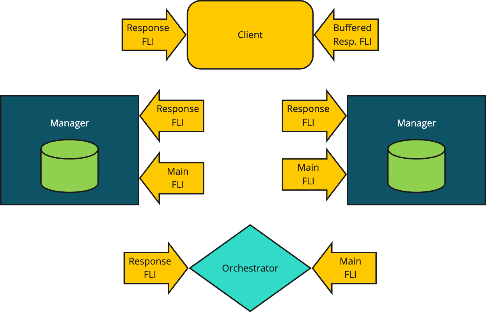
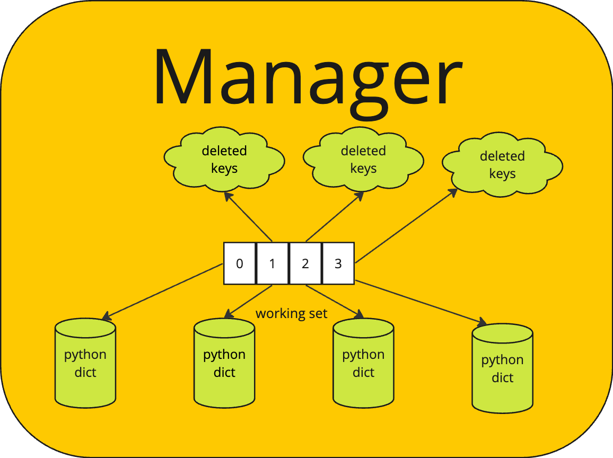
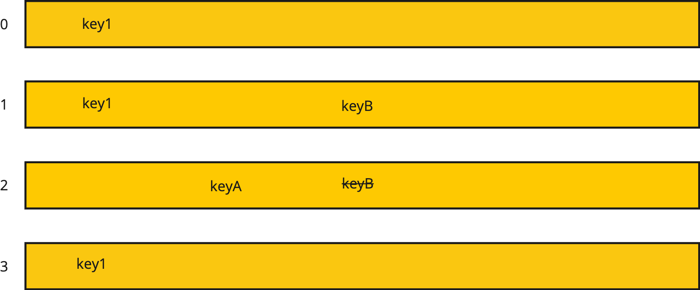

.. _distdictdesign:

Distributed Dictionary
========================

The Dragon Distributed Dictionary implements a data distributed key-value store
that spans multiple nodes of a distributed program's allocation. This makes it
possible to create large key-value stores, larger than could be stored in memory
on one node. It also distributes access to the key-value store so that there is
no bottlekneck in accessing or storing values. Access to the store is distributed
according to an evenly distributed hashing algorithm, thus statististically
spreading the data evenly over all the nodes of the store.

The next section describes the design of the Distributed Dictionary followed
by :ref:`Performance Tips <ddictperformance>` which offers some tips and pointers to things to read
on how to get the best performance from the Distributed Dictionary in your
application.

.. _ddictdesign:

Design
_________

A design requirement is for the distributed dictionary to scale to 10,000
managers and 100,000 clients. Any centralized focal point is going to be a
bottleneck for a design that must scale to these sizes. The design presented here
reflects that need by minimizing the overhead of clients attaching and detaching
from the distributed dictionary.

To implement the key-value store there are three entities that are named:

    * Clients access the key-value store primarily using get and put operations
      though other operations are also defined.

    * An Orchestrator provides coordination services and orchestrates startup,
      teardown, and client attaching and detaching activities.

    * Managers provide access to data that is stored within their shard of the
      key-value store, generally handling the interaction between clients and
      data stored within a manager's shard.

    **Conceptual View of a Distributed Dictionary**

Clients connect with managers based on the hashed values
of the keys they are either looking up or the key-value pairs they are storing.
The orchestrator starts the managers and is responsible for negotiating the
connections between clients and managers. The orchestrator is also responsible
for tearing down a distributed dictionary. The following sections cover the
interactions between the components in detail depicting the messaging that is
exchanged between them during lifetime management and operation of the key-value
store.

.. code-block:: Python
    :name: user_hash
    :linenos:
    :caption: **User-defined Manager Selection**

    class MyKey:
        import cloudpickle

        def __init__(self, key_value):
            self._key_value = key_value

        def __hash__(self):
            # hash_fun can be user-defined in whatever way
            # makes the best selection. It might, for instance,
            # return the index of the manager you wish to target.
            return hash_fun(self._key_value)

        def __getstate__(self):
            return cloudpickle.dumps(self._key_value)

Normally the key value is hashed using a simple byte hashing algorithm which is
callable from C, C++, and Python. From Python the key is serialized first, then
a hash value is determined which finally determines which manager will hold a
stored key-value pair. The distribution of that byte level hashing function is relied
on to distribute the data amongst the managers in a statistically even manner.

Some applications may wish to have finer control over the placement of data in
the distributed dictionary. For instance, in some applications it might be that
data could be placed on the same node as clients which will write and read the
data. In cases like this it is possible to define a class with its own hash
function which can be used to determine which manager is selected. Once selected,
the manager itself will still use the low-level byte hashing function itself, but
selection of a manager can be determined by provding an appropriate class with
its own hash function as shown in :numref:`user_hash`. The *getstate* function is
called when the key is serialized and the definition provided in the sample code
simply strips off the extra *MyKey* definition and results in serializing the
original key value.

Prominently in the :numref:`ddict_pic` are the use of FLIs (i.e. :ref:`File Like
Interfaces <fli_overview>`). FLIs enable safe 1:1 conversations between a sender
and a receiver. FLIs are configurable to allow safe 1:1 streaming conversations as
well where the sender may stream content to a receiver over multiple messages.
FLIs and streaming FLIs are used extensively in the design of the distributed
dictionary and some familiarity with the FLI API is assumed. Each component has
two FLIs as shown in the figure. In general a main FLI is used to service new
incoming requests and a response FLI is used to handle responses to requests made
by a component. In the case of a client, two response FLIs are created to handle
streaming and non-streaming responses.

Every FLI is created of some set of channels. Each component within the
distributed dictionary is responsible for creating its own FLIs and channels. The
required channels are created using a new API, supported by Dragon Local Services
on the node where a component is located. The new API, a class method named
*make_process_local* is callable via the :ref:`Channels API <DragonCoreChannelsCython>`.

When a distributed dictionary is created by a client, the API first creates an
Orchestrator which is told details about the size and configuration of the
distributed dictionary being created. The orchestrator starts by creating two FLI
interfaces, its main FLI and its response FLI. It publishes its main FLI to the
client that created it by printing the serialized descriptor to the FLI to
standard out of the Orchestrator.

The Orchestrator creates the specified number of Managers, providing each with the
orchestrator response FLI and its main FLI. The orchestrator receives registration
requests by each manager and responds to each manager on the manager's resposne FLI.

.. _ddictperformance:

Performance Considerations
____________________________________________

Because of the way the Distributed Dictionary is designed, there are several knobs
that can be used to optimize performance. Depending on your application and the
system you are running on, you may get the best performance while using one or more
of these optimizations.

    * On machines where there is more than on NIC (network interface card), you will
      likely obtain better performance by having more than one manager per node. This
      is because clients can access each manager completely in parallel when two NICs
      are present. When starting the dictionary you can specify the number of managers
      per node. If you benchmark your application you can play with this knob to see
      how it affects performance in your application. Even on machines without two NICs
      you may find that increasing the number of managers per node helps performance
      since each manager is doing work on its local shard of the dictionary and likely is
      not driving a single NIC to it maximum throughput.

    * In applications where data is purposefully sharded across multiple workers you can
      get much better performance if colocating workers with data is possible in your
      application. This is possible using the technique presented in :ref:`Design <ddictdesign>`. The
      idea is that you write a wrapper class for your keys as shown in :numref:`user_hash`.
      The hash function would then return the manager id of the local manager. Consult the
      reference guide for the Python or C interface to see how to get the local manager's
      id.

    * Checkpointing, covered in :ref:`Checkpointing <ddictcheckpointing>`, is an effective way to use the
      dictionary to store generations of data and allow workers to be working with
      different generations. Unlike a database where there is only one version of data
      at any point in time, the Distributed Dictionary allows you to store more than one
      version corresponding to a checkpoint. What's more, clients can work with different
      checkpoints at the same time which increases the amount of parallelism provided by
      workers since they don't have to all be in lock step with each other. There are limits
      on the number of checkpoints that can be active at any point in time. This is called the
      working set size. If your code could benefit from checkpointing, playing with the working
      set size is a knob you can turn to tune performance.

.. _ddictcheckpointing:

Checkpointing
_________________

When using a distributed dictionary it may be desirable to checkpoint operations
within the dictionary. Checkpointing is designed to minimize the interaction
between clients and managers to allow for scaling the dictionary to the sizes
needed to support large-scale supercomputing.

In addition to checkpointing computation, persisting a checkpoint to disk is also
introduced, which is likely needed at scale. This is covered in more detail in
the next section.

To implement checkpointing we want to avoid a global synchronization point to
achieve the maximum amount of parallelization and minimum impact to processes.
This means we need a protocol that allows some processes to work with data from a
new checkpoint while others continue to work with an older copy. Inherent in this
design is that all processes work on data that changes over time and there are
discrete moments where the data is updated.

To implement checkpointing for these kinds of applications we introduce the
concept of a working set. A working set is a set of checkpoints that all reside
in memory at a given moment of time.

The algorithm introduces a checkpoint id. This id starts at 0 when a
distributed dictionary is created. It is a 64-bit unsigned which can wrap around
(but probably won't). When a client wants to checkpoint it will invoke its
checkpoint function which will simply increment the checkpoint id modulo the
maximum 64-bit value (it will automatically wrap in C/C++, but will be added mod
the max 64-bit size in Python). No interaction with the managers or orchestrator
is necessary when a client checkpoints.

Another goal of checkpointing is to keep from copying data unnecessarily. All
distributed dictionary client operations will include their checkpoint id.
Creation, Read, and Write operations will proceed as follows in the subheadings
below.

When a checkpointing distributed dictionary is created, it may be told to persist
for every *persist_freq* number of checkpoints. When persisted, an argument,
*persist_base* will provide the base filename. A unique filename for the
checkpoint id and the particular manager id is constructed and used when
persisting a checkpoint.

Example
------------

Here is sample code for computing :math:`\pi` which makes use of, and
demonstrates, distributed dictionary checkpointing. The complete code is
available at example/dragon_data/ddict/ddict_checkpoint_pi.py. In this program,
we generate a set of random points within a square with a side length of 2. There
is a circle inside the square with a radius of 1. The square and circle are
centered at the origin of the coordinate system. We calculate the approximation
of :math:`\pi/4`` by the ratio of points that fall within the circle to the total
number of points generated inside the square.

    **The Unit Circle Inscribed in a Square**

The derivation of the approach for approximating :math:`\pi` focuses on the area
of a circle vs the area of an enclosing square as depicted in
:numref:`circlesquare`. The square has area 4 which is computed from the side
length of 2 which is the radius of the circle times 2 (i.e. the unit circle in
this instance). For the square, :math:`Area_{square} =(2r)^2 = 4r^2`. The area of
a circle is :math:`Area_{circle} =\pi r^2`. Counting random points and whether
they land inside the circle, we approximate the probability of landing
inside the circle. Every point generated lands inside the square so those that
also land inside the circle gives us the ratio of points that land inside the
circle over those that land inside the square (i.e. all points). The formula for
the ratio is :math:`(\pi r^2 / (4r^2)) = \pi / 4`. In our example, :math:`r=1`
but we are computing a ratio so it would work with any :math:`r`. It takes a lot
of points to accurately compute :math:`\pi`. The algorithm provided here computes
it to the point where it is converging slower than the number of decimal places
provided.

.. literalinclude:: ../../../examples/dragon_data/ddict/ddict_checkpoint_pi.py
    :name: checkpointex
    :linenos:
    :caption: **ddict_checkpoint_pi.py: Approximation of PI Using Checkpointing in the Distributed Dictionary**

The code in :numref:`checkpointex` makes use of a distributed dictionary with a
working set size of 4. This means that up to 4 checkpoints can exist in each
manager of the distributed dictionary. In addition, the *wait_for_keys* being
specified means that clients, i.e. the *proc_function*, will remain synchronized
as they progress through their iterations since each client depends on the results
of the other clients as it computes.

The use of the multiprocessing pool is a scalable means of creating the clients of
this simulation. Each instance of the proc_function will compute and return its
local average value. As seen in :numref:`checkpointex`, an equivalent method would
have been to retrieve the result from the distributed dictionary, but for this final
result in this program, collecting the results via the *starmap* multiprocessing
map function is more efficient.

.. code-block:: Python
    :linenos:
    :name: ddict_pi_demo_run
    :caption: **Running the Checkpointing Demo**

    (_env) .../hpc-pe-dragon-dragon/examples/dragon_data/ddict $ dragon ddict_checkpoint_pi.py --trace
    chkpt 0, client 1 local_avg=0.78423
    chkpt 0, client 0 local_avg=0.78617
    ...
    chkpt 1, client 0 local_avg=0.7857033333333333
    chkpt 1, client 2 local_avg=0.7857378787878788
    chkpt 1, client 5 local_avg=0.785789393939394
    ...
    chkpt 39, client 9 local_avg=0.7856719183793902
    chkpt 39, client 10 local_avg=0.785670221021504
    chkpt 39, client 28 local_avg=0.7856690040479251
    pi simulation result = 3.1426821260796105
    ...
    Globally there were 40 checkpoints that were performed.
    The result is 3.1426821261
    Stats of ddict: [DDictManagerStats(manager_id=0, total_bytes=2147483648, total_used_bytes=745472, bytes_for_dict=2147483648, dict_used_bytes=745472, overhead_used_bytes=0, num_keys=91), DDictManagerStats(manager_id=1, total_bytes=2147483648, total_used_bytes=581632, bytes_for_dict=2147483648, dict_used_bytes=581632, overhead_used_bytes=0, num_keys=71)]
    +++ head proc exited, code 0

Running this demo program as shown in the abbreviated output of
:numref:`ddict_pi_demo_run` shows that the thirty-nine checkpoints where
generated globally in the application (i.e. across the two managers) and the data
was distributed as shown in the output with 91 keys stored at manager 0 and 71
keys stored at manager 1. The *trace* option displays output as the clients run
helping to illustrate what the code is doing.

Dictionary Creation
______________________

Internally to each manager, one dictionary per checkpoint copy in the working set
is maintained. For our purposes we'll call each working set item a checkpoint. A
checkpoint is a local, internal Python dictionary inside the manager. A manager
manages one shard of the distributed data and one checkpoint corresponds to one
internal dictionary that keeps track of the key/value pairs that were modified
during that checkpoint lifetime.

When a dictionary is created, one pool is created which is big enough to hold all
the working set of the distributed dictionary. By doing this, no copying of
values is necessary between working sets. Working sets are maintained entirely by
the internal manager dictionaries that manage the keys and values.

    **Detailed View of Manager**

The internal dictionaries are maintained in a map of the working set, called
*working_set* as pictured in :numref:`manager_pic`. A map (i.e. another internal
dictionary) called *working_set*, maps the checkpoint number to a tuple of the
deleted keys and the checkpoint's working dictionary. Initially the checkpoint id
is 0 for all clients and each dictionary in the working_set of each manager is
empty. The working set contains dictionaries for 0, 1, 2, on up to the
working_set_size to begin.

For each working set member (i.e. checkpoint), except the oldest, there is a
deleted_keys set. This is a set of all keys that were deleted for a given
checkpoint id. If a new value is stored in the working set for a checkpoint id
level, then the key is removed from the deleted_keys set. The deleted_keys set is
added to when a key is deleted from a checkpoint, but it exists at an older
checkpoint. Otherwise, the key is just deleted from the checkpoint in which it
exists.

.. code-block:: Python
    :linenos:
    :name: ddict_create_proto
    :caption: **Creating a Distributed Dictionary**

    d = DDict(managers_per_node=None, num_nodes=None, total_mem=None, working_set_size=1,
            wait_for_keys=False, wait_for_writers=False, policy=None, persist_freq=None,
            persist_base_name=None, timeout=None)

:numref:`ddict_create_proto` shows the signature for creating a distributed
dictionary. When creating a distributed dictionary it is possible to specify the
number of managers and number of nodes on which the distributed dictionary will
be deployed. It is also possible to determine in more detail, for example on
which nodes, a distributed dictionary will be deployed by providing a policy on
the policy argument. The working set size may be specified as described above. A
working set size of one means that no checkpointing will occur. A size of two or
more allows checkpointing. Creating a working set size of more than two enables
additional distributed parallelism by allowing clients to operate more
independently.

In certain use cases it may be that there are a set of keys that should not
persist between checkpoints AND that all keys written into one checkpoint should
be written into all checkpoints. To get this behavior, the *wait_for_keys*
argument should be set to *True*. In this case, it will be desirable to wait for
all such keys to be written. In this case, keys that are written as *d[key] =
value* will be assumed to be part of this set of keys. A second method of storing
key/value pairs by writing *d.pput(key, value)* will result in writing a
key/value that persists across checkpoints (i.e. persistent put) and will not be
a part of the set of keys that are waited upon.

Waiting for keys means that a client that does a read or write for a checkpoint
that currently does not exist in the working set (i.e. beyond the end of the
working set) will block until all the keys in the retiring checkpoint have been
written and all clients have moved on to new checkpoints.

With this mode of operation, readers of key/values in a checkpoint will also block
if the key is not yet available. Once available, the reader will get the value
and continue with execution.

All blocking operations are subject to a timeout. A timeout of *None* indicates
to the distributed dictionary that clients want to wait forever for their
requests to be satisfied. Specifying timeout values is application specific, but
providing a timeout is a good idea. When creating a dictionary, the timeout that is
specified is propagated to the orchestrator and through it to all managers as well
providing a global timeout to the entire distributed dictionary and all operations
that should be subject to a timeout. A default value of 10 seconds is provided, but
this may be overridden by providing a timeout when the dictionary is constructed.

A less restrictive option is to set *wait_for_writers* to *True* when creating
the distributed dictionary. In this case, all keys persist in the distributed
dictionary across checkpoints, but all writers must have advanced their
checkpoint before a checkpoint can be retired. It is assumed in this mode that
writers that have written to the dictionary in the past will also be writing the
same keys in the future. In this case then the distributed dictionary manager can
monitor all writers and require that they have moved on from a checkpoint before
retiring an older one.

Under the *wait_for_writers* requirements, a writer requesting to move on from a
checkpoint will wait (i.e. block) if there are other writers that are still
writing at a checkpoint that would be retired. If a reader moves on to new
checkpoints, then it would continue, unblocked since keys persist across
checkpoints and reader that are reading at a newer checkpoint can still see
key/value pairs written in the past.

These subtle differences in blocking and distributed dictionary behavior should
be carefully considered when writing an application. They provide different
behavior and synchronization opportunities.

The persist_freq refers to a frequency that the distributed dictionary should be
persisted. It will be persisted as checkpoints are retired. The frequency refers
to how often a retiring checkpoint should be persisted. The persist_base_name is
used to determine the name of the persisted state. The manager_id of the manager
is appended to the base name followed by the checkpoint id of the persisted
state.

Retiring and Persisting Checkpoints
_________________________________________

A checkpoint that will no longer be in the working set is removed from the
working set and retired. This is done with little to no impact on the processes
that are using the dictionary. When the checkpoint is about to be retired a few
checks are made depending on the options that were selected when the dictionary
was created.

Checkpoints are retired when a client attempts to write into a new checkpoint that
has not been set up yet. In that case, the oldest checkpoint is retired and a new
checkpoint is created.

If *wait_for_keys* was chosen when the dictionary was created, then all
non-persisting keys in the retiring checkpoint must exist in the next newer
checkpoint. If they do not, then the request to move to a new checkpoint will be
enqueued until later on an internal queue of requests to be processed later.
Under this option, even reads of non-persisting keys will be queued if the newer
checkpoint id does not exist. Any operations that attempt to get the state for a
newer checkpoint that depends on the keys of the newer checkpoint will also be
enqueued until the newer checkpoint exists.

If *wait_for_keys* was chosen when the dictionary was created, then the retiring
checkpoint keys that are in the set of keys to persist are deep copied to
the next newer checkpoint unless the next newer checkpoint has the key in its
deleted_keys set or the key is already present in the newer checkpoint.

If *wait_for_writers* was chosen when the dictionary was created, then all
writers into a checkpoint must have advanced to a checkpoint id greater
than the one to be retired before the checkpoint can be retired. If all
writers have not advanced, then the request to move to a new checkpoint
will be queued internally until it can be processed.

If *wait_for_keys* was not specified on creation of the dictionary, then all keys
are treated as persisting keys when checkpoints are retired.

If the retiring checkpoint is to be persisted, then all key/value pairs in the retiring
checkpoint are written to persistent storage. The retiring checkpoint's internal
dictionary is handed over to a process to persist the values to disk. As it does
so, the key/value pairs are deleted from the pool of the manager, thereby
releasing those resources. The persisting of the data can occur completely
independent of client interactions with the distributed dictionary. There are no
shared data resources except the pool which is already multi-thread and
multi-process safe. Otherwise there are no shared resources.

One possible design for persisting to disk is to form DDPut messages (or another
capnp message) for each key/value pair in the pool and write them to a file
descriptor which represents a file opened by the manager. The captain proto
library supports writing to a file descriptor and we have a message already that
contains the checkpoint number, the key, and the value. When recovery was
initiated, a process could open the file, read the messages, and route the
messages right into the manager to restore it to that point in time.

    **Working Set**

Consider the working set given in :numref:`workingset_pic` for a dictionary with
all persistent keys. The figure shows that checkpoint 0, 1, 2, and 3 are in the
working set. During checkpoints 0, 1, and 3 the key *key1* was written into the
distributed dictionary. During checkpoint 2 a *keyA* was written into the
dictionary. During checkpoint 1 the *keyB* was written into the dictionary. But
during checkpoint 2 *keyB* was deleted from the dictionary.

Now, if a client comes along that's got checkpoint 3 as its checkpoint id, and
looks up *keyB* it will not be found. However if another client currently at
checkpoint 1 comes along, it will discover *keyB* in the dictionary. For any key
the corresponding value also exists.

The pool can hold duplicates of keys and values. The pool has no restrictions on
what can be stored within it. Each dictionary at each checkpoint is a separate
dictionary so the keys and values stored at each checkpoint are completely
independent of what is stored at other checkpoints.

Assuming that the working set size of this dictionary is 4, then when a new
checkpoint comes along it will result in checkpoint 0 being retired. Since *key1*
exists at checkpoint 2, the *key1* from checkpoint 0 is simply deleted from the
pool and the dictionary is replaced by a new empty dictionary for checkpoint 4.

Given the current state in :numref:`workingset_pic` a call to get the length of
the dictionary would result in finding 2 keys, *key1* and *keyA*. This can be
found by constructing a temporary set of keys. Starting with the keys of
checkpoint 0, add all the keys of checkpoint 1, then delete all deleted keys of
checkpoint 1. Add in all keys of checkpoint 2 and then delete all deleted keys
from the temporary set. Repeat this process for all checkpoint levels in the
working set. Then take the length of the computed temporary set and that gives
you the length of the dictionary, i.e. the number of keys active at any point in
time. Similarly, a call to find all keys at a particular checkpoint level can be
found using this algorithm.

Read Operations
_________________

Read operations include get operations but also all operations that examine the
state of the distributed dictionary. A read operation includes the checkpoint
index. Here is how it proceeds:

    * Client sends get operation to correct manager with checkpoint id, chkpt_id.

    * If the chckpt_id is older than any checkpoint id in the working set, the oldest
      checkpoint copy will be examined since that contains the base copy. If
      *wait_for_keys* was specified and a reader tries to read a
      non-persisting key older than the working set, the read is rejected.

    * If the chckpt_id is newer than any other checkpoint id in the working set,
      then no worries. We use the newest chkpt_id we have in the working set in that
      case unless *wait_for_keys* was specified and this is a non-persisting key. In
      that case, the reader's request is queued internally until it can be processed.

    * Manager receives the message and examines the
      working_set[checkpoint_map[chkpt_id]] dictionary for the key. If the value
      is found, great! Return it.

    * If the key is found in the set of deleted keys for a checkpoint then return
      that it was not found.

    * If the key being looked up is not found and the key is a persisting key
      (i.e. because *wait_for_keys* was requested), then examine the next
      older checkpoint in the working set by looking at the checkpoint
      dictionary and also looking at the deleted_keys set. Keep repeating
      this until the working set is exhausted or until the key is found.
      Once the key is found, return its value or return not found depending
      on where the key was found.

    * If the key being looked up is not found and is not in the set of persisting
      keys (i.e. and *wait_for_keys* was requested) then queue up the request
      internally until it can be satisfied.

    * If the working set is exhausted, then report that the key was not found.

For operations where you are given a key, like *contains* for instance, the algorithm
is similar to the one above.

For operations that need global state (like the length operation), you can do
set operations to form the correct state information. For instance for length, you
would take the union of all the keys in the working set subtracting out the set of
deleted keys. This will give you the total length of the dictionary. This is best
computed from oldest to newest.

Write Operations
_________________

There are two types of write/put operations: one for persistent keys and one for
non-persisting keys. When *wait_for_keys* is *True* then *DDPut* is for
non-persisting keys, otherwise it stores persisting keys. The *DDPPut* is the
persistent put operation. Exactly what occurs on a put is different for
persistent and non-persistent puts.

On persistent puts, steps proceed as follows:

Puts (and deletes) into the distributed dictionary come to a manager. Each put
operation now includes a chkpt_id that identifies which checkpoint it is written
into. If the chckpt_id does not exist in the working set of the manager, the
working set is rotated until it does. Rotating is described in the earlier
*Retiring and Persisting Checkpoints* heading.

A put operation then creates a new entry for the current checkpoint if the key
does not already exist in the indicated checkpoint and updates the value if the
key already does exist in the current checkpoint.

If the key is deleted it is removed from the checkpoint dictionary if it exists
and if the key exists in an older checkpoint, then it is also added to the set of
deleted_keys for the checkpoint.

If a put or delete is targeting a checkpoint that no longer exists then the
operation is rejected.

For non-persistent puts, the checkpoint id must be in the working set or newer.
If it is older than the working set then the put operation is rejected. If it is
newer than all checkpoints in the working set, then the oldest checkpoint is
examined and if it does not contain all the non-persisting keys of the next newer
checkpoint, then the put request is internally queued up for later processing.

Message Flow Between Components
_________________________________________

The following sections illustrate the flow of messages between components of the
distributed dictionary. All messages are hidden behind the distributed dictionary
API. These are internal details of the implementation.

Bringup, Attach, Detach
-------------------------

Creating a distributed dictionary involves a Python client providing information
about how many managers, the number of nodes, the total amount of memory, and a
policy for where to place managers. The following diagram provides the details of
interactions between components for distributed dictionary bringup. Message
definitions appear in the aptly named section below. There are a few notes here
about this flow.

    * The client/manager attach flow (see the diagram) is not necessary
      when a client has sent the *DDRegisterClient* to a manager. In other
      words, the *DDRegisterClient* does all the work of the
      DDRegisterClientID* message when it is sent to a manager so it does not
      need to be repeated.

    * Not pictured in the diagram, the Orchestrator supports the
      *DDGetRandomManager* message and respond to it since some clients may have
      been started on a node without a manager. When that occurs the
      client will receive a *Not Found* response to the *SHGetKV*
      message. In that case the client should fall back to sending the
      *DDGetRandomManager* message to the Orchestrator

    * Each Manager and the Orchestrator are assigned a range of
      client IDs to assign. The Managers get 100,000 each based on the manager ID
      and starting at 0. The Orchestrator gets the rest. In this way no two
      clients will get the same client ID. Necessarily, client IDs will not
      be sequentially allocated across all nodes.

.. figure:: images/ddict_bringup.srms1.png
    :scale: 75%
    :name: ddict_bringup

    **The Distributed Dictionary Bringup, Attach, Detach Sequence Diagram**

Teardown
----------

Bringing down a distributed dictionary is initiated by one client. Other clients
should already be aware the dictionary is being destroyed. If not, they will
begin to get errors when interacting with the dictionary since channels will no
longer exist.

.. figure:: images/ddict_teardown.srms1.png
    :scale: 75%
    :name: ddict_teardown

    **The Distributed Dictionary Teardown Sequence Diagram**

Put and Get Interaction
------------------------

Puts and gets are initiated by client programs. The key is hashed by the client
program's put or get API call and divided by the number of managers to obtain the
integer remainder (modulo operator) value. That value picks which manager is
responsible for the put or get operation for the given key. It is imperative that
all clients use the same hashing function and that all managers are in the same
order for all clients.

Put and get operations are designed to minimize the number of copies of data that
are made when they are performed. By having each manager create their own FLI
stream channels, keys and values sent to the manager are automatically allocated
from the manager's pool since allocations sent to a channel use the same
channel's pool by default within the dragon api.

Internally to managers they see only managed memory allocations. Each key is one
allocation. Values are streamed to the manager through the file-like interface,
so values are typically a sequence of managed memory allocations. The internal
dictionary of each manager is a map from a managed memory allocation to a list of
managed memory allocations.

.. figure:: images/ddict_put.srms1.png
    :scale: 75%
    :name: ddict_put

    **The Distributed Dictionary Put Sequence Diagram**

Likewise, as shown in :numref:`ddict_get` the value is streamed back to the
client on a get operation. Closing the send handle results in the EOT being
transmitted. The client simply reads values for multi-part values until EOT is
signaled. In the low-level interface this surfaces as DRAGON_EOT return code. In
Python it is signalled by an EOFError exception.

.. figure:: images/ddict_get.srms1.png
    :scale: 75%
    :name: ddict_get

    **The Distributed Dictionary Get Sequence Diagram**

Pop
-----

.. figure:: images/ddict_pop.srms1.png
    :scale: 75%
    :name: ddict_pop

    **The Distributed Dictionary Pop Sequence Diagram**

Contains
----------

.. figure:: images/ddict_contains.srms1.png
    :scale: 75%
    :name: ddict_contains

    **The Distributed Dictionary Contains Sequence Diagram**

Length
-----------

.. figure:: images/ddict_getLength.srms1.png
    :scale: 75%
    :name: ddict_get_length

    **The Distributed Dictionary Get Length Sequence Diagram**

Clear
--------

.. figure:: images/ddict_clear.srms1.png
    :scale: 75%
    :name: ddict_clear

    **The Distributed Dictionary Get Length Sequence Diagram**

Get All Keys
---------------
.. figure:: images/ddict_keys.srms1.png
    :scale: 75%
    :name: ddict_keys

    **The Distributed Dictionary Get Length Sequence Diagram**

.. _pythonDDictClient:

Python Reference
_________________

.. currentmodule:: dragon.data.ddict

.. autosummary::
    :toctree:
    :recursive:

    ddict

.. _DragonDDictCClient:

C Reference
______________

.. contents:: Table of Contents
    :local:

Description
-------------

The distributed dictionary C client description.

Example
------------

Here is some sample code for creating an FLI using only the C interface. This
example code was taken from the test/channel_subtests/test_fli.c program. Note
that for this to be useful production code, resources should be created using a
means of guaranteeing unique CUIDs for channels and if needed, unique MUIDs for
pools. For instance, you might use the dragon_create_process_local_channel API
call to create guaranteed unique CUIDs for you channels.

.. code-block:: C
    :linenos:
    :caption: **Using the Distributed Dictionary C Client**

    #include <dragon/channels.h>
    #include <dragon/fli.h>

    #define M_UID 0
    #define POOL_M_UID 2
    #define POOL "fli_test"
    #define NUM_CHANNELS 10
    #define MAX_STREAM_SIZE 500

    dragonError_t create_pool(dragonMemoryPoolDescr_t* mpool) {
        /* Create a memory pool to allocate messages and a Channel out of */
        size_t mem_size = 1UL<<31;

        dragonError_t err = dragon_memory_pool_create(mpool, mem_size, POOL, POOL_M_UID, NULL);
        if (err != DRAGON_SUCCESS)
            err_fail(err, "Failed to create memory pool");

        return DRAGON_SUCCESS;
    }

    dragonError_t create_channels(dragonMemoryPoolDescr_t* mpool, dragonChannelDescr_t channel[], int arr_size) {
        int k;
        dragonError_t err;

        for (k=0;k<arr_size;k++) {
            /* Create the Channel in the memory pool */
            err = dragon_channel_create(&channel[k], k, mpool, NULL);
            if (err != DRAGON_SUCCESS)
                err_fail(err, "Failed to create a channel");
        }

        return DRAGON_SUCCESS;
    }

    int main() {
        dragonError_t err;
        dragonMemoryPoolDescr_t pool;
        dragonChannelDescr_t channels[NUM_CHANNELS];
        dragonChannelDescr_t* channel_ptrs[NUM_CHANNELS];
        dragonFLIDescr_t fli;
        dragonFLISerial_t ser;

        /* Creating the channel set and the pool */
        for (int k=0;k<NUM_CHANNELS;k++)
            channel_ptrs[k] = &channels[k];

        /* Always check error codes - omitted for brevity */
        err = create_pool(&pool);
        err = create_channels(&pool, channels, NUM_CHANNELS);
        err = dragon_fli_create(&fli, channel_ptrs[0], channel_ptrs[1], &pool, NUM_CHANNELS-2, &channel_ptrs[2], false, NULL);
        err = dragon_fli_serialize(&fli, &ser);

        /* The serialized fli named ser can then be base64 encoded and shared
           with other processes where it can then be base64 decoded
           and attached to other processes within the dragon run-time. */

        ...
    }

Structures
--------------

.. doxygengroup:: ddict_structs
   :content-only:
   :members:

Lifecycle Management
----------------------

.. doxygengroup:: ddict_lifecycle
   :content-only:
   :members:

Request Management
---------------------

.. doxygengroup:: ddict_requests
   :content-only:
   :members:

Send/Recv Functions
---------------------

.. doxygengroup:: ddict_sendrecv
   :content-only:
   :members:

Dictionary Operations
------------------------

.. doxygengroup:: ddict_ops
   :content-only:
   :members:

Messages
___________

.. _ddmessages:

#. **DDGetRandomManager**

    *type enum*
        DD_GET_RANDOM_MANAGER

    *purpose*
        Client request a main manager from Orchestrator. This is for off-node bringup for a client.

    *fields*

        **response_fli**
            - string
            - b64 encoded serialized response fli.

    *see also*
        DDGetRandomManagerResponse, DDRegisterClient, DDConnectToManager

        Refer to the :ref:`cfs` section for additional request message fields.

    *implementation(s):* :func:`Python<dragon.infrastructure.messages.DDGetRandomManager>`

#. **DDGetRandomManagerResponse**

    *type enum*
        DD_GET_RANDOM_MANAGER_RESPONSE

    *purpose*
        Orchestrator return fli of a main manager for clients to request connection to other managers.

    *fields*

        **mainFLI**
            - string
            - b64 encoded serialized main fli of the manager.

    *see also*
        DDGetRandomManager

        Refer to the :ref:`cfs` section for additional request message fields.

    *implementation(s):* :func:`Python<dragon.infrastructure.messages.DDGetRandomManagerResponse>`

#. **DDRegisterClient**

    *type enum*
        DD_REGISTER_CLIENT

    *purpose*
        Obtain unique client id from main manager and register client id to main manager.

    *fields*

        **response_fli**
            - string
            - b64 encoded serialized fli for response.

        **buffered_response_fli**
            - string
            - b64 encoded serialized fli for buffered response.

    *see also*
        DDRegisterClientResponse, DDRegisterClientID

        Refer to the :ref:`cfs` section for additional request message fields.

    *implementation(s):* :func:`Python<dragon.infrastructure.messages.DDRegisterClient>`

#. **DDRegisterClientResponse**

    *type enum*

        DD_REGISTER_CLIENT_RESPONSE

    *purpose*
        Provide the unique client id and number of managers.

    *fields*

        **client_id**
            - uint32
            - unique for this client.

        **num_managers**
            - uint32
            - number of managers in the dictionary.

        **manager_id**
            - uint32
            - id of of the main manager to the client.

        **timeout**
            - uint32
            - timeout of the dictionary, same as the timeout in the initialization.

    *see also*
        DDRegisterClient

        Refer to the :ref:`cfs` section for additional response message fields.

    *implementation(s):* :func:`Python<dragon.infrastructure.messages.DDRegisterClientResponse>`

#. **DDRegisterManager**

    *type enum*
        DD_REGISTER_MANAGER

    *purpose*
        Manager registers with Orchestrator and get a list of managers from Orchestrator.

    *fields*

        **response_fli**
            - string
            - b64 encoded serialized fli for the response to this request.

        **mainFLI**
            - string
            - b64 encoded serialized fli for the main channel for the manager.

    *see also*
        DDRegisterManagerResponse

        Refer to the :ref:`cfs` section for additional request message fields.

    *implementation(s):* :func:`Python<dragon.infrastructure.messages.DDRegisterManager>`

#. **DDRegisterManagerResponse**

    *type enum*
        DD_REGISTER_MANAGER_RESPONSE

    *purpose*
        Provide the acknowledgement that the manager is registered and a list of managers. This serves as a
        synchronization point for client/manager interaction. Clients can request other manager's fli from the main manager assigned to them.

    *fields*

       **manager_id**
            - uint32
            - unique for this manager.

       **managers**
            - list
            - a list of b64 encoded serialized flis for the main channels of all managers.

    *see also*
        DDRegisterManager

        Refer to the :ref:`cfs` section for additional response message fields.

    *implementation(s):* :func:`Python<dragon.infrastructure.messages.DDRegisterManagerResponse>`

#. **DDConnectToManager**

    *type enum*
        DD_CONNECT_TO_MANAGER

    *purpose*
        Obtain the manager mainFLI from the main manager so a client can attach to the manager.

    *fields*

        **client_id**
            - uint32
            - unique client id assigned by main manager.

        **manager_id**
            - uint32
            - the ID of the manager that client requests to connect to.

    *see also*
        DDConnectToManagerResponse

        Refer to the :ref:`cfs` section for additional request message fields.

    *implementation(s):* :func:`Python<dragon.infrastructure.messages.DDConnectToManager>`

#. **DDConnectToManagerResponse**

    *type enum*
        DD_CONNECT_TO_MANAGER_RESPONSE

    *purpose*
        return the mainFLI of the manager whose ID was provided on the request.

    *fields*

        **mainFLI**
            - string
            - b64 encoded serialized fli for the main channel for the manager.

    *see also*
        DDConnectToManager

        Refer to the :ref:`cfs` section for additional request message fields.

    *implementation(s):* :func:`Python<dragon.infrastructure.messages.DDConnectToManagerResponse>`

#. **DDRegisterClientID**

    *type enum*
        DD_REGISTER_CLIENT_ID

    *purpose*
        Register the client ID and associated client response fli with a manager so the
        response fli does not need to be included in future messages and client ID can be
        used instead.

    *fields*

        **client_id**
            - uint32
            - unique client id assigned by main manager.

        **response_fli**
            - string
            - b64 encoded serialized response fli for client requests.

        **buffered_response_fli**
            - string
            - b64 encoded serialized response fli for client requests.

    *see also*
        DDRegisterClientIDResponse, DDRegisterClient

        Refer to the :ref:`cfs` section for additional request message fields.

    *implementation(s):* :func:`Python<dragon.infrastructure.messages.DDRegisterClientID>`

#. **DDRegisterClientIDResponse**

    *type enum*
        DD_REGISTER_CLIENT_ID_RESPONSE

    *purpose*
        Provide the acknowledgement that the client is registered with the manager.
        This serves as a synchronization point for client/manager interaction.

    *fields*

        **None other than the err field which will hold a dragon return code.**

    *see also*
        DDRegisterClientID, DDRegisterClient

        Refer to the :ref:`cfs` section for additional response message fields.

    *implementation(s):* :func:`Python<dragon.infrastructure.messages.DDRegisterClientIDResponse>`

#. **DDDestroy**

    *type enum*
        DD_DESTROY

    *purpose*
        Sent by a client to the orchestrator to destroy the distributed dictionary.

    *fields*

        **client_id**
            - uint32
            - The client id of the requesting client.

        **response_fli**
            - string
            - b64 encoded serialized response fli.

    *see also*
        DDDestroyResponse, DDDestroyManager

        Refer to the :ref:`cfs` section for additional request message fields.

    *implementation(s):* :func:`Python<dragon.infrastructure.messages.DDDestroy>`

#. **DDDestroyResponse**

    *type enum*
        DD_DESTROY_RESPONSE

    *purpose*
        Provide the acknowledgement that the distributed dictionary destruction has
        completed.

    *fields*

        **None other than the err field which will hold a dragon return code.**

    *see also*
        DDDestroy

        Refer to the :ref:`cfs` section for additional response message fields.

    *implementation(s):* :func:`Python<dragon.infrastructure.messages.DDDestroyResponse>`

#. **DDDestroyManager**

    *type enum*
        DD_DESTROY_MANAGER

    *purpose*
        Sent by the orchestrator to destroy a distributed manager.

    *fields*

        **response_fli**
            - string
            - b64 encoded serialized response fli.

    *see also*
        DDDestroyManagerResponse, DDDestroy

        Refer to the :ref:`cfs` section for additional request message fields.

    *implementation(s):* :func:`Python<dragon.infrastructure.messages.DDDestroyManager>`

#. **DDDestroyManagerResponse**

    *type enum*
        DD_DESTROY_MANAGER_RESPONSE

    *purpose*
        Provide the acknowledgement that the distributed dictionary manager destruction has
        completed.

    *fields*

        **None other than the err field which will hold a dragon return code.**

    *see also*
        DDDestroyManager

        Refer to the :ref:`cfs` section for additional response message fields.

    *implementation(s):* :func:`Python<dragon.infrastructure.messages.DDDestroyManagerResponse>`

#. **DDPut**

    *type enum*
        DD_PUT

    *purpose*
        Sent by a client to put a key/value pair into the distributed dictionary. It is sent
        to a particular manager which is chosen by pre-hashing the key and dividing modulo the
        number of managers.

    *fields*

        **client_id**
            - uint32
            - The client id of the requesting client.

        **chkpt_id**
            - uint64
            - The checkpoint identifier for this operation.

        **persist**
            - bool
            - Persistent or non-persisting key.

        *NOTE* The key and value are written separately from the message using the fli api.

    *see also*
        DDPutResponse

        Refer to the :ref:`cfs` section for additional request message fields.

    *implementation(s):* :func:`Python<dragon.infrastructure.messages.DDPut>`

#. **DDPutResponse**

    *type enum*
        DD_PUT_RESPONSE

    *purpose*
        Provide the acknowledgement that the distributed dictionary manager that the
        put has completed.

    *fields*

        **None other than the err field which will hold a dragon return code.**

    *see also*
        DDPut

        Refer to the :ref:`cfs` section for additional response message fields.

    *implementation(s):* :func:`Python<dragon.infrastructure.messages.DDPutResponse>`

#. **DDGet**

    *type enum*
        DD_GET

    *purpose*
        Sent by a client to a manager to get a value for a key.

    *fields*

        **client_id**
            - uint32
            - The client id of the requesting client.

        **chkpt_id**
            - uint64
            - The checkpoint identifier for this operation.

        *NOTE* The key is written separately from the message using the fli api.

    *see also*
        DDGetResponse

        Refer to the :ref:`cfs` section for additional request message fields.

    *implementation(s):* :func:`Python<dragon.infrastructure.messages.DDGet>`

#. **DDGetResponse**

    *type enum*
        DD_GET_RESPONSE

    *purpose*
        Provide the value for the associated key or an error code indicating what happened.

    *fields*

        **None other than the err field which will hold a dragon return code.**

        *NOTE* The value is written separately from the message using the fli api.

    *see also*
        DDGet

        Refer to the :ref:`cfs` section for additional response message fields.

    *implementation(s):* :func:`Python<dragon.infrastructure.messages.DDGetResponse>`

