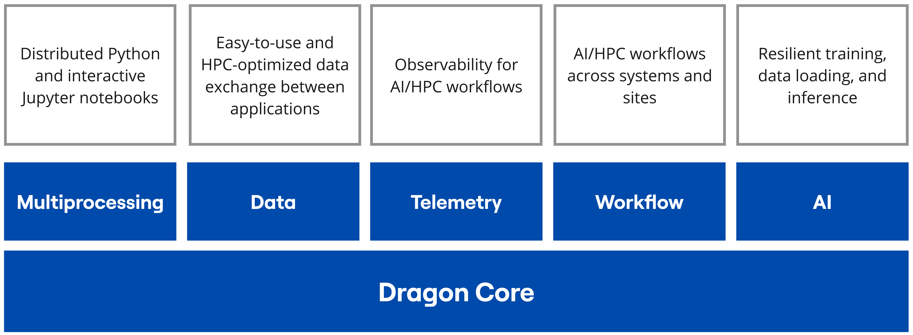

.. _getting-started:

.. currentmodule:: dragon.mpbridge.context

Introduction to Dragon
++++++++++++++++++++++

Wondering where to start with Dragon? This page is for you. We'll walk through select patterns and abstractions and
have you quickly programming at scale.

|

Python multiprocessing
======================

Dragon was initially designed to allow developers to program to the standard
:external+python:doc:`Python multiprocessing API <library/multiprocessing>` and scale their application to an
entire supercomputer. The team took what they learned developing high-performance, scalable software for Cray, Inc. and
applied it to the standard API for parallel Python. We won't duplicate
:external+python:doc:`multiprocessing <library/multiprocessing>` documentation here, but it is
worth reviewing some of the key interfaces and their typical use cases.

Pool
----

The :external+python:doc:`multiprocessing <library/multiprocessing>` documentation introduces the API with this basic
example using :external+python:py:meth:`Pool.map() <multiprocessing.pool.Pool.map>`.

.. code-block:: python

    from multiprocessing import Pool

    def f(x):
        return x*x

    if __name__ == '__main__':
        with Pool(5) as p:
            print(p.map(f, [1, 2, 3]))

This code starts up an additional 5 processes and executes the function `f()` across each item in the list `[1,2,3]`.
When your application has a pattern like this, :external+python:py:class:`~multiprocessing.pool.Pool` is
a great tool for getting true parallel performance as each process is its own interpreter and GIL. This is especially
important when the list of items is very large. The Dragon version of this code looks like the following:

.. code-block:: python

    import dragon
    from multiprocessing import Pool, set_start_method

    def f(x):
        return x*x

    if __name__ == '__main__':
        set_start_method("dragon")
        with Pool(5) as p:
            print(p.map(f, [1, 2, 3]))

and run with:

.. code-block:: console

    dragon my_prog.py

We needed to add a single `import dragon` and tell :external+python:doc:`multiprocessing <library/multiprocessing>` to
use the `dragon` start method. That's it. If this code then called libraries underneath that also use
:external+python:doc:`multiprocessing <library/multiprocessing>`, those two steps enables Dragon for the
libraries as well. But what do I get from this? The true power of Dragon comes when you have a very large working set
and can scale across an entire cluster. Since the Dragon v0.9 release, we regularly test
:py:meth:`Dragon Pool() <dragon.mpbridge.context.DragonContext.Pool>` with over 50,000 workers on hundreds of nodes on a
Cray EX supercomputer.

.. code-block:: python

    import dragon
    from multiprocessing import Pool, set_start_method

    def f(x):
        return x*x

    if __name__ == '__main__':
        set_start_method("dragon")
        with Pool(50000) as p:
            print(p.map(f, range(50000)))

You can also manage multiple :py:meth:`~dragon.mpbridge.context.DragonContext.Pool` instances at once and have them
come and go at different times. This is great
for use-cases where the nature of computation changes over time. For example, imagine we had to process two types of
files, `type A` and `type B`. Let's say `type A` takes twice as much time to process a single file as `type B`. One
approach to balance the processing could look like this:

.. code-block:: python

    import dragon
    from multiprocessing import Pool, set_start_method

    def f(x):
        return x*x

    if __name__ == '__main__':
        set_start_method("dragon")

        typeAfiles = get_type_a_files()  # replace with your list of type A files
        typeBfiles = get_type_b_files()  # replace with your list of type B files

        poola = Pool(2000)
        poolb = Pool(1000)

        resultsa = poola.map_async(f, typeAfiles)
        resultsb = poolb.map_async(f, typeBfiles)
        for result in resultsa.get():
            pass  # do something with each result
        for result in resultsb.get():
            pass  # do something with each result

        poola.close()
        poolb.close()
        poola.join()
        poolb.join()

Since we can manage the life-cycle of :py:meth:`~dragon.mpbridge.context.DragonContext.Pool` explicitly, we can have
them close and bring up new ones as our
computational load changes. For Dragon users, they can start to view their set of nodes as a single collection of
resources and program different elements of their application to use different amounts of resources over time. It's
kind of cloud-like.

In addition to scaling :py:meth:`~dragon.mpbridge.context.DragonContext.Pool` to supercomputer scales, Dragon also lets
users do something basic :external+python:doc:`multiprocessing <library/multiprocessing>`
doesn't let you do. You can nest :py:meth:`Pools <dragon.mpbridge.context.DragonContext.Pool>` inside of one another. Pools
that use Pools? Why might you want that?
There are a lot of use-cases for this. Imagine your use-case is to process different types of data as they land in a
filesystem. Imagine that each file has many components that themselves require
:py:class:`Pool.map() <dragon.mpbridge.pool.DragonPool.map>`-like operations. Something
like this:

.. code-block:: python

    import dragon
    from multiprocessing import Pool, set_start_method

    def proc_data(d):
        # do some work

    def f(workfile):
        with open(workfile, "rb") as f:
            data = f.read()
            with Pool(128) as p:
                results = p.map(proc_data, list(data))
        return results

    if __name__ == '__main__':
        set_start_method("dragon")

        files = get_work_files()  # replace with your list of work files
        with Pool(128) as p:
            all_results = p.map(f, files)

There is much more you can do with :py:meth:`~dragon.mpbridge.context.DragonContext.Pool` yet, especially when an entire
supercomputer's resources are at your
command. The key thing is that with Dragon's implementation you can scale out, get great performance on the internal
communication that happens in :py:meth:`~dragon.mpbridge.context.DragonContext.Pool`, and it integrates with the rest of
the Python ecosystem as it should.

Queue
-----

The other interface we typically highlight from :external+python:doc:`multiprocessing <library/multiprocessing>` is
:external+python:py:class:`~multiprocessing.Queue`.
We often use it any time there are multiple readers and/or writers needing to communicate. It's a FIFO-style queue, and
with Dragon's implementation, processes can transparently access it from any node in a supercomputer the Dragon runtime
is deployed to. :py:meth:`~dragon.mpbridge.context.DragonContext.Queue` is used internally in
:py:meth:`~dragon.mpbridge.context.DragonContext.Pool` for both the input of items to process and the results that
come back to the calling process. Since we test Dragon's :py:meth:`~dragon.mpbridge.context.DragonContext.Pool`
implementation on hundreds of nodes, we know our
:py:meth:`~dragon.mpbridge.context.DragonContext.Queue` scales well. We do have designs for even better scaling, but
that's for a different document. Here's how to
use :py:meth:`~dragon.mpbridge.context.DragonContext.Queue` in combination with another idiom from
:external+python:doc:`multiprocessing <library/multiprocessing>` called
:external+python:py:class:`multiprocessing.Process`.

.. code-block:: python

    import dragon
    from multiprocessing import Process, Queue, set_start_method

    def compute_it(f):
        # do something

    def work(f, resultq):
        resultq.put(compute_it(f))

    if __name__ == '__main__':
        set_start_method("dragon")

        q = Queue()
        somedata = "hello world"  # replace with the actual data to process
        p = Process(target=work, args=(somedata, q,))
        p.start()

        result = q.get()
        p.join()

:py:meth:`~dragon.mpbridge.context.DragonContext.Queue` is a "pickleable" object, which means you can pass it as an
argument to an entirely different Python process,
as done in this example. The same is true for all the other communication and collective primitives in
:external+python:doc:`multiprocessing <library/multiprocessing>`. Dragon's implementation relies on our high-performance
(Shared memory+RDMA-capable) communication layer, called :py:class:`Channels <dragon.channels.Channel>`.

Data
====

The Python `dict <https://docs.python.org/3/tutorial/datastructures.html#dictionaries>`_ is one of the most fundamental
and useful abstractions in the language, in our opinion. What if we had a `dict` that scaled to hundreds or thousands of
nodes and could be accessed by thousands of processes at the same time? Dragon has this feature. With the Dragon
distributed `dict`, :py:class:`~dragon.data.DDict`, you can easily
manage data exchange at-scale between processes with great performance. Like everything communication related in Dragon,
it uses our :py:class:`Channels <dragon.channels.Channel>` layer for
high-performance communication. It behaves with the same semantics as the normal `dict` and how they are accessed from
multiple threads at the same time. The only difference with the :py:class:`~dragon.data.DDict` is it works across multiple processes.

Using the :py:class:`~dragon.data.DDict` looks like the following:

.. code-block:: python

    import dragon
    from multiprocessing import Pool, set_start_method, current_process
    from dragon.data.ddict import DDict

    def setup(dist_dict):
        me = current_process()
        me.stash = {}
        me.stash["ddict"] = dist_dict

    def assign(x):
        dist_dict = current_process().stash["ddict"]
        key = str(x)  # use a string representation of x as the key
        dist_dict[key] = x

    if __name__ == '__main__':
        set_start_method("dragon")

        dist_dict = DDict(managers_per_node=1, num_nodes=1, total_mem=1024**3)

        with Pool(5, initializer=setup, initargs=(dist_dict,)) as p:
            print(p.map(assign, [1, 2, 3]))

        for k in dist_dict.keys():
            print(f"{k} = {dist_dict[k]}", flush=True)

You can start to think of the :py:class:`~dragon.data.DDict` like a co-located object store that scales with your
application. For
example, you might read in a large quantity of data from a filesystem and store them into the
:py:class:`~dragon.data.DDict` with keys
mimicing file paths. If you don't have a great parallel filesystem, this lets you read the data once, cache it in the
memory of your nodes, and leverage your network's performance (and shared memory) for subsequent accesses. You can use
it instead of storing intermediate results to a filesystem. If your workload consists of stages of Python processes in
a pipeline, :py:class:`~dragon.data.DDict` is a very convenient way to manage data exchange without any system-specific
code, such as file paths.

More Dragon Capabilities
========================

Dragon offers several additional capabilities beyond the multiprocessing and data interfaces covered above.

Observability with Telemetry
-----------------------------

Dragon includes a telemetry module for collecting system metrics, resource utilization, and custom application data
in real-time across distributed nodes. This is valuable for understanding performance bottlenecks and debugging
large-scale runs. Telemetry data can be visualized in `Grafana <https://grafana.com/>`_ with minimal configuration.

See :ref:`TelemetryAPI` and the :ref:`Telemetry with Grafana <uses/grafana:Telemetry with Grafana>` tutorial.

Workflows and Task Orchestration
---------------------------------

For applications that need higher-level task coordination, :py:mod:`dragon.workflows` provides graph-based execution
of functions and parallel applications. The :py:class:`~dragon.workflows.batch.Batch` API is useful for parameter
sweeps and scientific workflows, and :py:class:`~dragon.workflows.runtime.Proxy` enables execution across multiple
systems.

See :ref:`WorkflowsAPI` and the :ref:`uses` page for workflow examples.

AI and Machine Learning Integration
-------------------------------------

Dragon integrates with popular AI frameworks through the :py:mod:`dragon.ai` module. This includes scalable data
loaders for PyTorch, support for distributed training across many GPUs, high-performance LLM inference with
load balancing, and a multi-agent orchestration framework for building complex AI pipelines on HPC clusters.

See :ref:`AIAPI` and the :ref:`Distributed PyTorch <uses/distributed_training:Distributed Training with PyTorch>` and
:ref:`Building AI Agents <uses/agent:Dragon AI Agent Framework — User Guide>` tutorials.

Native API
-----------

For applications requiring explicit resource placement, detailed process control, or cross-language support (C, C++,
Fortran), the :py:mod:`dragon.native` module provides a lower-level API with more control than the Python
multiprocessing bridge.

See :ref:`NativeAPI` for API details and :ref:`uses/gpus:Controlling GPU Affinity` for placement examples.

Next Steps
==========

Where you go from here depends on your use case:

* **Just getting started?** Explore the :ref:`uses` page for practical tutorials on common patterns like data
  processing, process orchestration, and running across multiple nodes.

* **Need to scale to a supercomputer?** Read :ref:`uses/multinode:Running Dragon on Multiple Nodes` to learn about
  multi-node deployment.

* **Working with AI/ML?** Check out the :ref:`Distributed PyTorch <uses/distributed_training:Distributed Training with PyTorch>`
  tutorial for training models at scale, or :ref:`Building AI Agents <uses/agent:Dragon AI Agent Framework — User Guide>`
  for complex multi-agent workflows.

* **Need to monitor your application?** See :ref:`uses/grafana:Telemetry with Grafana` for real-time observability.

* **Want the full API?** Visit the :ref:`DragonAPI` for complete reference documentation of all Dragon components.
