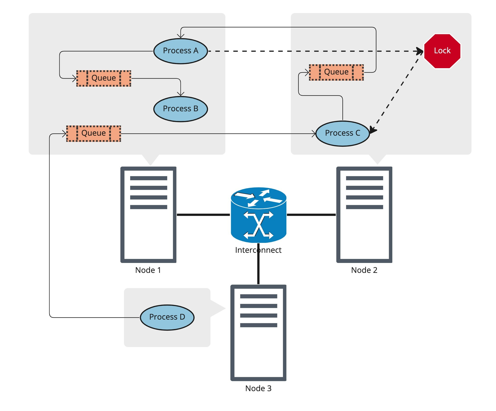

Introduction
++++++++++++

This document is intended for programmers who want to understand the Dragon
run-time services and use them in their programs. Dragon includes a set of
services that provide the ability to write programs in a distributed environment
without regard for where processes run or how they communicate and synchronize
between :term:`nodes<Node>`. However, Dragon still gives you the power to make decisions about
where your data resides and gives you the power to place parts of your
distributed program close to your data. In addition, Dragon takes full advantage
of shared memory on a node when it is possible. The power of Dragon lies in the
fact that you can take full advantage of process/data affinity when you are
ready, without having to rewrite your code. And Dragon’s services work
independently of where processes and Dragon resources are placed.

    **Dragon Object Location Transparency**

Dragon provides synchronization and communication :term:`objects<Dragon Object>`
as well as process management to a parallel distributed program. And it manages
doing this with complete :term:`transparency<Transparency>` to the application.
While the placement of data, :term:`Dragon objects<Dragon Object>`, and
processes may be controlled by the application, it is not required.  And, the
communication between nodes that is required to make all this work is done
automatically by the Dragon run-time services. In :numref:`overview-queue-doc` above you should
notice that Process A is running on a different node than the queue it is
receiving from. At the same time, both A and B are sharing a queue on-node.
Process D is sending to a queue off-node. The :term:`transparency<Transparency>`
provided by Dragon means that the code in all these processes is identical. The
code to receive off a remotely located queue is exactly the same as the code to
receive off a locally located queue. The services provided by Dragon are
completely transparent to the user’s program. The same is true of locks in the
diagram.  Lock placement does not affect user code. The code to acquire a lock
on a remote node is exactly the same as the code to acquire a lock locally.

This work was inspired by the need to build a multi-node
`Python Multiprocessing <https://docs.python.org/3/library/multiprocessing.html>`_
implementation. The standard Python Multiprocessing implementation was not a multi-node
implementation. There are currently many libraries that rely on Python’s
multiprocessing library, but to scale further and handle larger problems, a
multi-node implementation of the library is needed.

While Dragon provides a multi-node implementation of Python multiprocessing it
is much more than that. It was designed from the ground-up to support programs
written in multiple languages including Python, C, C++, and Fortran. Programs
written in these languages can use Dragon to communicate between processes. For
example, if one part of your application is written in C and another in Fortran,
the two processes can communicate via a Dragon
:term:`managed queue object <Managed Object>`. Dragon provides cross-language
support of its synchronization and communication objects so code written in one
language may communicate and synchronize via Dragon objects with programs
written in other languages. Dragon provides multi-lingual support of
applications within its run-time services and API.

Programmers looking for a place to start should likely start with
`Python Multiprocessing <https://docs.python.org/3/library/multiprocessing.html>`_ .
This API is supported by Dragon with a few minor exceptions.
Differences between the original and Dragon version of multiprocessing are
provided :ref:`here <pguide/dragon_multiprocessing:multiprocessing with dragon>`.
Using Python multiprocessing has advantages like process management and high level
communication and synchronization objects like Python multiprocessing’s
Connection object, Queue, Value, and Lock.

For the programmer who wants to dive deeper into the Dragon run-time services
and what they offer, the :ref:`Dragon Native <ref/native/index:Dragon
Native>` API provides more control and multi-language interoperability. It also
requires more management by the programmer. The :ref:`pguide/pguide:Programming
Guide` in the next section provides recipes and examples for using Dragon’s API
directly (in lieu of using Python multiprocessing) in C, C++, Fortran, and
Python. The Dragon API provides all the details of the API for each of these
languages. The good news for programmers is that there is no additional
infrastructure that you have to design to expand beyond one node. Dragon does
that for you. Happy Programming!
