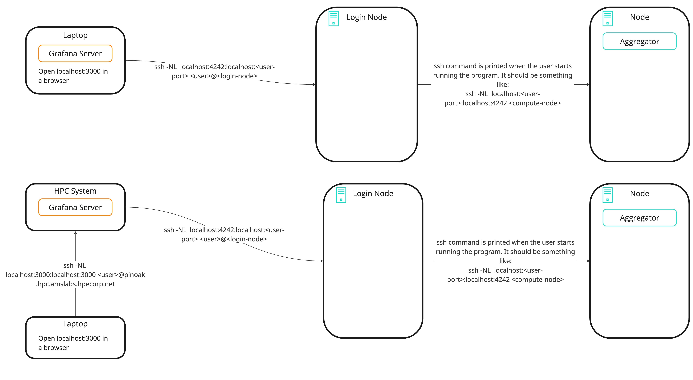

.. _grafana:

Telemetry with Grafana
**********************

Dragon Telemetry enables users to monitor and collect data on critical factors like system performance, and resource utilization.
Visualizations can be accessed real-time using Grafana. In this tutorial we will walk through how to enable, view, and add custom metrics using Telemetry. 

.. toctree::
   :maxdepth: 1

Running Telemetry
=================

Below is a simple example that initializes a Pool of workers that perform some computation. This is the base example that we will be building on top of during the remainder of this tutorial.

.. code-block:: python
    :linenos:
    :caption: Telemetry Example

    import dragon
    import multiprocessing as mp
    import time
    import itertools
    import random

    def worker(task_id):
        start_time = time.time()
        res = sum(i * i for i in range(task_id))
        end_time = time.time()
        duration = end_time - start_time
        return f"Task {task_id} completed in {duration:.2f} seconds."

    def main():
        num_cpus = 4
        # Start Dragon
        multiprocessing.set_start_method("dragon")
        # Initialize the pool of workers
        pool = mp.Pool(num_cpus)

        tasks = [random.randint(900000000, 999999999) for _ in range(30)]
        start = time.time()
    
        results = pool.map(worker, tasks)
        end = time.time()
        total_duration = end - start
        for result in results:
            print(result, flush=True)

        print(f"\nTotal execution time: {total_duration:.2f} seconds.", flush=True)
        pool.close()
        pool.join()

    if __name__ == "__main__":
        # Initializes local telemetry object.
        dt = dragon_telem()

        main()

        # This shuts down the telemetry collection and cleans up the workers and the node local telemetry databases.
        # This only needs to be called by one process.
        dt.finalize()
        

.. code-block:: console
    :linenos:
    :caption: **Output running a Pool example with Telemetry enabled**

    > salloc -N 2 --exclusive
    > dragon --telemetry-level=2 telemetry_tutorial.py 
    Port forwarded using:  ssh -NR localhost:34383:0.0.0.0:34383 pinoak-login1
    Task 930680889 completed in 52.30 seconds.
    Task 913000711 completed in 51.44 seconds.
    Task 953078228 completed in 49.84 seconds.
    Task 991416633 completed in 59.53 seconds.
    Task 975347560 completed in 62.78 seconds.
    Task 995407115 completed in 59.55 seconds.
    Task 996281122 completed in 52.75 seconds.
    Task 925282227 completed in 56.38 seconds.
    Task 913398131 completed in 49.62 seconds.
    Task 949008582 completed in 56.06 seconds.

Accessing Telemetry Metrics
=============================

Install Grafana
-------------------

Grafana can be downloaded `here <https://grafana.com/grafana/download?edition=oss>`_. We suggest following the instructions provided by Grafana to install Grafana locally. 
**Telemetry has been verified to be working with Grafana v12.1.0 (current latest) and is compatible with all versions starting from v10.4.x.**

We have created a custom config YAML for Grafana OpenTSDB connection setup that can be found `here https://github.com/DragonHPC/dragon/blob/main/src/dragon/telemetry/imports/custom.yaml`.
Place this file where you have installed Grafana in ``grafana/conf/provisioning/datasources``.

**Do not replace default.yml**

We have also provided a custom dashboard that can be found `here https://github.com/DragonHPC/dragon/blob/main/src/dragon/telemetry/imports/Grafana_DragonTelemetryDashboard.json`. 
This dashboard can be imported in Grafana.

Port forwarding
---------------
There are two instances where port forwarding is required. These two port forwards together give Grafana access to the Aggregator to make requests for metrics.

1. Aggregator
    - Compute node to login node
    - The command for this will be printed in the output when the application is run with the telemetry flag
    - Example -  ``ssh command: ssh -NL localhost:4242:localhost:4242 pinoak0027``
    - NOTE: Run this step only after the command has been printed for you.
2. Grafana to Aggregator
    - This step may vary depending on where the Grafana server is running
    - If Grafana is on localhost (laptop):
        - On laptop - ``ssh -NL localhost:4242:localhost:4242 <user>@<login-node>``
    - NOTE: This can be setup anytime and left running. This provides Grafana access to the dragon implementation of the OpenTSDB datasource. Users should still use the default ``http://localhost:3000`` to open Grafana in their browser.

Grafana Dashboard
-----------------

(Skip step 1. if you have added custom files to the config directory).

1. Navigate to Home > Connections > Datasources. Click on Add New Datasource and selct OpenTSDB. 
    Fill in details as shown below. Click on Save & Test.

    .. figure:: images/grafana_datasource.jpg
        :name: OpenTSDB Datasource

2. Navigate to Home > Dashboards. Click on New > Import. Upload the custom Dashboard. 

3. Go to Home > Dashboards and select your dashboard. You should see something like below - 

    .. figure:: images/grafana_dashboard.jpg
        :name: Grafana Dashboard

    - Select your datasource name from the dropdown [1]
    - These are CPU metrics [2]
    - Each row can be expanded for different telemetry levels. They have their own set of panels [3]

4. Click on the top right corner of any panel to edit it.

    .. figure:: images/grafana_panel.jpg
        :name: Memory Usage Panel

Troubleshooting
=============================
Sometimes metrics don't show up on Grafana dashboard panels (if it's the first time you're running Grafana and Telemetry). To resolve this:
- Verify that Grafana is able to access Telemetry by clicking on `Save & Test` under the OpenTSDB datasource.
- Refresh Grafana Panels individually
    - Click on the Edit option of any panel.
    - Click on the Datasource dropdown and re-select OpenTSDB
    - Click on the Metric dropdown and re-type the metric name.
    - Click on Apply (top-right corner)
    - Repeat for all panels
    - Save the Dashboard

Custom Metrics
==============
To add custom metrics, we initialize Dragon Telemetry, and use the `add_data` method to add metrics. 
Using the previous code, we will keep the `main()` function as is, and make the following changes to the rest of the code.

.. code-block:: python
    :linenos:
    :caption: Telemetry Custom Metrics

    import dragon
    import multiprocessing as mp
    import time
    import itertools
    import random
    from dragon.telemetry.telemetry import Telemetry as dragon_telem

    def worker(task_id):
        dt = dragon_telem()
        start_time = time.time()
        res = sum(i * i for i in range(task_id))
        end_time = time.time()
        duration = end_time - start_time
        # Add custom metric 
        dt.add_data(ts_metric_name= "duration", ts_data=duration, telemetry_level=2, tagk="task_id", tagv=task_id)
        return f"Task {task_id} completed in {duration:.2f} seconds."

    def main():
        # Same as above code

    if __name__ == "__main__":
        
        # Initializes local telemetry object.
        dt = dragon_telem()

        main()

        # This shuts down the telemetry collection and cleans up the workers and the node local telemetry databases.
        # This only needs to be called by one process.
        dt.finalize()

Telemetry levels
================
In the previous run we used the argument `--telemetry-level=2`. This means that metrics will be collected for all telemetry levels 
that are less than or equal to the given telemetry level argument. 

Running with `--telemetry-level=3` enables GPU metrics.

User defined metrics are by default set to a telemetry level of 1 but can be changed, as demonstrated in the example.
Running without the arg will mean that no telemetry data is collected. All of user generated telemetry data can be left in the user 
program but will not be collected.

Additional configurations
----------------------------

* :ref:`telemetry`

Related Cookbook Examples
----------------------------

* :ref:`dragon_telemetry`