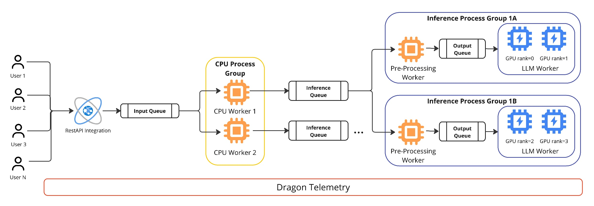

.. _inference_tutorial:

Dragon Inference Service - User Guide
+++++++++++++++++++++++++++++++++++++

The Dragon inference service runs a shared vLLM-backed LLM service inside a
Dragon allocation. It is intended for applications that need many Python
processes, agents, or workflow tasks to submit prompts to the same GPU-backed
model service without each process loading its own model.

The inference service provides a pull-based distributed load balancing component
enabled by RDMA-backed Dragon queues, that eliminates stragglers. Each worker process group
owns a local queue and pulls requests only when it is ready.
It also offers optional dynamic batching, prompt guardrails, and dynamic worker management.

For source-level architecture details, see :ref:`developer-guide-inference`.
For generated API documentation, see :ref:`InferenceAPI`. For copyable example
patterns, see :ref:`inference-cookbook`.

    **Dragon inference service architecture**

:numref:`dragon-inference-service-architecture` is an example deployment shape,
not a required layout. It shows many users or client applications feeding a
single shared input queue, optionally through a REST API integration. Behind
that queue, a Dragon CPU process group contains two CPU workers. Each CPU
worker owns local inference queues and forwards requests to inference worker
process groups.

The visible example shows two inference process groups, ``1A`` and ``1B``.
Each process group has an optional preprocessing worker for batching and
guardrails, an output queue between preprocessing and generation, and one LLM
worker running vLLM. The LLM workers are drawn with two GPU ranks each:
``1A`` uses GPU ranks ``0`` and ``1``, while ``1B`` uses GPU ranks ``2`` and
``3``. That corresponds to ``ModelConfig.tp_size=2`` because each LLM worker
uses two GPUs for tensor parallel generation. The two visible LLM workers
therefore consume four GPUs in total.

The same service scales from this example by changing configuration. Increasing
``hardware.num_inf_workers_per_cpu`` adds more inference worker process groups
under each CPU worker. Increasing ``hardware.num_gpus`` or ``hardware.num_nodes``
adds more available device groups. Changing ``model.tp_size`` changes how many
GPUs each LLM worker consumes; for example, ``tp_size=1`` creates single-GPU
workers, while ``tp_size=4`` creates workers that each span four GPUs. Dragon
handles process placement, queue communication, synchronization, telemetry, and
GPU affinity so callers can share model replicas without managing backend
worker processes directly.

.. contents:: In This Guide
   :local:
   :depth: 2

What the Service Provides
=========================

The inference package in ``dragon.ai.inference`` provides:

- A top-level :py:class:`~dragon.ai.inference.Inference` object that starts and
  stops the backend service.
- A shared :py:class:`~dragon.native.queue.Queue` request path. Callers submit
  work to one queue, and every request carries its own response queue.
- A preferred chat interface,
  :py:class:`~dragon.ai.inference.DragonQueueLLMProxy`, for agent and OpenAI-style
  chat workloads.
- Streaming support via :py:meth:`~dragon.ai.inference.DragonQueueLLMProxy.chat_stream`
  for token-by-token output in interactive applications.
- Optional dynamic batching that groups nearby requests before a vLLM
  generation call.
- Optional prompt guardrails based on PromptGuard.
- Optional dynamic worker management that can spin extra GPU workers down after
  an idle period and spin them up again when request pressure rises.
- Tensor-parallel vLLM workers placed with Dragon process and GPU affinity
  controls.

The module is experimental. APIs, configuration defaults, and the vLLM
compatibility steps may change as the service matures.
Currently, the service supports only vLLM-backed models. Other backends may be added in the future.
Also, the service is designed for launching replicas of vLLM engines across nodes. It does not
currently support multi-node tensor parallelism or pipeline parallelism for a single model instance.
Each model needs to fit on the GPUs of a single node, and the service can run multiple replicas of that model across
nodes. Sharding a model across multiple nodes is left for future work.

Install the Inference Dependencies
==================================

Install Dragon with the ``ai`` optional dependency set. The base Dragon package
keeps inference and agent dependencies out of the default install; the ``ai``
extra installs the Python packages used by ``dragon.ai.inference`` and the
Dragon agent framework.

For a released Dragon package, use:

.. code-block:: console
    :linenos:

    > pip3 install "dragonhpc[ai]"

For a source checkout, install the package from ``src/`` with the same extra:

.. code-block:: console
    :linenos:

    > pip3 install -e "src[ai]"

vLLM support is supplied by the Dragon vLLM compatibility plugin, which is
bundled inside ``dragonhpc`` and registered automatically by the ``ai`` extra.
The ``ai`` extra also installs a supported vLLM (``vllm>=0.11.0,<0.18.0``), so
installing the extra is all that is required:

.. code-block:: console
    :linenos:

    > pip3 install "dragonhpc[ai]"

Dragon registers its vLLM patches through vLLM's ``vllm.general_plugins`` entry
point group, so vLLM loads them automatically when an ``LLM()`` instance starts.
The patches activate only inside the Dragon inference service and are otherwise
a no-op, so they do not affect vLLM used outside Dragon.

You also need access to the model weights. For Hugging Face-hosted models, set
``HF_TOKEN`` in the environment used to launch Dragon. For local model paths,
pass the local path as ``model_name`` and still provide a token string because
the configuration requires one.

Start a Minimal Service
=======================

The service lifecycle is:

1. Create an input :py:class:`~dragon.native.queue.Queue`.
2. Build an :py:class:`~dragon.ai.inference.InferenceConfig`.
3. Create :py:class:`~dragon.ai.inference.Inference`.
4. Call ``initialize()`` before submitting requests.
5. Call ``destroy()`` during teardown.

Run programs that use Dragon native objects under Dragon, for example
``dragon my_inference_app.py``.

.. code-block:: python
   :linenos:
   :caption: **Minimal inference service with one text request**

   import os

     from dragon.ai.inference import (
       BatchingConfig,
       DynamicWorkerConfig,
       GuardrailsConfig,
       HardwareConfig,
       Inference,
       InferenceConfig,
       ModelConfig,
   )
   from dragon.native.queue import Queue

   inference_queue = Queue()
   response_queue = Queue()

   config = InferenceConfig(
       model=ModelConfig(
           model_name="meta-llama/Llama-3.1-8B-Instruct",
           hf_token=os.environ["HF_TOKEN"],
           tp_size=1,
           max_tokens=256,
           max_model_len=8192,
       ),
       hardware=HardwareConfig(num_nodes=1, num_gpus=1),
       batching=BatchingConfig(enabled=True, batch_type="dynamic"),
       guardrails=GuardrailsConfig(enabled=False),
       dynamic_worker=DynamicWorkerConfig(enabled=False),
   )

   service = Inference(config, inference_queue)

   try:
       service.initialize()
       service.query(("Explain tensor parallelism in one paragraph.", response_queue))

       result = response_queue.get()
       print(result["assistant"])
       print(f"end-to-end latency: {result['end_to_end_latency']} seconds")
   finally:
       service.destroy()
       response_queue.close()

``Inference.query()`` is useful for plain text prompts and pre-batched prompt
lists. It places a tuple on the backend queue and expects a response dictionary
with model output and metrics. The preferred interface for agent and chat
applications is the proxy described next.

Use the Chat Proxy
==================

:py:class:`~dragon.ai.inference.DragonQueueLLMProxy` gives callers an
async chat API over the same shared inference queue. Create one proxy per agent
or client process. Every ``chat()`` call borrows a private response queue from a
bounded pool, sends an
:py:class:`~dragon.ai.inference.InferenceRequest`, waits for the
response, and returns the assistant text.

.. code-block:: python
   :linenos:
   :caption: **Submitting chat requests through the shared queue**

   import asyncio

  from dragon.ai.inference import DragonQueueLLMProxy

   async def ask(inference_queue):
       proxy = DragonQueueLLMProxy(inference_queue, max_concurrent_requests=16)
       try:
           return await proxy.chat(
               [
                   {"role": "system", "content": "You are concise."},
                   {"role": "user", "content": "What does Dragon add to vLLM?"},
               ]
           )
       finally:
           await proxy.shutdown()

   answer = asyncio.run(ask(inference_queue))
   print(answer)

The proxy accepts OpenAI-style ``messages`` and optional ``tools``,
``json_schema``, and ``continue_final_message`` arguments. When ``json_schema``
is provided, the backend attaches vLLM guided or structured decoding parameters
for that request.

.. code-block:: python
   :linenos:
   :caption: **Requesting structured JSON output**

   schema = {
       "type": "object",
       "properties": {
           "summary": {"type": "string"},
           "risk": {"type": "string", "enum": ["low", "medium", "high"]},
       },
       "required": ["summary", "risk"],
   }

   text = await proxy.chat(
       [{"role": "user", "content": "Summarize the deployment risk."}],
       json_schema=schema,
   )

Use Streaming for Interactive Applications
==========================================

For interactive applications that need low-latency token-by-token output,
use :py:meth:`~dragon.ai.inference.DragonQueueLLMProxy.chat_stream`. This
async generator yields :py:class:`~dragon.ai.inference.StreamChunk` objects
as tokens are generated, enabling Server-Sent Events (SSE) responses and
real-time display.

.. code-block:: python
   :linenos:
   :caption: **Streaming chat responses token by token**

   import asyncio

   from dragon.ai.inference import DragonQueueLLMProxy, StreamChunk

   async def stream_response(inference_queue):
       proxy = DragonQueueLLMProxy(inference_queue, max_concurrent_requests=16)
       try:
           async for chunk in proxy.chat_stream(
               [
                   {"role": "system", "content": "You are a helpful assistant."},
                   {"role": "user", "content": "Tell me a short story."},
               ]
           ):
               # Print each token as it arrives
               print(chunk.delta_text, end="", flush=True)

               # Check if generation is complete
               if chunk.is_finished:
                   print()  # Newline at end
                   print(f"Finish reason: {chunk.finish_reason}")
                   print(f"Total tokens: {chunk.metrics.get('total_output_tokens', 0)}")
       finally:
           await proxy.shutdown()

   asyncio.run(stream_response(inference_queue))

Each ``StreamChunk`` contains:

- ``delta_text``: New text generated since the last chunk
- ``accumulated_text``: Full response text so far
- ``is_finished``: ``True`` when generation is complete
- ``finish_reason``: Why generation stopped (e.g., ``"stop"``, ``"length"``)
- ``metrics``: Performance metrics (only populated on the final chunk)

Streaming also supports JSON schema constraints for structured output:

.. code-block:: python
   :linenos:
   :caption: **Streaming with structured JSON output**

   schema = {
       "type": "object",
       "properties": {"name": {"type": "string"}, "age": {"type": "integer"}},
       "required": ["name", "age"],
   }

   async for chunk in proxy.chat_stream(
       [{"role": "user", "content": "Generate a person profile."}],
       json_schema=schema,
   ):
       print(chunk.delta_text, end="", flush=True)

.. note::

   Streaming requires vLLM 0.5.0 or newer for true token-by-token output.
   With older vLLM versions, the service returns the complete response as a
   single chunk. Streaming requests bypass dynamic batching and are processed
   with effective batch size of 1.

Load Configuration from YAML
============================

The repository includes ``src/dragon/ai/inference/config.sample`` as a starting
point for YAML configuration. Programmatic configuration is often easier for
applications, but YAML is convenient for performance studies and launch scripts.

.. code-block:: python
   :linenos:
   :caption: **Loading an InferenceConfig from YAML**

   import yaml

  from dragon.ai.inference import InferenceConfig

   with open("config.yaml", "r", encoding="utf-8") as stream:
       raw_config = yaml.safe_load(stream)

   raw_config.setdefault("token", "")
   config = InferenceConfig.from_dict(raw_config)

The parser validates the top-level section names and every known field name.
Unexpected keys raise ``ValueError`` so typographical errors do not silently
fall back to defaults.

Configuration Reference
=======================

Model
-----

.. list-table:: ``ModelConfig`` and YAML ``required``/``llm`` fields
   :header-rows: 1
   :widths: 30 20 45

   * - Field
     - Default
     - Meaning
   * - ``model_name``
     - required
     - Hugging Face model name or local model directory.
   * - ``hf_token``
     - required
     - Hugging Face token string. Required by the config object even for local
       paths.
   * - ``tp_size``
     - required
     - Tensor-parallel size. Each model worker uses this many GPUs.
   * - ``dtype``
     - ``"bfloat16"``
     - Model precision passed to vLLM.
   * - ``max_tokens``
     - ``100``
     - Maximum new tokens generated per response.
   * - ``max_model_len``
     - ``8192``
     - Prompt plus output context window passed to vLLM.
   * - ``top_k`` / ``top_p``
     - ``50`` / ``0.95``
     - Sampling controls.
   * - ``temperature``
     - ``0.5``
     - Sampling temperature controlling randomness. ``0.0`` is greedy; higher
       values increase randomness.
   * - ``repetition_penalty``
     - ``1.1``
     - Penalty applied to previously generated tokens to discourage repetition.
       Values greater than ``1.0`` penalize repeats.
   * - ``ignore_eos``
     - ``False``
     - If ``True``, generation continues after the EOS token is produced
       instead of stopping.
   * - ``skip_special_tokens``
     - ``False``
     - If ``True``, special tokens are removed from the generated output text.
   * - ``system_prompt``
     - ``["You are a helpful chatbot"]``
     - System instructions used by the plain text ``query()`` path.
   * - ``vllm_log_level``
     - ``"error"``
     - vLLM logging level.
   * - ``gpu_memory_utilization``
     - ``0.95``
     - Fraction of GPU memory vLLM uses for model weights and KV cache. Range
       is ``(0, 1]``. Lower values leave headroom for other processes.

Hardware
--------

.. list-table:: ``HardwareConfig`` fields
   :header-rows: 1
   :widths: 30 20 45

   * - Field
     - Default
     - Meaning
   * - ``num_nodes``
     - ``-1``
     - Number of Dragon allocation nodes to use. ``-1`` means all nodes.
   * - ``num_gpus``
     - ``-1``
     - Number of GPUs per node to use. ``-1`` means all visible GPUs.
   * - ``num_inf_workers_per_cpu``
     - ``-1``
     - Number of GPU inference workers grouped under each CPU head worker.
       ``-1`` auto-calculates the value as ``num_gpus // tp_size`` (with a
       minimum of one) after the GPU count is resolved.
   * - ``node_offset``
     - ``0``
     - First node index to use when multiple services share an allocation.
   * - ``inf_wrkr_queue_maxsize``
     - ``-1``
     - Maximum size of the per-CPU-head inference worker input queue. ``-1``
       auto-calculates the value as ``num_inf_workers_per_cpu * 2``.

Each inference worker receives a contiguous group of ``tp_size`` GPU devices.
For example, on one 8-GPU node with ``tp_size=2``, Dragon can form four model
workers. When ``num_inf_workers_per_cpu`` is left at ``-1``, the service
auto-calculates it as ``num_gpus // tp_size`` (here ``8 // 2 = 4``), so all four
model workers are grouped under the node's CPU head worker.

Batching
--------

.. list-table:: ``BatchingConfig`` fields
   :header-rows: 1
   :widths: 30 20 45

   * - Field
     - Default
     - Meaning
   * - ``enabled``
     - ``True``
     - Enables batching logic.
   * - ``batch_type``
     - ``"dynamic"``
     - ``"dynamic"`` collects requests inside the service. ``"pre-batch"``
       expects callers to submit lists of prompts.
   * - ``batch_wait_seconds``
     - ``0.1``
     - Time window used by dynamic batching before flushing a partial batch.
   * - ``max_batch_size``
     - ``60``
     - Maximum request count per vLLM generation call and vLLM
       ``max_num_seqs``.

Dynamic batching is the right default for concurrent clients and agents.
Pre-batching is useful for benchmark drivers and offline prompt lists where
the caller already controls grouping.

Guardrails
----------

.. list-table:: ``GuardrailsConfig`` fields
   :header-rows: 1
   :widths: 30 20 45

   * - Field
     - Default
     - Meaning
   * - ``enabled``
     - see note
     - Enables PromptGuard filtering before prompts reach vLLM.
   * - ``prompt_guard_model``
     - ``"meta-llama/Prompt-Guard-86M"``
     - Hugging Face model used for jailbreak scoring.
   * - ``prompt_guard_sensitivity``
     - ``0.5``
     - Prompts with a jailbreak score greater than or equal to this threshold
       are rejected.

Rejected prompts receive the standard response ``Your input has been
categorized as malicious. Please try again.`` and do not reach the LLM.

.. note::

   ``InferenceConfig(...)`` omits guardrails by default through its top-level
   default factory. ``GuardrailsConfig()`` itself defaults to enabled, and the
   YAML ``from_dict()`` path also defaults missing ``guardrails.toggle_on`` to
   enabled. Set ``GuardrailsConfig(enabled=...)`` or
   ``guardrails.toggle_on`` explicitly in production code.

Dynamic Workers
---------------

.. list-table:: ``DynamicWorkerConfig`` fields
   :header-rows: 1
   :widths: 30 20 45

   * - Field
     - Default
     - Meaning
   * - ``enabled``
     - see note
     - Enables worker spin-up and spin-down behavior.
   * - ``min_active_workers_per_cpu``
     - ``1``
     - Minimum model workers that remain active under each CPU head.
   * - ``spin_down_threshold_seconds``
     - ``3600``
     - Idle time before an extra worker can spin down.
   * - ``spin_up_threshold_seconds``
     - ``3``
     - Rolling time window used to detect request pressure.
   * - ``spin_up_prompt_threshold``
     - ``5``
     - Request count inside the rolling window that triggers an available
       worker to spin up.

.. note::

   ``InferenceConfig(...)`` omits dynamic worker management by default through
   its top-level default factory. ``DynamicWorkerConfig()`` itself defaults to
   enabled, and the YAML ``from_dict()`` path also defaults missing
   ``dynamic_inf_wrkr.toggle_on`` to enabled. Set this field explicitly.

Choose Resource Settings
========================

Start from the model's memory needs and tensor parallelism requirements:

- ``tp_size`` must be at least ``1`` and cannot exceed the number of GPUs per
  node selected for the service.
- Each inference worker consumes ``tp_size`` GPUs.
- The number of inference workers per node is roughly
  ``floor(num_gpus / tp_size)``.
- ``num_nodes=-1`` and ``num_gpus=-1`` use the whole Dragon allocation.
- ``node_offset`` lets a second service start on a later node in the same
  allocation.

Examples:

.. list-table:: Resource patterns
   :header-rows: 1
   :widths: 25 35 35

   * - Goal
     - Settings
     - Effect
   * - Small model on one GPU
     - ``num_nodes=1``, ``num_gpus=1``, ``tp_size=1``
     - One vLLM worker on one GPU.
   * - Larger model across four GPUs
     - ``num_nodes=1``, ``num_gpus=4``, ``tp_size=4``
     - One tensor-parallel worker using four GPUs.
   * - Many replicas of a smaller model
     - ``num_nodes=1``, ``num_gpus=8``, ``tp_size=1``
     - Up to eight independent model workers.
   * - Two services in one allocation
     - Service A ``node_offset=0``; service B ``node_offset=1``
     - Each service uses a different node slice.

Response Shape and Metrics
==========================

The backend sends a dictionary to each response queue. The proxy normalizes that
dictionary to the assistant text, while direct ``query()`` users receive the
full dictionary:

.. code-block:: python
   :linenos:

   {
       "hostname": "node001",
       "inf_worker_id": 1,
       "devices": [0, 1],
       "batch_size": 4,
       "cpu_head_network_latency": 0.01,
       "guardrails_inference_latency": 0.0,
       "guardrails_network_latency": 0,
       "model_inference_latency": 1.34,
       "model_network_latency": 0.0,
       "end_to_end_latency": 1.42,
       "requests_per_second": 2.98,
       "total_tokens_per_second": 740.21,
       "total_output_tokens_per_second": 120.08,
       "user": "Explain tensor parallelism.",
       "assistant": "Tensor parallelism splits ...",
   }

These metrics are also recorded through Dragon telemetry from the inference
worker process.

Shutdown
========

Always call ``destroy()`` on the service. It sets the shared end event, joins
CPU worker process groups, stops and closes the process group, and closes the
input queue. For proxies, call ``await proxy.shutdown()`` in each client
process so pooled response queues are destroyed.

.. code-block:: python
   :linenos:

   try:
       service.initialize()
       # submit work
   finally:
       service.destroy()

Troubleshooting
===============

``Tensor Parallelism cannot be greater than the number of GPUs``
    Lower ``tp_size`` or increase ``hardware.num_gpus``. ``tp_size`` is the
    number of GPUs consumed by a single model worker.

``Unexpected keys in config.yaml``
    The YAML parser rejects unknown field names. Compare the section and field
    names with ``src/dragon/ai/inference/config.sample``.

Model download or authentication failures
    Check ``HF_TOKEN``, model access permissions, and whether ``model_name`` is
    a valid Hugging Face name or local directory.

Port collisions or distributed initialization failures
  The service sets ``MASTER_PORT`` and uses the Dragon vLLM plugin to patch
  open-port selection. The plugin and a supported vLLM
  (``vllm>=0.11.0,<0.18.0``) are both installed by ``dragonhpc[ai]``, so confirm
  the ``ai`` extra is installed in the environment used to launch Dragon.

Calls through ``DragonQueueLLMProxy.chat()`` appear to wait
    ``max_concurrent_requests`` is a hard limit on in-flight requests per proxy.
    Additional calls wait until a pooled response queue is released.

Guardrails reject prompts unexpectedly
    Lower sensitivity only with care. A prompt is considered safe when its
    jailbreak score is below ``prompt_guard_sensitivity``.
