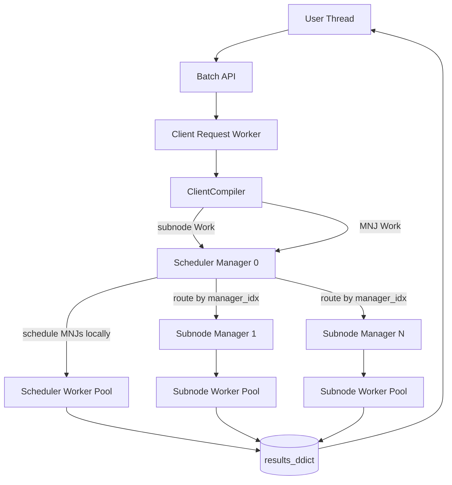
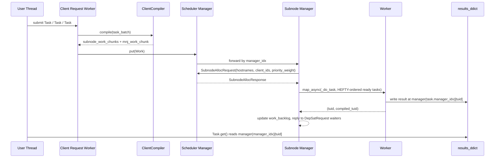

# Batch Design

This document describes the current design of the Batch runtime in [batch.py](batch.py). It is intended for developers who need to understand how Batch moves from user task submission to execution, result publication, and fence completion.

The design is intentionally split across three layers:

- client-side code that accepts user submissions, tracks logical dependencies, compiles batches of tasks, and dispatches work
- a top-level scheduler manager that owns node allocation and multi-node job orchestration
- subnode managers that launch functions and single-node jobs on worker pools after receiving an allocation for their pool nodes

Batch uses a hierarchical scheduling model rather than a single global scheduler for every task launch. The client decides placement of subnode tasks onto managers. The scheduler decides when node allocations can be granted. Each subnode manager decides the launch order of ready tasks inside its current allocation phase.

## High-Level Goals

The current design is trying to achieve several things at once:

- keep user-facing submission simple: users create tasks and dependencies implicitly through Task arguments and declared reads/writes
- minimize scheduler hot-path work by moving compilation and task placement out to the client
- reduce off-node traffic when reading and writing results by using manager-local `results_ddict` access wherever possible
- preserve correct dependency handling across separately compiled batches, at least until the next fence boundary
- give heavyweight work such as multi-node jobs a distinct path from throughput-oriented single-node work
- use a lightweight HEFT-inspired policy to prioritize critical-path work without simulating full processor schedules

## Main Runtime Objects

The important types are:

- `Batch`: the client-facing API and owner of manager bringup, client registration, the Batch-owned results `DDict`, and the client request worker thread
- `Task` / `TaskCore`: the user-visible task handle and the lean runtime representation sent to managers/workers
- `FunctionCore` and `JobCore`: concrete task implementations for Python callables and process-group jobs
- `ClientCompiler`: client-side compiler that converts a stream of submitted tasks into one compiled batch with placement and routing metadata
- `Work`: one manager-targeted partition of a compiled batch, containing ready and blocked tasks for that manager
- `Manager`: one runtime scheduler/executor process; the scheduler owns the ingress queue and subnode managers are indexed `0..n-1` for task placement

## Runtime Lifecycle Model

Batch now has two runtime lifecycle modes.

- unmanaged mode (`managed_lifecycle=False`, the default): the Batch instance shared by clients shuts down automatically after the last attached client detaches
- managed mode (`managed_lifecycle=True`): that client-shared Batch instance stays alive until some client calls `Batch.destroy()`

This is a runtime-wide policy, not a per-handle policy. Serializing and deserializing a `Batch`
handle preserves the runtime's lifecycle mode.

### Client handle lifecycle

Each `Batch` Python object is a client handle attached to the same Batch instance shared by clients.

- `join()` is client-scoped: it flushes pending local submissions, fences this client's work, stops the client request worker, and unregisters the client from the managers
- `destroy()` is runtime-scoped and is only allowed in managed mode
- `__del__` is best-effort only: it attempts a bounded `join(timeout=1.0)` first and falls back to a lighter detach path if that fails

Manager-side cleanup distinguishes between:

- clean detach: `join()` completed successfully, so manager-side client state (`ret_q`, completed-task caches, pending-count bookkeeping) can be reaped immediately
- fallback detach: `__del__` had to fall back to stop/unregister without a completed fence, so manager-side client state is retained until all in-flight work and scheduler bookkeeping for that client drain naturally

This means deleting a Python handle does not directly tear down the client-shared Batch instance. It only tries to detach that client cleanly.

### Serialization and deserialization

Serializing a `Batch` handle produces a new attachable client handle, not a transferred owner.

- the deserialized handle registers as a fresh client with the existing managers
- it preserves the runtime lifecycle mode
- it carries serialized manager queues plus a serialized `ProcessGroup` client so it can wait for runtime shutdown if it later becomes the last client or calls `destroy()` in managed mode

This is important because shutdown is no longer tied to a distinguished creator client.

## Topology And Process Model

Batch derives a manager topology from the current Dragon allocation.

- the scheduler is a dedicated manager process placed on the first Batch allocation node, independent of the creating client process
- each requested node contributes one one-node worker pool
- subnode managers are indexed `0..n-1`, one per requested node
- Batch always provisions at least one subnode manager because `num_nodes` is clamped to at least `1`
- `pool_nodes` is currently retained only for API compatibility and is forcibly overridden to `1`
- each manager runs as its own process in a `ProcessGroup`
- each manager owns a Dragon work queue and a local worker pool

At startup, Batch also creates a distributed dictionary:

- `results_ddict` is always created and owned by Batch, with one DDict manager per requested node
- `results_ddict_mem` lets the caller choose the total memory for that Batch-owned DDict; when omitted, Batch allocates one gibibyte per requested node
- task results are stored by stable base `tuid`
- Batch maps each task's logical `manager_idx` directly to the owning results-DDict manager
- scheduler-owned tasks use `manager_idx = -1`, which maps to DDict manager `0` because the scheduler is an extra process rather than an extra allocation node

This topology is important for performance because the scheduler does not launch all work itself. Non-multi-node work is always owned by a subnode manager, while the scheduler grants allocations and launches only multi-node jobs from its own pool.

## Architecture Overview

## End-To-End Flow

The runtime path from task submission to `results_ddict` write looks like this.

### 1. User submission on the client

The user creates tasks through Batch APIs such as function or job submission.

During construction:

- each task receives a stable client-local `tuid` of the form `"{client_id}-{seq}"`
- `Task` records logical dependencies in `TaskCore.dependencies`
- task arguments that are themselves `Task` objects create argument dependencies
- declared reads/writes create data-access dependencies through the `accesses` map

At this stage, tasks are still client-side logical objects. Nothing has been compiled or placed yet.

### 2. Client request worker batches submissions

The user thread does not compile tasks directly. Instead, it enqueues them to the client request worker.

This thread exists for two reasons:

- it can batch adjacent task submissions into one compile pass, reducing per-task overhead
- it separates user submission latency from compile and dispatch work

The worker repeatedly drains consecutive `Task` items into a `task_batch` and calls `_compile_and_dispatch_client_tasks(task_batch)`.

### 3. ClientCompiler turns logical tasks into runnable work

`ClientCompiler.compile()` is the main compilation step.

It performs several jobs:

1. assigns a new `compiled_tuid` for the batch
2. applies the `dep_frontier` rules for reads/writes to create inter-task dependencies
3. builds the current batch DAG for same-batch dependencies
4. computes HEFTY weights and a deterministic topological tie-break order
5. partitions subnode tasks onto managers
6. assigns each task a stable `manager_idx`
7. builds dependency routing metadata for same-batch and cross-batch edges
8. emits one `Work` chunk per subnode manager plus an optional separate multi-node-job work chunk

The output is a compiled task object whose important runtime payload is:

- `subnode_work_chunks`: zero or more `Work` objects for subnode managers
- `mnj_work_chunk`: one scheduler-local `Work` object containing multi-node jobs, if any exist

### 4. Dispatch from client to scheduler

The client request worker sends all compiled `Work` objects to the scheduler queue.

The scheduler acts as the ingress point for all work, but it does not re-compile or re-place tasks. It only routes the already-compiled `Work` objects by stable `manager_idx`.

This separation is one of the most important design changes in the current architecture:

- compilation and subnode placement happen on the client
- scheduler runtime logic focuses on node allocation, fence coordination, and MNJ submission

### 5. Scheduler routes or executes work

When the scheduler receives a `Work` item:

- if `work.manager_idx` is a subnode manager index, scheduler forwards it to that manager's queue
- otherwise scheduler handles it locally

Local handling is used for:

- multi-node jobs

Treating any other scheduler-owned task as an invariant violation keeps the old scheduler-side single-node launch path from reappearing silently.

### 6. Subnode manager accepts a Work chunk

When a subnode manager receives `Work`:

- it verifies the client is active
- it verifies the work chunk does not contain a multi-node job
- if it does not currently hold a node allocation for its pool hostnames, it queues the work in the current allocation snapshot and requests an allocation from the scheduler
- once allocated, it records the `Work` in `work_backlog`, adds ready tasks to the HEFTY ready heap, and sends `DepSatRequest` messages directly to the managers that own blocked tasks' upstream dependencies

### 7. Scheduler grants subnode allocations hierarchically

Subnode managers do not launch work immediately. They first request an allocation for the set of pool nodes that back that manager.

This is the key hierarchical scheduling boundary:

- client chooses which manager should own a subnode task
- scheduler decides when that manager may use its nodes
- subnode manager decides the local launch order of ready tasks during that allocation phase

Once the scheduler replies with `SubnodeAllocResponse`, the subnode manager begins launching work from the pending snapshot.

### 8. Workers execute tasks and write results

Workers run `_do_task`, which calls `_do_task_impl` for the actual task implementation.

For job tasks, host placement is resolved before dispatch. A `JobCore` reaching a worker without `hostname_list` set is treated as a manager-side bug rather than something the worker repairs dynamically.

The worker:

1. runs the task
2. records the task result and exception state; task stdout/stderr are redirected to shared-filesystem log files under the submitting client's Batch log directory
3. sends direct `DepSat` notifications for same-batch downstream tasks using `TaskCore.downstream_routes`
4. maps `manager_idx` to the colocated DDict manager and writes the result tuple there
5. returns `(tuid, compiled_tuid)` to the manager through `map_async`

The direct write to the colocated DDict manager is a deliberate locality optimization. The result key remains the stable base `tuid`, but the read/write path is directed to the DDict manager that owns the task's placement. Because Batch owns the results DDict and creates exactly one DDict manager per requested node, result routing is simple: subnode manager `i` writes to DDict manager `i`, while scheduler-owned tasks use DDict manager `0`.

### 9. Manager handles completion

When a manager receives completion notifications:

- it removes the task from the ready set inside its `Work`
- it stores `tuid -> manager_idx` in `_completed_tuids`
- it replies to any pending `DepSatRequest` listeners waiting on that `tuid`
- it decrements per-client in-flight work counts when a `Work` chunk fully drains
- if the task was an MNJ on the scheduler, it frees the associated node allocation

### 10. Client retrieves results

`Task.get()` first ensures that `manager_idx` is known. If compile has not happened yet, it flushes the client request worker so the task is compiled and assigned.

Then `Task.get()`:

- derives the owning DDict manager from `manager_idx`
- reads the result tuple by stable `tuid`
- re-raises the stored exception if the worker failed

Per-client log discovery is opt-in and file-based rather than result-based. It is enabled by constructing `Batch(task_logs=True)`. When enabled, each Batch client owns a log directory rooted at `runinfo/<batch-run-id>/client-<id>/task_logs`, with per-kind subdirectories (`function/`, `process/`, `job/`) and a `manifest.jsonl` file that records each task's resolved stdout/stderr paths. When disabled (the default), no `runinfo` directory or manifest is created and task stdout/stderr are only written to files when an explicit `stdout`/`stderr` path is supplied; otherwise task output is forwarded to the client console via the normal Dragon output-forwarding path.

Client-side helper APIs such as `Batch.log_dir()`, `Batch.log_manifest_path()`, `Batch.iter_log_records()`, `Batch.find_logs()`, and `Batch.read_logs()` use that manifest as the source of truth for log discovery and require `task_logs=True` (they raise `RuntimeError` when task logging is disabled). `Task.log_paths()` and `Task.get_stdout()`/`Task.get_stderr()` continue to work for any task given an explicit output path, regardless of the `task_logs` setting.

Batch submission metadata is now intended to flow through `Batch.options(...)` so execution options are kept distinct from user payload arguments. The older style of passing metadata such as `reads`, `writes`, `name`, `timeout`, `stdout`, or `stderr` directly to `Batch.function/process/job` is retained only as a deprecated compatibility path.

For process and job submissions, task-level `stdout` and `stderr` configured via `Batch.options(...)` act as defaults. Any `stdout` or `stderr` already present on a specific `ProcessTemplate` takes precedence for that template.

If a user cancellation was accepted for a running process/job task, `Task.get()` also normalizes the late `DragonUserCodeError` raised by `ProcessGroup` shutdown into `TaskCancelledError` so callers observe the Batch-level cancellation contract.

This means the client does not need to know where the task ran physically, only which DDict manager owns its result.

## Sequence Diagram

## Hierarchical Scheduling

Batch has two distinct scheduling layers.

### Layer 1: Placement of subnode work onto managers

This happens on the client in `ClientCompiler.hefty_partition()`.

The compiler:

- separates multi-node jobs from subnode tasks
- computes a HEFTY priority order for subnode tasks
- greedily assigns each subnode task to one manager partition
- records `manager_idx` on each task

This step decides ownership, not launch time.

### Layer 2: Allocation and launch

This happens at runtime inside managers.

- scheduler grants or defers node allocations
- subnode managers acquire and release allocations for their pool nodes
- once allocated, subnode managers launch ready tasks in HEFTY order using a per-phase heap
- scheduler handles multi-node jobs by requesting actual node counts and launching them from its own pool only after allocation

This hierarchy is useful because it keeps global coordination small. The scheduler does not need to micromanage every function launch. It only arbitrates scarce node allocations.

## HEFTY Priority And Placement

The current policy is deliberately HEFT-like, not full HEFT. Calling it HEFTY is accurate.

### Weight calculation

`assign_heft_weights()` computes an upward-rank style priority on the current compiled batch DAG.

1. compute a deterministic topological order using lexicographic tie-breaking by `tuid`
2. store that order as `task_core.heft_topo_order`
3. walk the DAG in reverse topological order
4. set

$$
weight(task) = compute\_cost(task) + \max(weight(successor))
$$

where `compute_cost(task)` is currently:

- `1` for functions
- `1` for non-parallel jobs
- `100 * num_procs` for parallel jobs

This is a simple approximation of critical-path importance rather than a full heterogeneous execution-time model.

### Launch-order key

Both placement and subnode ready-task launch order use the same deterministic priority key:

$$
(-weight,\ heft\_topo\_order,\ tuid)
$$

This means:

- higher weight runs first
- equal weights break by stable topological order
- remaining ties break by `tuid`

### Placement heuristic

`hefty_partition()` sorts subnode tasks by the HEFTY key, then greedily places each task on the best partition.

For each candidate partition it computes:

- `base_cost = _task_compute_cost(task)`
- `comm_penalty = number of upstream argument producers placed on a different manager`
- `candidate_key = (load + base_cost + comm_penalty, comm_penalty, load, part_idx)`

The algorithm then chooses the minimum key.

Only argument dependencies contribute to `comm_penalty`. Pure data-access dependencies
still constrain execution order, but they do not require the downstream task to fetch
an upstream Python result value for argument substitution, so Batch does not use them
as a locality signal during partitioning.

This is not classic HEFT because it does not simulate per-processor finish times. Instead, it combines:

- critical-path priority from upward ranks
- coarse balancing through partition load
- locality bias through `comm_penalty`
- deterministic spreading through a per-batch `subnode_offset`

### Cross-batch locality

Locality is not only about parents within the current batch.

When scoring a task, the compiler also consults `tuid_to_manager_q` for already-compiled upstream tasks from prior batches. That lets the compiler prefer keeping a downstream task on the same manager as a previous producer when possible.

## Dependency Handling

Batch has two different dependency mechanisms.

### Logical dependency recording

When tasks are created, dependencies are recorded durably in `TaskCore.dependencies`.

Sources of logical dependencies include:

- explicit Task arguments
- inferred read/write hazards from declared data accesses

These logical records survive until compile time.

### Runtime dependency routing

At compile time, logical dependencies are converted into runtime routing metadata.

There are two cases.

#### Same compiled batch

If both ends of the dependency are in the same newly compiled batch:

- the compiler adds a direct DAG edge
- it installs a `DependencyNotificationRoute` on the upstream task
- on completion, the worker sends `DepSat` directly to the downstream manager queue

This is the fast path.

#### Cross-batch dependency

If the upstream task is from a prior batch:

- the compiler installs a `DependencyRequestRoute` on the downstream task
- when the downstream `Work` is accepted, the owning manager sends a `DepSatRequest` directly to the upstream manager named in that route
- if the upstream task already completed, the upstream manager replies immediately using `_completed_tuids`
- otherwise the upstream manager stores the waiter in `_dep_request_reply_map` and replies when the upstream task finishes

The scheduler is not in this dependency fast path unless it happens to be the owner of the upstream task. This avoids duplicated notifications and allows separately compiled batches to depend on earlier work without reusing old in-memory DAG objects.

## dep_frontier And Inter-Batch Data Dependencies

`dep_frontier` is client-side state in `ClientCompiler` that tracks the most recent accesses for each `(kvs, key)` pair.

Each entry stores:

- the current frontier task list
- whether that frontier is a read frontier or write frontier
- `write_before_read`, which preserves the last write that should still precede later readers

Its purpose is to infer ordering across batches without keeping a full cumulative runtime DAG.

Examples:

- read after write: a new reader depends on the last writer
- write after read: a new writer depends on all frontier readers
- write after write: a new writer depends on the prior writer
- read after read: readers can coexist, but if there was an earlier write, the read still depends on that write

Because `dep_frontier` lives across compile calls, data hazards can create inter-batch dependencies even when tasks were not compiled together.

This is important for correctness and also for placement locality, because prior producers remain visible through `tuid_to_manager_q`.

## State That Spans Batches Versus State That Is Intra-Batch

Understanding state lifetime is one of the most important parts of understanding Batch.

### Client-side state that spans batches

These live in `ClientCompiler` until fence reset:

- `dep_frontier`: needed to infer data dependencies across separate compile batches
- `tuid_to_manager_q`: needed to route cross-batch dependency requests and score locality for prior producers
- `_compiled_task_ctr`: monotonically increasing counter for assigning `compiled_tuid`

This state is cleared when the client request worker processes a fence and calls `_reset_client_compile_state()`.

### Manager-side state that spans batches within a fence epoch

These span multiple compile batches until a fence boundary or until the corresponding work completes:

- `_completed_tuids`: lets later batches request already-finished upstream results
- `_dep_request_reply_map`: tracks waiters for still-running upstreams
- `_pending_task_counts`: per-client in-flight `Work` chunk counts
- `_subnode_alloc_counts`: scheduler-side count of subnode allocations still covering a client's work
- `_mnj_pending_counts`: scheduler-side count of in-flight multi-node jobs for a client

Fence completion clears the state that should not survive into the next epoch:

- scheduler sends `ClearFenceState(client_id)` to all subnode managers
- managers clear `_completed_tuids[client_id]` and `_pending_task_counts[client_id]`
- client clears `dep_frontier` and `tuid_to_manager_q`

### Strictly intra-batch or per-allocation-phase state

These are short-lived:

- `Work._ready_task_cores` and `Work._blocked_task_cores`
- `work_backlog[compiled_tuid]` entries
- `TaskCore.downstream_routes` and `upstream_routes` for the current compiled batch
- `_pending_work_chunks` and `_queued_work_chunks` on a subnode manager
- `_alloc_phase_clients`, `_alloc_phase_tuids`, and `_subnode_ready_heap` for the current allocation phase

These can be discarded as soon as the relevant batch or allocation phase completes.

## Fence Semantics

A fence is the main epoch boundary in the design.

The scheduler considers a client fence complete only when:

- `_mnj_pending_counts[client_id] == 0`
- `_subnode_outstanding[client_id] == 0`

In other words:

- all multi-node jobs for the client are done
- no subnode work is outstanding from scheduler routing through subnode manager allocation release

The `_subnode_outstanding` counter spans the entire lifecycle: it increments when the scheduler routes a Work chunk to a subnode manager, and decrements only when that manager releases its allocation (which implies all routed work has completed). This unified counter avoids race windows where fence could observe neither work-in-flight nor active allocations yet work was still queued for dispatch.

Once satisfied, the scheduler replies with `FenceComplete`, and the client resets its cross-batch compile state.

The fence boundary is what makes it safe to forget cross-batch dependency and placement metadata.

## Why Compilation Is On The Client

The most important architectural separation is between:

- the client request worker, which performs compilation and placement
- the scheduler manager, which performs allocation and runtime coordination

This split matters for performance.

### Benefits

- submission bursts can be batched before compile
- scheduler hot path avoids rebuild of dependency graphs and placement decisions
- compile work scales with number of clients rather than centralizing on manager 0
- runtime scheduling stays focused on scarce shared resources: nodes and fence state

## Why Scheduler And Subnode Managers Are Separate

The scheduler has a different job from subnode managers.

Scheduler responsibilities:

- receive all work ingress
- route by `manager_idx`
- allocate and free nodes
- defer and resume allocations
- launch multi-node jobs only after node allocation
- satisfy client fences

Subnode manager responsibilities:

- accept already-placed `Work` chunks
- own all non-multi-node task launches
- request access to their pool nodes
- maintain blocked and ready tasks for owned partitions
- satisfy dependency transitions
- launch ready tasks in HEFTY order during an allocation phase
- release their node allocation when the phase drains

This separation improves scalability because the scheduler only arbitrates coarse-grained resources, while subnode managers independently drive high-throughput local execution.

## Performance-Relevant Design Choices

Several design choices exist mainly for performance.

### Client-side batching of submissions

The client request worker groups adjacent `Task` submissions into one compile pass. This reduces compile overhead and amortizes partitioning and route construction.

### Stable manager-local result routing

Workers write results through the DDict manager derived from `task_core.manager_idx` rather than a global default handle. This reduces off-node DDict traffic and lets `Task.get()` read from the owning manager directly. The routing stays simple because Batch owns the results DDict and creates one DDict manager per requested node.

### Separate MNJ path

Multi-node jobs are never mixed into subnode work chunks. They use scheduler-local allocation and submission, which avoids polluting the subnode-manager path with heavyweight node-count allocation logic.

### Allocation-phase execution on subnode managers

Subnode managers ask the scheduler for their pool hostnames as a unit, then execute a snapshot of queued work for that phase. This reduces repeated allocation chatter and creates a clear phase boundary for cleanup.

### HEFTY ready heap

Ready tasks on subnode managers are staged in a heap keyed by HEFTY priority before being flattened into `map_async` input. This improves local launch order without changing the worker-pool interface.

### `chunk_size = 1` in `map_async`

This keeps completions responsive. Bundling multiple tasks in one worker chunk would delay dependency notifications and hold up downstream work.

### Direct same-batch dependency notifications

Same-batch edges use direct downstream routes instead of request/reply. This avoids needless indirection for the common case of newly compiled tasks that depend on one another.

### Deferred allocation handling

`request_nodes()` returns an immediate handle and allows deferred satisfaction later through `_process_alloc_completions()`. This keeps the scheduler loop non-blocking.

## Important Invariants

Several invariants are worth keeping in mind while editing the code.

- `tuid` is stable and client-visible; placement is recorded separately in `manager_idx`
- `results_ddict` keys are always base `tuid`, not `compiled_tuid`
- every task that executes must have `manager_idx` set before writing results
- subnode work chunks must not contain multi-node jobs
- same-batch dependencies use direct notify routes; cross-batch dependencies use `DepSatRequest`
- fence completion is the boundary at which cross-batch compile/runtime state may be cleared
- scheduler routes `Work` by stable `manager_idx`, not queue object identity

## Guidance For Future Changes

If you are changing Batch, the most common pitfalls are:

- accidentally duplicating dependency satisfaction by mixing same-batch direct notifications with cross-batch request routes
- clearing cross-batch state too early and breaking later compile batches before fence
- forgetting that `Task.get()` may need to flush client compilation before `manager_idx` is known
- mixing MNJs into the subnode path
- changing placement logic without updating both partitioning and ready-task launch order to use the same HEFTY key
- changing result routing without thinking about `manager_idx` and DDict locality

When in doubt, follow the boundary lines in the current design:

- logical dependency declaration on the client
- compile and placement on the client request worker
- allocation and fence logic on the scheduler
- launch ordering and dependency progression on subnode managers
- task execution and result publication on workers

That separation is what keeps the current design understandable and performant.